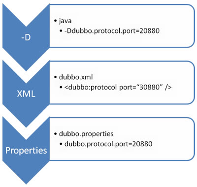

Dubbo 简介

<!--more-->

## 入门

### 架构


节点角色说明

| 节点        | 角色说明                |
| --------- | ------------------- |
| Provider  | 暴露服务的服务提供方          |
| Consumer  | 调用远程服务的服务消费方        |
| Registry  | 服务注册与发现的注册中心        |
| Monitor   | 统计服务的调用次调和调用时间的监控中心 |
| Container | 服务运行容器              |

调用关系说明

1. 服务容器负责启动，加载，运行服务提供者。
2. 服务提供者在启动时，向注册中心注册自己提供的服务。
3. 服务消费者在启动时，向注册中心订阅自己所需的服务。
4. 注册中心返回服务提供者地址列表给消费者，如果有变更，注册中心将基于长连接推送变更数据给消费者。
5. 服务消费者，从提供者地址列表中，基于软负载均衡算法，选一台提供者进行调用，如果调用失败，再选另一台调用。
6. 服务消费者和提供者，在内存中累计调用次数和调用时间，定时每分钟发送一次统计数据到监控中心。


## 快速启动

- Dubbo 采用全 Spring 配置方式，透明化接入应用，对应用没有任何 API 侵入，只需用 Spring 加载 Dubbo 的配置即可，Dubbo 基于 Spring 的 Schema 扩展进行加载。
- 如果不想使用 Spring 配置，可以通过 API 的方式 进行调用。


### 服务提供者

**定义服务接口**

DemoService.java

```java
package org.demo.dubbo;

public interface DemoService {

    String sayHello(String name);
}
```


**在服务提供方实现接口**

DemoServiceImpl.java

```java
package org.demo.dubbo.impl;

import org.demo.dubbo.DemoService;

public class DemoServiceImpl implements DemoService {
    @Override
    public String sayHello(String name) {
        return "Hello " + name;
    }
}
```


**用 Spring 配置声明暴露服务**

provider.xml

```xml
<?xml version="1.0" encoding="UTF-8"?>
<beans 	xmlns="http://www.springframework.org/schema/beans"
		xmlns:xsi="http://www.w3.org/2001/XMLSchema-instance"
		xmlns:dubbo="http://code.alibabatech.com/schema/dubbo"
		xsi:schemaLocation="
		http://www.springframework.org/schema/beans http://www.springframework.org/schema/beans/spring-beans.xsd 
		http://code.alibabatech.com/schema/dubbo http://code.alibabatech.com/schema/dubbo/dubbo.xsd">

	<!-- 提供方应用信息，用于计算依赖关系 -->
	<dubbo:application name="hello-world-app" />
	
	<!-- 使用multicast广播注册中心暴露服务地址 -->
	<dubbo:registry address="zookeeper://localhost:2181" />
	
	<!-- 用dubbo协议在20880端口暴露服务 -->
	<dubbo:protocol name="dubbo" port="20880" />
	
	<!-- 声明需要暴露的服务接口 -->
	<dubbo:service interface="org.demo.dubbo.DemoService" ref="demoService" />
	
	<!-- 和本地bean一样实现服务 -->
	<bean id="demoService" class="org.demo.dubbo.impl.DemoServiceImpl" />
</beans>
```


**加载 Spring 配置**
Provider.java

```java
package org.demo;

import org.springframework.context.support.ClassPathXmlApplicationContext;

public class Provider {

	public static void main(String[] args) throws Exception {
		ClassPathXmlApplicationContext context = new ClassPathXmlApplicationContext(
				new String[] { "classpath:dubbo/provider.xml" });

		context.start();
		System.in.read(); // 按任意键退出
	}
}
```


### 服务消费者

通过 Spring 配置引用远程服务

consumer.xml

```xml
<?xml version="1.0" encoding="UTF-8"?>
<beans  xmlns="http://www.springframework.org/schema/beans"
		xmlns:xsi="http://www.w3.org/2001/XMLSchema-instance" 
		xmlns:dubbo="http://code.alibabatech.com/schema/dubbo"
		xsi:schemaLocation="
		http://www.springframework.org/schema/beans http://www.springframework.org/schema/beans/spring-beans.xsd 
		http://code.alibabatech.com/schema/dubbo http://code.alibabatech.com/schema/dubbo/dubbo.xsd">

	<!-- 消费方应用名，用于计算依赖关系，不是匹配条件，不要与提供方一样 -->
	<dubbo:application name="consumer-of-helloworld-app" />
	
	<!-- 使用multicast广播注册中心暴露发现服务地址 -->
	<dubbo:registry address="zookeeper://localhost:2181" />
	
	<!-- 生成远程服务代理，可以和本地bean一样使用demoService -->
	 <dubbo:reference id="demoService" interface="org.demo.dubbo.DemoService"  />
</beans>
```


**加载Spring配置，并调用远程服务**
Consumer.java

```java
public class Consumer {
	public static void main(String[] args) throws Exception {

		ClassPathXmlApplicationContext context = new ClassPathXmlApplicationContext(
				new String[] { "classpath:dubbo/consumer.xml" });
		context.start();
		
		// 获取远程服务代理
		DemoService demoService = (DemoService) context.getBean("demoService"); 
      
		String hello = demoService.sayHello("world"); // 执行远程方法
		System.out.println(hello); // 显示调用结果
    }
}
```


## 依赖

**必须依赖**

JDK 1.5+ 

**缺省依赖**

通过 `mvn dependency:tree > dep.log` 命令分析，Dubbo 缺省依赖以下三方库:

```
[INFO] +- com.alibaba:dubbo:jar:2.1.2:compile
[INFO] |  +- log4j:log4j:jar:1.2.16:compile
[INFO] |  +- org.javassist:javassist:jar:3.15.0-GA:compile
[INFO] |  +- org.springframework:spring:jar:2.5.6.SEC03:compile
[INFO] |  +- commons-logging:commons-logging:jar:1.1.1:compile
[INFO] |  \- org.jboss.netty:netty:jar:3.2.5.Final:compile
```

​			
​		

## 配置

### XML 配置

#### 配置之间的关系


| 标签                     | 用途     | 解释                                       |
| ---------------------- | ------ | ---------------------------------------- |
| `<dubbo:service/>`     | 服务配置   | 用于暴露一个服务，定义服务的元信息，一个服务可以用多个协议暴露，一个服务也可以注册到多个注册中心 |
| `<dubbo:reference/>`   | 引用配置   | 用于创建一个远程服务代理，一个引用可以指向多个注册中心              |
| `<dubbo:protocol/>`    | 协议配置   | 用于配置提供服务的协议信息，协议由提供方指定，消费方被动接受           |
| `<dubbo:application/>` | 应用配置   | 用于配置当前应用信息，不管该应用是提供者还是消费者                |
| `<dubbo:module/>`      | 模块配置   | 用于配置当前模块信息，可选                            |
| `<dubbo:registry/>`    | 注册中心配置 | 用于配置连接注册中心相关信息                           |
| `<dubbo:monitor/>`     | 监控中心配置 | 用于配置连接监控中心相关信息，可选                        |
| `<dubbo:provider/>`    | 提供方配置  | 当 ProtocolConfig 和 ServiceConfig 某属性没有配置时，采用此缺省值，可选 |
| `<dubbo:consumer/>`    | 消费方配置  | 当 ReferenceConfig 某属性没有配置时，采用此缺省值，可选     |
| `<dubbo:method/>`      | 方法配置   | 用于 ServiceConfig 和 ReferenceConfig 指定方法级的配置信息 |
| `<dubbo:argument/>`    | 参数配置   | 用于指定方法参数配置                               |


#### 配置覆盖关系

以 timeout 为例，显示了配置的查找顺序，其它 retries, loadbalance, actives 等类似:

- 方法级优先，接口级次之，全局配置再次之。


- 如果级别一样，则消费方优先，提供方次之。

**其中，服务提供方配置，通过 URL 经由注册中心传递给消费方。**


> - 建议由服务提供方设置超时，因为一个方法需要执行多长时间，服务提供方更清楚，如果一个消费方同时引用多个服务，就不需要关心每个服务的超时设置。
> - 理论上 ReferenceConfig 的非服务标识配置，在 ConsumerConfig，ServiceConfig, ProviderConfig 均可以缺省配置。


### 属性配置

- 如果**公共配置**很简单，没有多注册中心，多协议等情况，或者想**多个 Spring 容器想共享配置**，可以使用 dubbo.properties 作为缺省配置。
- Dubbo 将自动加载 classpath 根目录下的 `dubbo.properties`，
- 可以通过JVM启动参数`-Ddubbo.properties.file=xxx.properties` 改变缺省配置位置。


#### 映射规则

将 XML 配置的标签名，加属性名，用点分隔，多个属性拆成多行

- 比如: `dubbo.application.name=foo` 等价于 `<dubbo:application name="foo" />`
- 比如: `dubbo.registry.address=10.20.153.10:9090` 等价于 `<dubbo:registry address="10.20.153.10:9090" />`

如果 XML 有多行同名标签配置，可用 id 号区分，如果没有 id 号将对所有同名标签生效

- 比如: `dubbo.protocol.rmi.port=1009` 等价于 `<dubbo:protocol id="rmi" name="rmi" port="1099" />` 

- 比如: `dubbo.registry.china.address=10.20.153.10:9090` 等价于 `<dubbo:registry id="china" address="10.20.153.10:9090" />`

  ​

下面是 dubbo.properties 的一个典型配置:

```
dubbo.application.name=foo
dubbo.application.owner=bar
dubbo.registry.address=10.20.153.10:9090
```


#### 覆盖策略



- JVM 启动 -D 参数优先，这样可以使用户在部署和启动时进行参数重写，比如在启动时需改变协议的端口。
- XML 次之，如果在 XML 中有配置，则 dubbo.properties 中的相应配置项无效。
- Properties 最后，相当于缺省值，只有 XML 没有配置时，dubbo.properties 的相应配置项才会生效，通常用于共享公共配置，比如应用名。


### API 配置

#### 服务提供者

```java
import com.alibaba.dubbo.rpc.config.ApplicationConfig;
import com.alibaba.dubbo.rpc.config.RegistryConfig;
import com.alibaba.dubbo.rpc.config.ProviderConfig;
import com.alibaba.dubbo.rpc.config.ServiceConfig;
import com.xxx.XxxService;
import com.xxx.XxxServiceImpl; 

// 服务实现
XxxService xxxService = new XxxServiceImpl();

// 当前应用配置
ApplicationConfig application = new ApplicationConfig();
application.setName("xxx");

// 连接注册中心配置
RegistryConfig registry = new RegistryConfig();
registry.setAddress("10.20.130.230:9090");
registry.setUsername("aaa");
registry.setPassword("bbb");

// 服务提供者协议配置
ProtocolConfig protocol = new ProtocolConfig();
protocol.setName("dubbo");
protocol.setPort(12345);
protocol.setThreads(200);

// 注意:ServiceConfig为重对象，内部封装了与注册中心的连接，以及开启服务端口

// 服务提供者暴露服务配置
ServiceConfig<XxxService> service = new ServiceConfig<XxxService>(); 
// 此实例很重，封装 了与注册中心的连接，请自行缓存，否则可能造成内存和连接泄漏

service.setApplication(application);
service.setRegistry(registry); // 多个注册中心可以用setRegistries()
service.setProtocol(protocol); // 多个协议可以用setProtocols()
service.setInterface(XxxService.class);
service.setRef(xxxService);
service.setVersion("1.0.0");

// 暴露及注册服务
service.export();
```


#### 服务消费者

```java
import com.alibaba.dubbo.rpc.config.ApplicationConfig;
import com.alibaba.dubbo.rpc.config.RegistryConfig;
import com.alibaba.dubbo.rpc.config.ConsumerConfig;
import com.alibaba.dubbo.rpc.config.ReferenceConfig;
import com.xxx.XxxService;

// 当前应用配置
ApplicationConfig application = new ApplicationConfig();
application.setName("yyy");

// 连接注册中心配置
RegistryConfig registry = new RegistryConfig();
registry.setAddress("10.20.130.230:9090");
registry.setUsername("aaa");
registry.setPassword("bbb");

// 注意:ReferenceConfig为重对象，内部封装了与注册中心的连接，以及与服务提供方的连接
// 引用远程服务
ReferenceConfig<XxxService> reference = new ReferenceConfig<XxxService>(); 
// 此实例很重 ，封装了与注册中心的连接以及与提供者的连接，请自行缓存，否则可能造成内存和连接泄漏

reference.setApplication(application);
reference.setRegistry(registry); // 多个注册中心可以用setRegistries()
reference.setInterface(XxxService.class);
reference.setVersion("1.0.0");

// 和本地bean一样使用xxxService
XxxService xxxService = reference.get(); 
// 注意:此代理对象内部封装了所有通讯细节，对象较重，请缓存复用
```


#### 方法级设置

```java

...
// 方法级配置
List<MethodConfig> methods = new ArrayList<MethodConfig>();
MethodConfig method = new MethodConfig();
method.setName("createXxx");
method.setTimeout(10000);
method.setRetries(0);
methods.add(method);
// 引用远程服务
ReferenceConfig<XxxService> reference = new ReferenceConfig<XxxService>(); // 此实例很重 ，封装了与注册中心的连接以及与提供者的连接，请自行缓存，否则可能造成内存和连接泄漏
...
reference.setMethods(methods); // 设置方法级配置
...
```


### 注解配置

需要 2.2.1 以上版本支持


#### 服务提供方

```java
import com.alibaba.dubbo.config.annotation.Service;

@Service(version="1.0.0")
public class FooServiceImpl implements FooService {
// ...
}
 
```


#### XML 配置

```xml
<!-- 公共信息，也可以用dubbo.properties配置 -->
<dubbo:application name="annotation-provider" />
<dubbo:registry address="127.0.0.1:4548" />

<!-- 扫描注解包路径，多个包用逗号分隔，不填pacakge表示扫描当前ApplicationContext中所有的类 -->
<dubbo:annotation package="com.foo.bar.service" />
```


#### 服务消费方

```java
import com.alibaba.dubbo.config.annotation.Reference;
import org.springframework.stereotype.Component;

@Component
public class BarAction {
  
    @Reference(version="1.0.0")
    private FooService fooService;
}
```


#### XML配置

```xml
<!-- 公共信息，也可以用dubbo.properties配置 -->
<dubbo:application name="annotation-consumer" />
<dubbo:registry address="127.0.0.1:4548" />

<!-- 扫描注解包路径，多个包用逗号分隔，不填pacakge表示扫描当前ApplicationContext中所有的类 -->
<dubbo:annotation package="com.foo.bar.action" />
```

