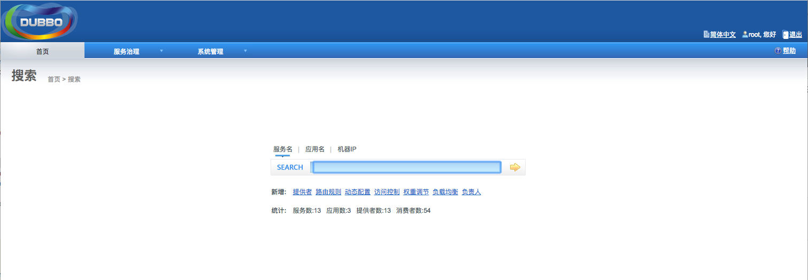
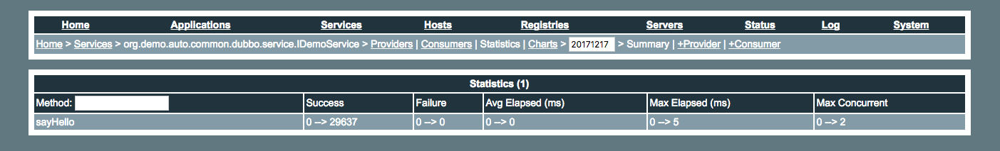
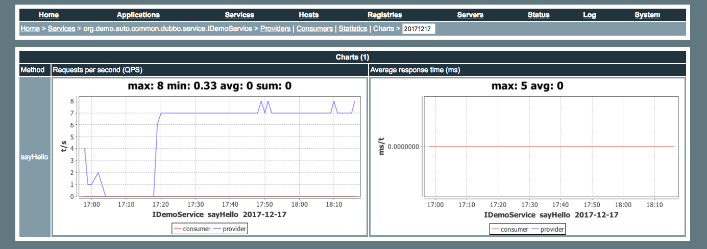

**使用dubbo的话，两个工具是不可少的：**

1. dubbo的管理控制台
2. 简易监控中心 monitor 

<!-- more -->

**简单介绍下monitor：**

Simple Monitor挂掉不会影响到Consumer和Provider之间的调用，所以用于生产环境不会有风险。

  配置好了之后可以结合admin管理后台使用，可以清晰的看到服务的访问记录、成功次数、失败次数等.....

Simple Monitor采用磁盘存储统计信息，请注意安装机器的磁盘限制，如果要集群，建议用[mount](http://alibaba.github.io/dubbo-doc-static/Administrator+Guide-zh.htm)共享磁盘。

   charts目录必须放在jetty.directory下，否则页面上访问不了。

</br>

## 编译源码

从github上下载dubbo源码进行编译，下载地址为 [https://github.com/alibaba/dubbo.git](https://github.com/alibaba/dubbo.git)

```
git clone https://github.com/alibaba/dubbo.git
cd dubbo
mvn clean install -Dmaven.test.skip // -Dmaven.test.skip 作用为跳过单元测试
```

</br>

## 部署 dubbo-admin

- 编译完成之后，在目录`dubbo/dubbo-admin/target` 下找到 `dubbo-admin-2.5.8.war` （版本号视具体情况不同），将其部署到 Tomcat 的 webapps 目录下，启动 Tomcat 服务器即可通过访问到 dubbo 的管理控制台




>  `Note` 最好将应用部署到根目录 ROOT 下，否则 dubbo-admin 在某些功能跳转的时候会找不到页面

</br>

- 将应用部署到Tomcat根目录的方法可参考

[Deploying my application at the root in Tomcat -- stackoverflow.com](https://stackoverflow.com/questions/5328518/deploying-my-application-at-the-root-in-tomcat)

修改 Tomcat 目录下的文件“conf/server.xml”，在Host节点下增加如下Context的内容配置：

```xml
<Context path="/" docBase="dubbo-admin“>
    <WatchedResource>WEB-INF/web.xml</WatchedResource>
</Context>
<Context path="/ROOT" docBase="ROOT">
    <WatchedResource>WEB-INF/web.xml</WatchedResource>
</Context>
```

</br>

## 部署简易监控中心 dubbo-monitor-simple

编译完成之后，在目录`dubbo/dubbo-simple/dubbo-monitor-simple/target/` 下找到 `dubbo-monitor-simple-2.5.8-assembly.tar.gz` ，解压之得到 `dubbo-monitor-simple-2.5.8`，修改配置文件 `conf/dubbo.properties`

```properties
dubbo.container=log4j,spring,registry,jetty
dubbo.application.name=simple-monitor
dubbo.application.owner=
# dubbo.registry.address=multicast://224.5.6.7:1234
dubbo.registry.address=zookeeper://127.0.0.1:2181 	// 1.修改为你使用的注册中心，我用zookeeper
#dubbo.registry.address=redis://127.0.0.1:6379
#dubbo.registry.address=dubbo://127.0.0.1:9090
dubbo.protocol.port=7070
dubbo.jetty.port=8081	// 2.内嵌了jetty容器，可能会和 dubbo-admin 的8080端口冲突，修改为 8081
# dubbo.jetty.directory=${user.home}/monitor
dubbo.jetty.directory=monitor						// 3.设置 monitor 存放数据的目录
dubbo.charts.directory=${dubbo.jetty.directory}/charts
dubbo.statistics.directory=${user.home}/monitor/statistics
dubbo.log4j.file=logs/dubbo-monitor-simple.log
dubbo.log4j.level=WARN
```

</br>

**创建基本文件夹，并运行`start.sh`启动简易监控中心：**

```
cd dubbo-monitor-simple-2.5.8
mkdir ./monitor
./bin/start.sh
```

</br>

**其他命令**

**启动:** `./bin/start.sh`

**停止:** `./bin/stop.sh`

**重启:** `./bin/restart.sh`

**调试:** `./bin/start.sh debug`

**系统状态:** `./bin/dump.sh`

**总控入口:** 

`./bin/server.sh start`

`./bin/server.sh stop`

`./bin/server.sh restart`

`./bin/server.sh debug`

`./bin/server.sh dump`

</br>

启动之后 过一段时候，你在配置文件中指定的目录：`dubbo.charts.directory=${dubbo.jetty.directory}/charts`  下面就会出来对应的文件，图表目录






</br>

`Note` **配置了后还是出不来图片，大致有两种情况：**

1、在配置dubbo.jetty.directory=/aa/bb/monitor 时候 monitor这个目录不存在，dubbo是不会自动给创建这个目录的，他下面的charts和统计的会自动创建；

2、在服务端需要配置监控的配置文件：`<dubbo:monitor protocol="registry" />`


参考：

[监控与管理dubbo服务](http://qinghua.github.io/dubbo-3/)

[dubbo-monitor-simple 监控中心安装](https://www.chen-hao.com.cn/posts/14197/)

