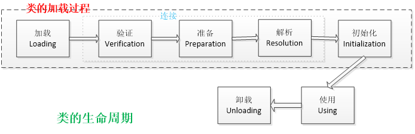
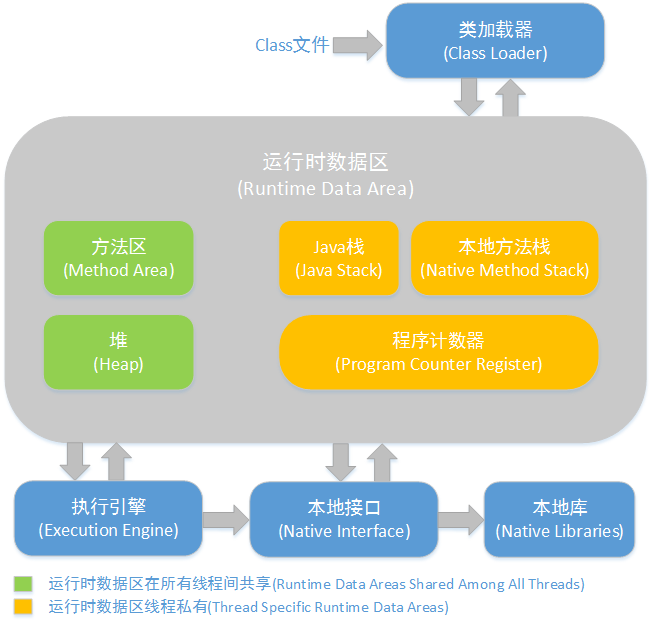

## jvm 总体梳理

jvm体系总体分四大块：

- 类的加载机制
- jvm内存结构
- GC算法 垃圾回收
- GC分析 命令调优


## 类的加载

### 什么是类的加载

类的加载指的是将类的.class文件中的二进制数据读入到内存中，将其放在运行时数据区的`方法区`内，然后在`堆区`创建一个java.lang.Class对象，用来封装类在方法区内的数据结构。类的加载的最终产品是位于堆区中的Class对象，Class对象封装了类在方法区内的数据结构，并且向Java程序员提供了访问方法区内的数据结构的接口。

### 类的生命周期

类的生命周期包括这几个部分，**加载、连接、初始化**、使用和卸载，其中前三部是类的加载的过程,如下图；



- **加载**，查找并加载类的二进制数据，在Java堆中也创建一个java.lang.Class类的对象
- **连接**，连接又包含三块内容：验证、准备、初始化。
  - 1）验证，文件格式、元数据、字节码、符号引用验证；
  - 2）准备，为类的静态变量分配内存，并将其初始化为默认值；
  - 3）解析，把类中的符号引用转换为直接引用
- **初始化**，为类的静态变量赋予正确的初始值
- **使用**，new出对象程序中使用
- **卸载**，执行垃圾回收


### 类加载器


- **启动类加载器：Bootstrap ClassLoader**，负责加载存放在 `JDK\jre\lib` (JDK代表JDK的安装目录，下同)下，或被 `-Xbootclasspath` 参数指定的路径中的，并且能被虚拟机识别的类库
- **扩展类加载器：Extension ClassLoader**，该加载器由 `sun.misc.Launcher$ExtClassLoader` 实现，它负责加载 `JDK\jre\lib\ext` 目录中，或者由 `java.ext.dirs` 系统变量指定的路径中的所有类库（如javax.*开头的类），开发者可以直接使用扩展类加载器。
- **应用程序类加载器：Application ClassLoader**，该类加载器由 `sun.misc.Launcher$AppClassLoader` 来实现，它负责加载用户类路径（ClassPath）所指定的类，开发者可以直接使用该类加载器


### 类加载机制

- **全盘负责**，当一个类加载器负责加载某个Class时，该Class所依赖的和引用的其他Class也将由该类加载器负责载入，除非显示使用另外一个类加载器来载入
- **父类委托**，先让父类加载器试图加载该类，只有在父类加载器无法加载该类时才尝试从自己的类路径中加载该类
- **缓存机制**，缓存机制将会保证所有加载过的Class都会被缓存，当程序中需要使用某个Class时，类加载器先从缓存区寻找该Class，只有缓存区不存在，系统才会读取该类对应的二进制数据，并将其转换成Class对象，存入缓存区。这就是为什么修改了Class后，必须重启JVM，程序的修改才会生效


### 双亲委派模型

双亲委派模型工作过程是：如果一个类加载器收到类加载的请求，它首先不会自己去尝试加载这个类，而是把这个请求委派给父类加载器完成。每个类加载器都是如此，只有当父加载器在自己的搜索范围内找不到指定的类时（即ClassNotFoundException），子加载器才会尝试自己去加载。


#### 为什么需要双亲委派模型

为什么需要双亲委派模型呢？假设没有双亲委派模型，试想一个场景：

- 黑客自定义一个`java.lang.String`类，该`String`类具有系统的`String`类一样的功能，只是在某个函数稍作修改。比如`equals`函数，这个函数经常使用，如果在这这个函数中，黑客加入一些“病毒代码”。并且通过自定义类加载器加入到JVM中。此时，如果没有双亲委派模型，那么`JVM`就可能误以为黑客自定义的`java.lang.String`类是系统的`String`类，导致“病毒代码”被执行。
- 而有了双亲委派模型，黑客自定义的`java.lang.String`类永远都不会被加载进内存。因为首先是最顶端的类加载器加载系统的`java.lang.String`类，最终自定义的类加载器无法加载`java.lang.String`类。
- 或许你会想，我在自定义的类加载器里面强制加载自定义的`java.lang.String`类，不去通过调用父加载器不就好了吗?确实，这样是可行。但是，在 JVM中，判断一个对象是否是某个类型时，如果该对象的实际类型与待比较的类型的类加载器不同，那么会返回false。

举个简单例子：

ClassLoader1、ClassLoader2都加载`java.lang.String`类，对应Class1、Class2对象。那么`Class1`对象不属于`ClassLoad2`对象加载的`java.lang.String`类型。


#### 实现双亲委派模型

双亲委派模型的原理很简单，实现也简单。每次通过先委托父类加载器加载，当父类加载器无法加载时，再自己加载。其实`ClassLoader`类默认的`loadClass`方法已经帮我们写好了，我们无需去写。

**自定义类加载器**

**几个重要函数**

- **loadClass**

loadClass 默认实现如下：

```java
public Class<?> loadClass(String name) throws ClassNotFoundException {
        return loadClass(name, false);
}

protected Class<?> loadClass(String name, boolean resolve)
    throws ClassNotFoundException
{
    synchronized (getClassLoadingLock(name)) {
        // First, check if the class has already been loaded
        Class c = findLoadedClass(name);
        if (c == null) {
            long t0 = System.nanoTime();
            try {
                if (parent != null) {
                    c = parent.loadClass(name, false);
                } else {
                    c = findBootstrapClassOrNull(name);
                }
            } catch (ClassNotFoundException e) {
                // ClassNotFoundException thrown if class not found
                // from the non-null parent class loader
            }
 
            if (c == null) {
                // If still not found, then invoke findClass in order
                // to find the class.
                long t1 = System.nanoTime();
                c = findClass(name);
 
                // this is the defining class loader; record the stats
                sun.misc.PerfCounter.getParentDelegationTime().addTime(t1 - t0);
                sun.misc.PerfCounter.getFindClassTime().addElapsedTimeFrom(t1);
                sun.misc.PerfCounter.getFindClasses().increment();
            }
        }
        if (resolve) {
            resolveClass(c);
        }
        return c;
    }
}
```

从上面代码可以明显看出，`loadClass(String, boolean)`函数即实现了双亲委派模型！整个大致过程如下：

1. 首先，检查一下指定名称的类是否已经加载过，如果加载过了，就不需要再加载，直接返回。
2. 如果此类没有加载过，那么，再判断一下是否有父加载器；如果有父加载器，则由父加载器加载（即调用`parent.loadClass(name, false);`）.或者是调用`bootstrap`类加载器来加载。
3. 如果父加载器及`bootstrap`类加载器都没有找到指定的类，那么调用当前类加载器的`findClass`方法来完成类加载。

换句话说，如果自定义类加载器，就必须重写`findClass`方法


- **find Class**

`findClass`的默认实现如下：

```java
protected Class<?> findClass(String name) throws ClassNotFoundException {
        throw new ClassNotFoundException(name);
}
```

可以看出，抽象类`ClassLoader`的`findClass`函数默认是抛出异常的。而前面我们知道，`loadClass`在父加载器无法加载类的时候，就会调用我们自定义的类加载器中的`findeClass`函数，因此我们必须要在`loadClass`这个函数里面实现将一个指定类名称转换为`Class`对象.

如果是是读取一个指定的名称的类为字节数组的话，这很好办。但是如何将字节数组转为`Class`对象呢？很简单，`Java`提供了`defineClass`方法，通过这个方法，就可以把一个字节数组转为Class对象啦~

- **defineClass**

`defineClass`主要的功能是：

将一个字节数组转为`Class`对象，这个字节数组是`class`文件读取后最终的字节数组。如，假设`class`文件是加密过的，则需要解密后作为形参传入`defineClass`函数。

```java
protected final Class<?> defineClass(String name, byte[] b, int off, int len)
        throws ClassFormatError  {
        return defineClass(name, b, off, len, null);
}
```

接下来就是自定义我们的类加载器：

```java
import java.io.FileInputStream;
import java.lang.reflect.Method;
 
public class Main {
    static class MyClassLoader extends ClassLoader {
        private String classPath;
 
        public MyClassLoader(String classPath) {
            this.classPath = classPath;
        }
 
        private byte[] loadByte(String name) throws Exception {
            name = name.replaceAll("\\.", "/");
            FileInputStream fis = new FileInputStream(classPath + "/" + name
                    + ".class");
            int len = fis.available();
            byte[] data = new byte[len];
            fis.read(data);
            fis.close();
            return data;
 
        }
 
        protected Class<?> findClass(String name) throws ClassNotFoundException {
            try {
                byte[] data = loadByte(name);
                return defineClass(name, data, 0, data.length);
            } catch (Exception e) {
                e.printStackTrace();
                throw new ClassNotFoundException();
            }
        }
 
    };
 
    public static void main(String args[]) throws Exception {
        MyClassLoader classLoader = new MyClassLoader("D:/test");
        Class clazz = classLoader.loadClass("com.huachao.cl.Test");
        Object obj = clazz.newInstance();
        Method helloMethod = clazz.getDeclaredMethod("hello", null);
        helloMethod.invoke(obj, null);
    }
}
```


## jvm内存结构

主要关注点：

- jvm内存结构都是什么
- 对象分配规则

### jvm内存结构



> 方法区和对是所有线程共享的内存区域；
>
> 而java栈、本地方法栈和程序员计数器是运行是线程私有的内存区域。

- **Java堆（Heap）**,是Java虚拟机所管理的内存中最大的一块。Java堆是被所有线程共享的一块内存区域，在虚拟机启动时创建。此内存区域的唯一目的就是存放对象实例，几乎所有的对象实例都在这里分配内存。
- **方法区（Method Area）**,方法区（Method Area）与Java堆一样，是各个线程共享的内存区域，它用于存储已被虚拟机加载的类信息、常量、静态变量、即时编译器编译后的代码等数据。
- **程序计数器（Program Counter Register）**,程序计数器（Program Counter Register）是一块较小的内存空间，它的作用可以看做是当前线程所执行的字节码的行号指示器。
- **JVM栈（JVM Stacks）**,与程序计数器一样，Java虚拟机栈（Java Virtual Machine Stacks）也是线程私有的，它的生命周期与线程相同。虚拟机栈描述的是Java方法执行的内存模型：每个方法被执行的时候都会同时创建一个栈帧（Stack Frame）用于存储局部变量表、操作栈、动态链接、方法出口等信息。每一个方法被调用直至执行完成的过程，就对应着一个栈帧在虚拟机栈中从入栈到出栈的过程。
- **本地方法栈（Native Method Stacks）**,本地方法栈（Native Method Stacks）与虚拟机栈所发挥的作用是非常相似的，其区别不过是虚拟机栈为虚拟机执行Java方法（也就是字节码）服务，而本地方法栈则是为虚拟机使用到的Native方法服务。


### 对象分配规则

- 对象优先分配在Eden区，如果Eden区没有足够的空间时，虚拟机执行一次Minor GC。
- 大对象直接进入老年代（大对象是指需要大量连续内存空间的对象）。这样做的目的是避免在Eden区和两个Survivor区之间发生大量的内存拷贝（新生代采用复制算法收集内存）。
- 长期存活的对象进入老年代。虚拟机为每个对象定义了一个年龄计数器，如果对象经过了1次Minor GC那么对象会进入Survivor区，之后每经过一次Minor GC那么对象的年龄加1，知道达到阀值对象进入老年区。
- 动态判断对象的年龄。如果Survivor区中相同年龄的所有对象大小的总和大于Survivor空间的一半，年龄大于或等于该年龄的对象可以直接进入老年代。
- **空间分配担保。**每次进行Minor GC时，JVM会计算Survivor区移至老年区的对象的平均大小，如果这个值大于老年区的剩余值大小则进行一次Full GC，如果小于检查HandlePromotionFailure设置，如果true则只进行Minor GC,如果false则进行Full GC。


## GC算法 垃圾回收

主要关注点：

- 对象存活判断
- GC算法
- 垃圾回收器


### 对象存活判断

判断对象是否存活一般有两种方式：

- **引用计数**：每个对象有一个引用计数属性，新增一个引用时计数加1，引用释放时计数减1，计数为0时可以回收。此方法简单，无法解决对象相互循环引用的问题。
- **可达性分析（Reachability Analysis）**：从GC Roots开始向下搜索，搜索所走过的路径称为引用链。当一个对象到GC Roots没有任何引用链相连时，则证明此对象是不可用的，不可达对象。


### GC算法

GC最基础的算法有三种：标记 -清除算法、复制算法、标记-压缩算法，我们常用的垃圾回收器一般都采用分代收集算法。

- **标记 -清除算法**，“标记-清除”（Mark-Sweep）算法，如它的名字一样，算法分为“标记”和“清除”两个阶段：首先标记出所有需要回收的对象，在标记完成后统一回收掉所有被标记的对象。
- **复制算法**，“复制”（Copying）的收集算法，它将可用内存按容量划分为大小相等的两块，每次只使用其中的一块。当这一块的内存用完了，就将还存活着的对象复制到另外一块上面，然后再把已使用过的内存空间一次清理掉。
- **标记-压缩算法**，标记过程仍然与“标记-清除”算法一样，但后续步骤不是直接对可回收对象进行清理，而是让所有存活的对象都向一端移动，然后直接清理掉端边界以外的内存
- **分代收集算法**，“分代收集”（Generational Collection）算法，把Java堆分为新生代和老年代，这样就可以根据各个年代的特点采用最适当的收集算法。


### 垃圾回收器

- **Serial收集器**，串行收集器是最古老，最稳定以及效率高的收集器，可能会产生较长的停顿，只使用一个线程去回收。
- **ParNew收集器**，ParNew收集器其实就是Serial收集器的多线程版本。
- **Parallel收集器**，Parallel Scavenge收集器类似ParNew收集器，Parallel收集器更关注系统的吞吐量。
- **Parallel Old 收集器**，Parallel Old是Parallel Scavenge收集器的老年代版本，使用多线程和“标记－整理”算法
- **CMS收集器**，CMS（Concurrent Mark Sweep）收集器是一种以获取最短回收停顿时间为目标的收集器。
- **G1收集器**，G1 (Garbage-First)是一款面向服务器的垃圾收集器,主要针对配备多颗处理器及大容量内存的机器. 以极高概率满足GC停顿时间要求的同时,还具备高吞吐量性能特征


更多关于 GC 的细节请看本博客的其他文章。


原文：

[JVM（8）：JVM知识点总览-高级Java工程师面试必备](http://www.importnew.com/23792.html)

[双亲委派模型与自定义类加载器](http://www.importnew.com/24036.html)