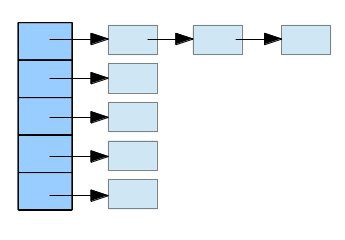

---
categories:
  - 'Java Core'
  - 'Java 集合'
date: 2017-03-25 22:46
status: public
title: Java集合类深入分析之HashMap(jdk1.6中的实现)
---

整理转载自
[java集合类深入分析之HashSet, HashMap篇](http://sauzny.iteye.com/blog/2020275)

## 一、HashMap概述：
1. HashMap是基于哈希表的Map接口的非同步实现。允许使用null值和null键。此类不保证映射的顺序，特别是它不保证该顺序恒久不变。

2. 最常见的两种操作方法是``get``, ``put``方法。get方法用于根据Key来取得所需要的Value值，而put方法用于根据特定的Key来放置对应的Value。除了这两个方法以外还有判断Key,Value是否存在的containsKey, containsValue方法。

3. Map类型的数据结构有一个比较好的地方就是在存取元素的时候都能够有比较高的效率。 因为每次存取元素的时候都是通过计算Key的hash值再通过一定的映射规则来实现，在理想的情况下可以达到一个常量值。

   <!-- more -->
**下面这部分是Map里面主要方法的列表：**

| 方法名           | 方法详细定义                               | 说明         |
| :------------ | :----------------------------------- | :--------- |
| containsKey   | boolean containsKey(Object key);     | 判断名是否存在    |
| containsValue | boolean containsValue(Object value); | 判断值是否存在    |
| get           | V get(Object key);                   | 读取元素       |
| put           | V put(K key, V value);               | 设置元素       |
| keySet        | Set<K> keySet();                     | 所有key值合集   |
| values        | Collection<V> values();              | 所有value的集合 |
| entrySet      | Set<Map.Entry<K, V>> entrySet();     | 键值对集合      |

***
## 二、HashMap的数据结构：
**HashMap 实际上是一个链表数组。**


**内部结构**
　　我们根据这种链表数组的类型，可以推断它内部肯定是有一个链表的结构。在HashMap内部，有一个``transient`` Entry[] table;这样的结构数组，它保存所有Entry的一个列表。而Entry的定义是一个典型的链表结构，不过由于既要有Key也要有Value，所以包含了Key, Value两个值。他们的定义如下：（为何使用 transient 下文补充）
​    
```java
 static class Entry<K,V> implements Map.Entry<K,V> {  
    final K key;  
    V value;  
    Entry<K,V> next;  
    final int hash;  

    /** 
     * Creates new entry. 
     */  
    Entry(int h, K k, V v, Entry<K,V> n) {  
        value = v;  
        next = n;  
        key = k;  
        hash = h;  
    }  
//...  
}  
```
　　这里省略了其他部分，主要把他们这个链表结构部分突出来。这部分就相当于链表里一个个的Node节点。ok，这样我们至少已经清楚了它里面是怎么组成的了。

***

## 三、数组增长调整（Rehashing）

　　现在再来看一个地方，我们实际中设计HashMap的时候，这里面数组的长度该多少合适呢？是否需要进行动态调整呢？如果是固定死的话，如果我们需要放置的元素少了，岂不是浪费空间？如果我们要放的元素太多了，这样也会导致更大程度的hash碰撞，会带来性能方面的损失。
1. 在HashMap里面保存元素的table是可以动态增长的，它有一个默认的长度16，还有一个最大长度 2^30。
2. 在HashMap里面什么时候进行动态增长呢，它有一个负载因数，默认为0.75，即元素个数达到数组长度的 75% 时自动翻倍。

```java
    /**
     * The default initial capacity - MUST be a power of two.
     */
    static final int DEFAULT_INITIAL_CAPACITY = 16;

    /**
     * The maximum capacity, used if a higher value is implicitly specified
     * by either of the constructors with arguments.
     * MUST be a power of two <= 1<<30.
     */
    static final int MAXIMUM_CAPACITY = 1 << 30;

    /**
     * The load factor used when none specified in constructor.
     */
    static final float DEFAULT_LOAD_FACTOR = 0.75f;
```

　　在HashMap的构造函数中，可以指定初始数组的长度。通过这个初始长度值，构造一个长度为2的若干次方的数组：

```java
   public HashMap(int initialCapacity, float loadFactor) {
        if (initialCapacity < 0)
            throw new IllegalArgumentException("Illegal initial capacity: " +
                                               initialCapacity);
        if (initialCapacity > MAXIMUM_CAPACITY)
            initialCapacity = MAXIMUM_CAPACITY;
        if (loadFactor <= 0 || Float.isNaN(loadFactor))
            throw new IllegalArgumentException("Illegal load factor: " +
                                               loadFactor);

        // Find a power of 2 >= initialCapacity
        int capacity = 1;
        while (capacity < initialCapacity)
            capacity <<= 1;

        this.loadFactor = loadFactor;
        threshold = (int)(capacity * loadFactor);
        table = new Entry[capacity];
        init();
    }   
```

　　在我们需要调整数组长度的时候，它的过程和前面讨论过的List, Queue有些类似，但是又有不同的地方。相同的地方在于，它每次也是将原来的数组长度翻倍，同时将元素拷贝过去。**但是由于HashMap本身的独特性质，它需要重新做一次映射。**实现这个过程的方法如下：

```java
void resize(int newCapacity) {  
    Entry[] oldTable = table;  
    int oldCapacity = oldTable.length;  
    if (oldCapacity == MAXIMUM_CAPACITY) {  
        threshold = Integer.MAX_VALUE;  
        return;  
    }  
  
    Entry[] newTable = new Entry[newCapacity];  
    transfer(newTable);  
    table = newTable;  
    threshold = (int)(newCapacity * loadFactor);  
}  
  
/** 
 * Transfers all entries from current table to newTable. 
 */  
void transfer(Entry[] newTable) {  
    Entry[] src = table;  
    int newCapacity = newTable.length;  
    for (int j = 0; j < src.length; j++) { //遍历原来的数组table  
        Entry<K,V> e = src[j];  
        if (e != null) {  
            src[j] = null;  
            do { 
                //对该链表元素里面所有链接的<key, value>对做重新的映射  
                Entry<K,V> next = e.next;  
                int i = indexFor(e.hash, newCapacity); 
                //这个过程是一个链表头插入的过程
                e.next = newTable[i];  
                newTable[i] = e;  
                e = next;  
            } while (e != null);  
        }  
    }  
}  
```

　　前面这部分的代码看起来比较长，实际上就是将旧的数组的元素挪到新的数组中来。因为新数组的长度不一样了，再映射的时候要**对链表里面所有的元素根据新的长度进行重新映射来对应到不同的位置**。
　　那么，我们可以看出来，元素存放的位置是和数组长度相关的。而这其中具体映射的过程和怎么放置元素的呢？我们在这里就可以找到一个入口点了。就是indexFor方法。

***
## 四、详细映射过程
　　我们要把一个<K, V>Entry放到table中间的某个位置，首先是通过计算key的hashCode值，我们都知道。在java里每个对象都有一个hashCode的方法，返回它对应的hash值。HashMap这边通过这个hash值再进行一次hash()方法的计算，得到一个int的结果。再通过indexFor将它映射到数组的某个索引。
```java
static int indexFor(int h, int length) {  
    return h & (length-1);  
}  
  
static int hash(int h) {  
    // This function ensures that hashCodes that differ only by  
    // constant multiples at each bit position have a bounded  
    // number of collisions (approximately 8 at default load factor).  
    h ^= (h >>> 20) ^ (h >>> 12);  
    return h ^ (h >>> 7) ^ (h >>> 4);  
}  
```
　　　hash方法就是对传进来的key的hashCode()值再进行一次运算。indexFor方法则是具体映射的方法。因为最后得到的这个值将走为存储Entry的索引。这里采用h & (length - 1)的手法比较有意思。因为我们定义的数组长度为2的若干次方，这意味着如果我们取长度减一的值时，它的二进制数字是最高位以下的所有位为1.经过与运算之后它的结果肯定在0~2**x之间。就算前面hash方法计算出来的结果比数组长度大也没关系，因为这么一与运算，前面长出来的部分都变成0了。它这一步运算的效果相当于h % length;
　　有了这部分对数组长度调整和映射关系的理解，我们再来看具体的get, put方法就很容易了。

***
## 五、HashMap 常用方法的实现

1) ``get``的实现
get方法的定义如下：
```java
public V get(Object key) {  
    if (key == null)  
        return getForNullKey();  
    int hash = hash(key.hashCode());  
    for (Entry<K,V> e = table[indexFor(hash, table.length)];   
    // table[indexFor(hash, table.length)] 就是将indexFor运算得到的值直接映射到数组的索引  
         e != null;  
         e = e.next) {  
         Object k;  
         if (e.hash == hash && ((k = e.key) == key || key.equals(k)))  
        //找到hash值相同的情况下可能出现hash碰撞，所以需要调用equals方法来比较是否相等  
            return e.value;  
    }  
    return null;  
}  
```
　　它这里就是一个映射，查找的过程。找到映射的点之后再和链表里的元素逐个比较，保证找到目标值。因为是hash表，会存在多个值映射到同一个index里面，所以这里还要和链表里的元素做对比。
​    
​    
2) ``put``的实现
　　put元素就是一个放置元素的过程，首先也是找到对应的索引，然后再把元素放到链表里面去。如果链表里有和元素相同的，则更新对应的value，否则就放到链表头。
```java
public V put(K key, V value) {  
    if (key == null)  
        return putForNullKey(value);  
    int hash = hash(key.hashCode());  
    int i = indexFor(hash, table.length);  
    for (Entry<K,V> e = table[i]; e != null; e = e.next) {  
        Object k;  
        if (e.hash == hash && ((k = e.key) == key || key.equals(k))) {  
        //如果找到相同的值，更新，然后返回。  
            V oldValue = e.value;  
            e.value = value;  
            e.recordAccess(this);  
            return oldValue;  
        }  
    }  
    //在前面的循环里面没有找到，则新建一个Entry对象，加入到链表头。  
    modCount++;  
    addEntry(hash, key, value, i);  
    return null;  
}  
```
　　addEntry方法会判断表长度，如果达到一定的阀值则调整数组的长度，将其翻倍：

```java
void addEntry(int hash, K key, V value, int bucketIndex) {  
        Entry<K,V> e = table[bucketIndex];  
        table[bucketIndex] = new Entry<>(hash, key, value, e);  
        if (size++ >= threshold)  
            resize(2 * table.length);  
    }  
```

3) ``containsKey`` 的实现
```java
    public boolean containsKey(Object key) {
        return getEntry(key) != null;
    }

    /**
     * Returns the entry associated with the specified key in the
     * HashMap.  Returns null if the HashMap contains no mapping
     * for the key.
     */
    final Entry<K,V> getEntry(Object key) {
        int hash = (key == null) ? 0 : hash(key.hashCode());
        for (Entry<K,V> e = table[indexFor(hash, table.length)];
             e != null;
             e = e.next) {
            Object k;
            if (e.hash == hash &&
                ((k = e.key) == key || (key != null && key.equals(k))))
                return e;
        }
        return null;
    }
```

3) ``containsValue`` 的实现
```java
 public boolean containsValue(Object value) {
	if (value == null)
            return containsNullValue();

	Entry[] tab = table;
        for (int i = 0; i < tab.length ; i++)
            for (Entry e = tab[i] ; e != null ; e = e.next)
                if (value.equals(e.value))
                    return true;
	return false;
    }
```

***
## 六、Set接口、
Set接口里面主要定义了常用的集合操作方法，包括添加元素，判断元素是否在里面和对元素过滤。
**常用的几个方法如下：**

| 方法名       |               方法详细定义                |       说明 |
| --------- | :---------------------------------: | -------: |
| contains  |     boolean contains(Object o);     | 判断元素是否存在 |
| add       |          boolean add(E e);          |     添加元素 |
| remove    |      boolean remove(Object o);      |     删除元素 |
| retainAll | boolean retainAll(Collection<?> c); |     过滤元素 |

我们知道，集合里面要求保存的元素是不能重复的，所以它里面所有的元素都是唯一的。它的定义就有点不太一样。


**HashSet**

　　HashSet是基于HashMap实现的，在它内部有如下的定义:
```java
private transient HashMap<E,Object> map;  
// Dummy value to associate with an Object in the backing Map  
private static final Object PRESENT = new Object();  
```

　　在它里面放置的元素都应到map里面的key部分，而在map中与key对应的value用一个Object()对象保存。因为内部是大量借用HashMap的实现，它本身不过是调用HashMap的一个代理，这些基本方法的实现就显得很简单：

```java
public boolean add(E e) {  
        return map.put(e, PRESENT)==null;  
    }  
  
public boolean remove(Object o) {  
        return map.remove(o)==PRESENT;  
    }  
  
public boolean contains(Object o) {  
        return map.containsKey(o);  
    }  
```

***
## 总结
　　 在前面的参考资料里已经对HashMap做了一个很深入透彻的解析。这里在前人的基础上加入一点自己个人的理解体会。希望对以后使用类似的结构有一个更好的利用，也能够充分利用里面的设计思想。

***
## 补充

1) **使用` transient` 关键字**
1. transient 是表明该数据不参与序列化。因为 HashMap 中的存储数据的数组数据成员中，数组还有很多的空间没有被使用，没有被使用到的空间被序列化没有意义。所以需要手动使用 writeObject() 方法，只序列化实际存储元素的数组。
2. 由于不同的虚拟机对于相同 hashCode 产生的 Code 值可能是不一样的，如果你使用默认的序列化，那么反序列化后，元素的位置和之前的是保持一致的，可是由于 hashCode 的值不一样了，那么定位函数 indexOf（）返回的元素下标就会不同，这样不是我们所想要的结果.

2) **私有 ``writeObject`` 和 ``readObject`` 方法**

**现象**
如果你有仔细阅读过HashMap的源码，那么你一定注意过一个问题：HashMap中有两个私有方法。
```jva
private void writeObject(java.io.ObjectOutputStream s) throws IOException
private void readObject(java.io.ObjectInputStream s) throws IOException, ClassNotFoundException
```
这两个方法有两个共同点：
1. 都是私有方法
2. 虽然是私有方法，但是在HashMap内部却找不到任何调用它们的地方

**疑问**
这两个方法是干嘛用的？
为什么要设置成私有的？

**解答**
**1) HashMap中的``writeObject``和``readObject``方法的作用是什么？**

答：``readObject``和``writeObject``方法都是为了HashMap的序列化而创建的。
首先，HashMap实现了Serializable接口，这意味着该类可以被序列化，而JDK提供的对于Java对象序列化操作的类是``ObjectOutputStream``，反序列化的类是``ObjectInputStream``。我们来看下序列化使用的ObjectOutputStream,它提供了不同的方法用来序列化不同类型的对象，比如``writeBoolean``,``wrietInt``,``writeLong``等，对于自定义类型，提供了``writeObject``方法。
ObjectOutputStream 的 writeObject 方法会调用下面的方法：

```java
private void writeSerialData(Object obj, ObjectStreamClass desc) 
	throws IOException 
    {
	ObjectStreamClass.ClassDataSlot[] slots = desc.getClassDataLayout();
	for (int i = 0; i < slots.length; i++) {
	    ObjectStreamClass slotDesc = slots[i].desc;
	    if (slotDesc.hasWriteObjectMethod()) {
		PutFieldImpl oldPut = curPut;
		curPut = null;

		if (extendedDebugInfo) {
		    debugInfoStack.push(
			"custom writeObject data (class \"" + 
			slotDesc.getName() + "\")");
		}

                SerialCallbackContext oldContext = curContext;
		try {
                    curContext = new SerialCallbackContext(obj, slotDesc);

		    bout.setBlockDataMode(true);
		    slotDesc.invokeWriteObject(obj, this);
		    bout.setBlockDataMode(false);
		    bout.writeByte(TC_ENDBLOCKDATA);
		} finally {
                    curContext.setUsed();
                    curContext = oldContext;

		    if (extendedDebugInfo) {
			debugInfoStack.pop();
		    }	
		} 

		curPut = oldPut;
	    } else {
		defaultWriteFields(obj, slotDesc);
	    }
	}
    }
```

可以看到，实际上在``ObjectOutputStream``中进行序列化操作的时候，会判断被序列化的对象是否自己重写了``writeObject``方法，如果重写了，就会调用被序列化对象自己的``writeObject``方法，如果没有重写，才会调用默认的序列化方法。
调用关系如下图：

**2) 为什么HashMap中的readObject和writeObject都是私有的？**

JDK文档中并没有明确说明设置为私有的原因。方法是私有的，那么该方法无法被子类override，这样做有什么好处呢？
如果我实现了一个继承HashMap的类，我也想有自己的序列化和反序列化方法，那我也可以实现私有的readObject和writeObject方法，而不用关心HashMap自己的那一部分。
下面的部分来自StackOverFlow:

```
We don't want these methods to be overridden by subclasses. Instead, each class can have its own writeObject method, and the serialization engine will call all of them one after the other. This is only possible with private methods (these are not overridden). (The same is valid for readObject.)
```


**3)为什么HashMap要自己实现writeObject和readObject方法，而不是使用JDK统一的默认序列化和反序列化操作呢？**

1. 首先要明确序列化的目的，将java对象序列化，一定是为了在某个时刻能够将该对象反序列化，而且一般来讲序列化和反序列化所在的机器是不同的，因为序列化最常用的场景就是跨机器的调用，而序列化和反序列化的一个最基本的要求就是，反序列化之后的对象与序列化之前的对象是一致的。
2. HashMap中，由于Entry的存放位置是根据Key的Hash值来计算，然后存放到数组中的，对于同一个Key，在不同的JVM实现中计算得出的Hash值可能是不同的。
3. Hash值不同导致的结果就是：有可能一个HashMap对象的反序列化结果与序列化之前的结果不一致。即有可能序列化之前，Key='AAA'的元素放在数组的第0个位置，而反序列化值后，根据Key获取元素的时候，可能需要从数组为2的位置来获取，而此时获取到的数据与序列化之前肯定是不同的。

**在《Effective Java》中，Joshua大神对此有所解释:**

```
For example, consider the case of a hash table. The physical representation is a sequence of hash buckets containing key-value entries. The bucket that an entry resides in is a function of the hash code of its key, which is not, in general, guaranteed to be the same from JVM implementation to JVM implementation. In fact, it isn't even guaranteed to be the same from run to run. Therefore, accepting the default serialized form for a hash table would constitute a serious bug. Serializing and deserializing the hash table could yield an object whose invariants were seriously corrupt.
```


**所以为了避免这个问题，HashMap采用了下面的方式来解决：**
1.  将可能会造成数据不一致的元素使用transient关键字修饰，从而避免JDK中默认序列化方法对该对象的序列化操作。不序列化的包括：Entry[] table,size,modCount。 
2.  自己实现writeObject方法，从而保证序列化和反序列化结果的一致性。

**4) 那么，HashMap又是通过什么手段来保证序列化和反序列化数据的一致性的呢？**

首先，HashMap序列化的时候不会将保存数据的数组序列化，而是将元素个数以及每个元素的Key和Value都进行序列化。
在反序列化的时候，重新计算Key和Value的位置，重新填充一个数组。
想想看，是不是能够解决序列化和反序列化不一致的情况呢？
由于不序列化存放元素的Entry数组，而是反序列化的时候重新生成，这样就避免了反序列化之后根据Key获取到的元素与序列化之前获取到的元素不同。