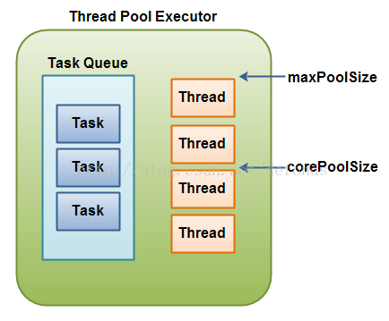

## 阻塞队列 BlockingQueue

java.util.concurrent 包里的 BlockingQueue 接口表示一个线程安放入和提取实例的队列。本小节我将给你演示如何使用这个 BlockingQueue。

本节不会讨论如何在 Java 中实现一个你自己的 BlockingQueue。如果你对那个感兴趣，参考《Java 并发指南》

<!--more-->

### BlockingQueue 用法

BlockingQueue 通常用于一个线程生产对象，而另外一个线程消费这些对象的场景。下图是对这个原理的阐述：


**一个线程往里边放，另外一个线程从里边取的一个 BlockingQueue。**

- 一个线程将会持续生产新对象并将其插入到队列之中，直到队列达到它所能容纳的临界点。也就是说，它是有限的。如果该阻塞队列到达了其临界点，负责生产的线程将会在往里边插入新对象时发生阻塞。它会一直处于**阻塞**之中，直到负责消费的线程从队列中拿走一个对象。
- 负责消费的线程将会一直从该阻塞队列中拿出对象。如果消费线程尝试去从一个空的队列中提取对象的话，这个消费线程将会处于**阻塞**之中，直到一个生产线程把一个对象丢进队列。


### BlockingQueue 的方法

BlockingQueue 具有 4 组不同的方法用于插入、移除以及对队列中的元素进行检查。如果请求的操作不能得到立即执行的话，每个方法的表现也不同。这些方法如下：

|      | 抛异常        | 特定值      | 阻塞     | 超时                          |
| ---- | ---------- | -------- | ------ | --------------------------- |
| 插入   | add(o)     | offer(o) | put(o) | offer(o, timeout, timeunit) |
| 移除   | remove(o)  | poll()   | take() | poll(timeout, timeunit)     |
| 检查   | element(o) | peek()   |        |                             |

四组不同的行为方式解释：

1. **抛异常**：如果试图的操作无法立即执行，抛一个异常。
2. **特定值**：如果试图的操作无法立即执行，返回一个特定的值(常常是 true / false)。
3. **阻塞**：如果试图的操作无法立即执行，该方法调用将会发生阻塞，直到能够执行。
4. **超时**：如果试图的操作无法立即执行，该方法调用将会发生阻塞，直到能够执行，但等待时间不会超过给定值。返回一个特定值以告知该操作是否成功(典型的是 true / false)。

无法向一个 BlockingQueue 中插入 null。如果你试图插入 null，BlockingQueue 将会抛出一个 NullPointerException。

可以访问到 BlockingQueue 中的所有元素，而不仅仅是开始和结束的元素。比如说，你将一个对象放入队列之中以等待处理，但你的应用想要将其取消掉。那么你可以调用诸如 remove(o) 方法来将队列之中的特定对象进行移除。但是这么干效率并不高(译者注：基于队列的数据结构，获取除开始或结束位置的其他对象的效率不会太高)，因此你尽量不要用这一类的方法，除非你确实不得不那么做。


### BlockingQueue 的实现

BlockingQueue 是个接口，你需要使用它的实现之一来使用 BlockingQueue。java.util.concurrent 具有以下 BlockingQueue 接口的实现(Java 6)：

- [ArrayBlockingQueue](http://blog.csdn.net/defonds/article/details/44021605#t7)
- [DelayQueue](http://blog.csdn.net/defonds/article/details/44021605#t8)
- [LinkedBlockingQueue](http://blog.csdn.net/defonds/article/details/44021605#t9)
- [PriorityBlockingQueue](http://blog.csdn.net/defonds/article/details/44021605#t10)
- [SynchronousQueue](http://blog.csdn.net/defonds/article/details/44021605#t11)


### BlockingQueue 的例子

这里是一个 Java 中使用 BlockingQueue 的示例。本示例使用的是 BlockingQueue 接口的 ArrayBlockingQueue 实现。

首先，BlockingQueueExample 类分别在两个独立的线程中启动了一个 Producer 和 一个 Consumer。Producer 向一个共享的 BlockingQueue 中注入字符串，而 Consumer 则会从中把它们拿出来。

```java
public class BlockingQueueExample {  
  
    public static void main(String[] args) throws Exception {  
  
        BlockingQueue queue = new ArrayBlockingQueue(1024);  
  
        Producer producer = new Producer(queue);  
        Consumer consumer = new Consumer(queue);  
  
        new Thread(producer).start();  
        new Thread(consumer).start();  
  
        Thread.sleep(4000);  
    }  
} 
```

以下是 Producer 类。注意它在每次 put() 调用时是如何休眠一秒钟的。这将导致 Consumer 在等待队列中对象的时候发生阻塞。

```java

public class Producer implements Runnable{  
  
    protected BlockingQueue queue = null;  
  
    public Producer(BlockingQueue queue) {  
        this.queue = queue;  
    }  
  
    public void run() {  
        try {  
            queue.put("1");  
            Thread.sleep(1000);  
            queue.put("2");  
            Thread.sleep(1000);  
            queue.put("3");  
        } catch (InterruptedException e) {  
            e.printStackTrace();  
        }  
    }  
} 
```

以下是 Consumer 类。它只是把对象从队列中抽取出来，然后将它们打印到 System.out。

```java
public class Consumer implements Runnable{  
  
    protected BlockingQueue queue = null;  
  
    public Consumer(BlockingQueue queue) {  
        this.queue = queue;  
    }  
  
    public void run() {  
        try {  
            System.out.println(queue.take());  
            System.out.println(queue.take());  
            System.out.println(queue.take());  
        } catch (InterruptedException e) {  
            e.printStackTrace();  
        }  
    }  
} 
```


## ArrayBlockingQueue

**ArrayBlockingQueue 类实现了 BlockingQueue 接口。**

ArrayBlockingQueue 是一个**有界的阻塞队列**，其内部实现是将对象放到一个数组里。有界也就意味着，它不能够存储无限多数量的元素。它有一个同一时间能够存储元素数量的上限。**你可以在对其初始化的时候设定这个上限，但之后就无法对这个上限进行修改了**(译者注：因为它是基于数组实现的，也就具有数组的特性：一旦初始化，大小就无法修改)。

ArrayBlockingQueue 内部以 FIFO(先进先出)的顺序对元素进行存储。队列中的头元素在所有元素之中是放入时间最久的那个，而尾元素则是最短的那个。

以下是在使用  ArrayBlockingQueue 的时候对其初始化的一个示例：

```java
BlockingQueue queue = new ArrayBlockingQueue(1024); 
queue.put("1");  
Object object = queue.take();  
```

以下是使用了 Java 泛型的一个 BlockingQueue 示例。注意其中是如何对 String 元素放入和提取的：

```java
BlockingQueue<String> queue = new ArrayBlockingQueue<String>(1024);  
queue.put("1");  
String string = queue.take(); 
```


## DelayQueue

**DelayQueue 实现了 BlockingQueue 接口。**

DelayQueue 对元素进行持有直到一个特定的延迟到期。注入其中的元素必须实现 `java.util.concurrent.Delayed` 接口，该接口定义：

```java
public interface Delayed extends Comparable<Delayed< {   
  
	public long getDelay(TimeUnit timeUnit);   
  
}
```

DelayQueue 将会在每个元素的 getDelay() 方法返回的值的时间段之后才释放掉该元素。如果返回的是 0 或者负值，延迟将被认为过期，该元素将会在 DelayQueue 的下一次 take  被调用的时候被释放掉。
传递给 getDelay 方法的 getDelay 实例是一个枚举类型，它表明了将要延迟的时间段。TimeUnit 枚举将会取以下值：

```
DAYS  
HOURS  
MINUTES  
SECONDS  
MILLISECONDS  
MICROSECONDS  
NANOSECONDS 
```

正如你所看到的，Delayed 接口也继承了 java.lang.Comparable 接口，这也就意味着 Delayed 对象之间可以进行对比。这个可能在对 DelayQueue 队列中的元素进行排序时有用，因此它们可以根据过期时间进行有序释放。
以下是使用 DelayQueue 的例子：

```java
public class DelayQueueExample {  
  
    public static void main(String[] args) {  
        DelayQueue queue = new DelayQueue();  
  
        Delayed element1 = new DelayedElement();  
  
        queue.put(element1);  
  
        Delayed element2 = queue.take();  
    }  
} 
```

DelayedElement 是我所创建的一个 DelayedElement 接口的实现类，它不在 java.util.concurrent 包里。你需要自行创建你自己的 Delayed 接口的实现以使用 DelayQueue 类。


## LinkedBlockingQueue

**LinkedBlockingQueue 类实现了 BlockingQueue 接口。**

LinkedBlockingQueue 内部以一个链式结构(链接节点)对其元素进行存储。**如果需要的话，这一链式结构可以选择一个上限。如果没有定义上限，将使用 `Integer.MAX_VALUE` 作为上限。**

LinkedBlockingQueue 内部以 FIFO(先进先出)的顺序对元素进行存储。队列中的头元素在所有元素之中是放入时间最久的那个，而尾元素则是最短的那个。

以下是 LinkedBlockingQueue 的初始化和使用示例代码：

```java
BlockingQueue<String> unbounded = new LinkedBlockingQueue<String>();  
BlockingQueue<String> bounded   = new LinkedBlockingQueue<String>(1024);  
  
bounded.put("Value");  
  
String value = bounded.take(); 
```


## PriorityBlockingQueue

**PriorityBlockingQueue 类实现了 BlockingQueue 接口。**

PriorityBlockingQueue 是一个**无界的并发队列**。它使用了和类 `java.util.PriorityQueue` 一样的排序规则。你无法向这个队列中插入 null 值。

所有插入到 PriorityBlockingQueue 的元素必须实现 `java.lang.Comparable` 接口。因此该队列中元素的排序就取决于你自己的 Comparable 实现。

注意 PriorityBlockingQueue 对于具有相等优先级(compare() == 0)的元素并不强制任何特定行为。

同时注意，如果你从一个 PriorityBlockingQueue 获得一个 Iterator 的话，该 Iterator 并不能保证它对元素的遍历是以优先级为序的。

以下是使用 PriorityBlockingQueue 的示例：

```java
BlockingQueue queue   = new PriorityBlockingQueue();  
  
    //String implements java.lang.Comparable  
    queue.put("Value");  
  
    String value = queue.take();  
```


## SynchronousQueue

SynchronousQueue 类实现了 BlockingQueue 接口。

SynchronousQueue 是一个特殊的队列，它的内部同时只能够容纳单个元素。如果该队列已有一元素的话，试图向队列中插入一个新元素的线程将会阻塞，直到另一个线程将该元素从队列中抽走。同样，如果该队列为空，试图向队列中抽取一个元素的线程将会阻塞，直到另一个线程向队列中插入了一条新的元素。

据此，把这个类称作一个队列显然是夸大其词了。它更多像是一个汇合点。


## 阻塞双端队列 BlockingDeque

java.util.concurrent 包里的 BlockingDeque 接口表示一个线程安放入和提取实例的双端队列。本小节我将给你演示如何使用 BlockingDeque。

BlockingDeque 类是一个双端队列，在不能够插入元素时，它将阻塞住试图插入元素的线程；在不能够抽取元素时，它将阻塞住试图抽取的线程。

deque(双端队列) 是 "Double Ended Queue" 的缩写。因此，双端队列是一个你可以从任意一端插入或者抽取元素的队列。


### BlockingDeque 的使用

在线程既是一个队列的生产者又是这个队列的消费者的时候可以使用到 BlockingDeque。如果生产者线程需要在队列的两端都可以插入数据，消费者线程需要在队列的两端都可以移除数据，这个时候也可以使用 BlockingDeque。BlockingDeque 图解：


一个 BlockingDeque - 线程在双端队列的两端都可以插入和提取元素。

一个线程生产元素，并把它们插入到队列的任意一端。如果双端队列已满，插入线程将被阻塞，直到一个移除线程从该队列中移出了一个元素。如果双端队列为空，移除线程将被阻塞，直到一个插入线程向该队列插入了一个新元素。


### BlockingDeque 的方法

BlockingDeque 具有 4 组不同的方法用于插入、移除以及对双端队列中的元素进行检查。如果请求的操作不能得到立即执行的话，每个方法的表现也不同。这些方法如下：

|      | 抛异常            | 特定值           | 阻塞           | 超时                               |
| ---- | -------------- | ------------- | ------------ | -------------------------------- |
| 插入   | addFirst(o)    | offerFirst(o) | putFirst(o)  | offerFirst(o, timeout, timeunit) |
| 移除   | removeFirst(o) | pollFirst(o)  | takeFirst(o) | pollFirst(timeout, timeunit)     |
| 检查   | getFirst(o)    | peekFirst(o)  |              |                                  |

|      | 抛异常           | 特定值          | 阻塞          | 超时                              |
| ---- | ------------- | ------------ | ----------- | ------------------------------- |
| 插入   | addLast(o)    | offerLast(o) | putLast(o)  | offerLast(o, timeout, timeunit) |
| 移除   | removeLast(o) | pollLast(o)  | takeLast(o) | pollLast(timeout, timeunit)     |
| 检查   | getLast(o)    | peekLast(o)  |             |                                 |

四组不同的行为方式解释：

1. **抛异常**：如果试图的操作无法立即执行，抛一个异常。
2. **特定值**：如果试图的操作无法立即执行，返回一个特定的值(常常是 true / false)。
3. **阻塞**：如果试图的操作无法立即执行，该方法调用将会发生阻塞，直到能够执行。
4. **超时**：如果试图的操作无法立即执行，该方法调用将会发生阻塞，直到能够执行，但等待时间不会超过给定值。返回一个特定值以告知该操作是否成功(典型的是 true / false)。


### BlockingDeque 继承自 BlockingQueue

**BlockingDeque 接口继承自 BlockingQueue 接口。**这就意味着你可以像使用一个 BlockingQueue 那样使用 BlockingDeque。如果你这么干的话，各种插入方法将会把新元素添加到双端队列的尾端，而移除方法将会把双端队列的首端的元素移除。正如 BlockingQueue 接口的插入和移除方法一样。

以下是 BlockingDeque 对 BlockingQueue 接口的方法的具体内部实现：

| BlockingQueue | BlockingDeque   |
| ------------- | --------------- |
| add()         | addLast()       |
| offer() x 2   | offerLast() x 2 |
| put()         | putLast()       |
|               |                 |
| remove()      | removeFirst()   |
| poll() x 2    | pollFirst() x 2 |
| take()        | takeFirst()     |
|               |                 |
| element()     | getFirst()      |
| peek()        | peekFirst()     |


### BlockingDeque 的实现

既然 BlockingDeque 是一个接口，那么你想要使用它的话就得使用它的众多的实现类的其中一个。java.util.concurrent 包提供了以下 BlockingDeque 接口的实现类：

- [LinkedBlockingDeque](http://blog.csdn.net/defonds/article/details/44021605#t18)


### BlockingDeque 代码示例

以下是如何使用 BlockingDeque 方法的一个简短代码示例：

```java
BlockingDeque<String> deque = new LinkedBlockingDeque<String>();  
  
deque.addFirst("1");  
deque.addLast("2");  
  
String two = deque.takeLast();  
String one = deque.takeFirst();
```


## LinkedBlockingDeque

**LinkedBlockingDeque 类实现了 BlockingDeque 接口。**

deque(双端队列) 是 "Double Ended Queue" 的缩写。因此，双端队列是一个你可以从任意一端插入或者抽取元素的队列。

LinkedBlockingDeque 是一个双端队列，在它为空的时候，一个试图从中抽取数据的线程将会阻塞，无论该线程是试图从哪一端抽取数据。

以下是 LinkedBlockingDeque 实例化以及使用的示例：

```java
BlockingDeque<String> deque = new LinkedBlockingDeque<String>();  
  
deque.addFirst("1");  
deque.addLast("2");  
  
String two = deque.takeLast();  
String one = deque.takeFirst(); 
```


## 并发 Map(映射) ConcurrentMap

**java.util.concurrent.ConcurrentMap**

java.util.concurrent.ConcurrentMap 接口表示了一个能够对别人的访问(插入和提取)进行并发处理的 java.util.Map。

ConcurrentMap 除了从其父接口 java.util.Map 继承来的方法之外还有一些额外的原子性方法。


### ConcurrentMap 的实现

既然 ConcurrentMap 是个接口，你想要使用它的话就得使用它的实现类之一。java.util.concurrent 包具备 ConcurrentMap 接口的以下实现类：

- ConcurrentHashMap


### ConcurrentHashMap

ConcurrentHashMap 和 java.util.HashTable 类很相似，**但 ConcurrentHashMap 能够提供比 HashTable 更好的并发性能**。在你从中读取对象的时候 ConcurrentHashMap 并不会把整个 Map 锁住。此外，在你向其中写入对象的时候，ConcurrentHashMap 也不会锁住整个 Map。**它的内部只是把 Map 中正在被写入的部分进行锁定。**

另外一个不同点是，在被遍历的时候，即使是 ConcurrentHashMap 被改动，它也不会抛 ConcurrentModificationException。尽管 Iterator 的设计不是为多个线程的同时使用。

更多关于 ConcurrentMap 和 ConcurrentHashMap 的细节请参考官方文档。


### ConcurrentMap 例子

以下是如何使用 ConcurrentMap 接口的一个例子。本示例使用了 ConcurrentHashMap 实现类

```java
ConcurrentMap concurrentMap = new ConcurrentHashMap();  
  
concurrentMap.put("key", "value");  
  
Object value = concurrentMap.get("key");  
```


## 并发导航映射 ConcurrentNavigableMap

java.util.concurrent.ConcurrentNavigableMap 是一个支持并发访问的 java.util.NavigableMap，它还能让它的子 map 具备并发访问的能力。所谓的 "子 map" 指的是诸如 headMap()，subMap()，tailMap() 之类的方法返回的 map。

NavigableMap 中的方法不再赘述，本小节我们来看一下 ConcurrentNavigableMap 添加的方法。


### headMap()

headMap(T toKey) 方法返回一个包含了小于给定 toKey 的 key 的子 map。

如果你对原始 map 里的元素做了改动，这些改动将影响到子 map 中的元素(译者注：map 集合持有的其实只是对象的引用)。

以下示例演示了对 headMap() 方法的使用：

```java
ConcurrentNavigableMap map = new ConcurrentSkipListMap();  
  
map.put("1", "one");  
map.put("2", "two");  
map.put("3", "three");  
  
ConcurrentNavigableMap tailMap = map.tailMap("2");  
```

tailMap 将拥有键 "2" 和 "3"，因为它们不小于给定键 "2"。关于这个方法及其重载版本具体是怎么工作的细节请参考 Java 文档。


### subMap()

subMap() 方法返回原始 map 中，键介于 from(包含) 和 to (不包含) 之间的子 map。示例如下：

```java
ConcurrentNavigableMap map = new ConcurrentSkipListMap();  
  
map.put("1", "one");  
map.put("2", "two");  
map.put("3", "three");  
  
ConcurrentNavigableMap subMap = map.subMap("2", "3");  
```

返回的 submap 只包含键 "2"，因为只有它满足不小于 "2"，比 "3" 小。

## 更多方法

ConcurrentNavigableMap 接口还有其他一些方法可供使用，比如：

- descendingKeySet()
- descendingMap()
- navigableKeySet()

关于这些方法更多信息参考官方 Java 文档。


## 闭锁 CountDownLatch


## 栅栏 CyclicBarrier


## 交换机 Exchanger


## 信号量 Semaphore

java.util.concurrent.Semaphore 类是一个计数信号量。这就意味着它具备两个主要方法：

- acquire()
- release()

计数信号量由一个指定数量的 "许可" 初始化。每调用一次 acquire()，一个许可会被调用线程取走。每调用一次 release()，一个许可会被返还给信号量。因此，在没有任何 release() 调用时，最多有 N 个线程能够通过 acquire() 方法，N 是该信号量初始化时的许可的指定数量。这些许可只是一个简单的计数器。这里没啥奇特的地方。


### Semaphore 用法

信号量主要有两种用途：

1. 保护一个重要(代码)部分防止一次超过 N 个线程进入。
2. **在两个线程之间发送信号。**


### 保护重要部分

如果你将信号量用于保护一个重要部分，试图进入这一部分的代码通常会首先尝试获得一个许可，然后才能进入重要部分(代码块)，执行完之后，再把许可释放掉。比如这样：

```java
Semaphore semaphore = new Semaphore(1);  
  
//critical section  
semaphore.acquire();  
  
...  
  
semaphore.release();  
```


### 在线程之间发送信号

如果你将一个信号量用于在两个线程之间传送信号，通常你应该用一个线程调用 acquire() 方法，而另一个线程调用 release() 方法。

如果没有可用的许可，acquire() 调用将会阻塞，直到一个许可被另一个线程释放出来。同理，如果无法往信号量释放更多许可时，一个 release() 调用也会阻塞。

**通过这个可以对多个线程进行协调。**比如，如果线程 1 将一个对象插入到了一个共享列表(list)之后之后调用了 acquire()，而线程 2 则在从该列表中获取一个对象之前调用了 release()，**这时你其实已经创建了一个阻塞队列。信号量中可用的许可的数量也就等同于该阻塞队列能够持有的元素个数。**


### 公平

没有办法保证线程能够公平地可从信号量中获得许可。也就是说，无法担保掉第一个调用 acquire() 的线程会是第一个获得一个许可的线程。如果第一个线程在等待一个许可时发生阻塞，而第二个线程前来索要一个许可的时候刚好有一个许可被释放出来，那么它就可能会在第一个线程之前获得许可。

如果你想要强制公平，Semaphore 类有一个具有一个布尔类型的参数的构造子，通过这个参数以告知 Semaphore 是否要强制公平。强制公平会影响到并发性能，所以除非你确实需要它否则不要启用它。

以下是如何在公平模式创建一个 Semaphore 的示例：

```java
Semaphore semaphore = new Semaphore(1, true);  
```


### 更多方法

java.util.concurrent.Semaphore 类还有很多方法，比如：

- availablePermits()
- acquireUninterruptibly()
- drainPermits()
- hasQueuedThreads()
- getQueuedThreads()
- tryAcquire()
- 等等

这些方法的细节请参考 Java 文档。

### 

## 执行器服务 ExecutorService

java.util.concurrent.ExecutorService 接口表示一个异步执行机制，使我们能够在后台执行任务。因此一个 ExecutorService 很类似于一个线程池。实际上，存在于 java.util.concurrent 包里的 ExecutorService 实现就是一个线程池实现。


### ExecutorService 例子

以下是一个简单的 ExecutorService 例子：

```java
ExecutorService executorService = Executors.newFixedThreadPool(10);  
  
executorService.execute(new Runnable() {  
    public void run() {  
        System.out.println("Asynchronous task");  
    }  
});  
  
executorService.shutdown();  
```

首先使用 newFixedThreadPool() 工厂方法创建一个 ExecutorService。这里创建了一个十个线程执行任务的线程池。

然后，将一个 Runnable 接口的匿名实现类传递给 execute() 方法。这将导致 ExecutorService 中的某个线程执行该 Runnable。


### 任务委派

下图说明了一个线程是如何将一个任务委托给一个 ExecutorService 去异步执行的：


一个线程将一个任务委派给一个 ExecutorService 去异步执行。

一旦该线程将任务委派给 ExecutorService，该线程将继续它自己的执行，独立于该任务的执行。


### ExecutorService 实现

既然 ExecutorService 是个接口，如果你想用它的话就得去使用它的实现类之一。java.util.concurrent 包提供了 ExecutorService 接口的以下实现类：

- [ThreadPoolExecutor](http://blog.csdn.net/defonds/article/details/44021605#t53)
- [ScheduledThreadPoolExecutor](http://blog.csdn.net/defonds/article/details/44021605#t55)


### 创建一个 ExecutorService

ExecutorService 的创建依赖于你使用的具体实现。但是你也可以使用 `Executors` 工厂类来创建 ExecutorService 实例。以下是几个创建 ExecutorService 实例的例子：

```java
ExecutorService executorService1 = Executors.newSingleThreadExecutor();  
  
ExecutorService executorService2 = Executors.newFixedThreadPool(10);  
  
ExecutorService executorService3 = Executors.newScheduledThreadPool(10);  
```


### ExecutorService 使用

有几种不同的方式来将任务委托给 ExecutorService 去执行：

- execute(Runnable)
- submit(Runnable)
- submit(Callable)
- invokeAny(...)
- invokeAll(...)

接下来我们挨个看一下这些方法。


### execute(Runnable)

execute(Runnable) 方法要求一个 java.lang.Runnable 对象，然后对它进行异步执行。以下是使用 ExecutorService 执行一个 Runnable 的示例：

```java
ExecutorService executorService = Executors.newSingleThreadExecutor();  
  
executorService.execute(new Runnable() {  
    public void run() {  
        System.out.println("Asynchronous task");  
    }  
});  
  
executorService.shutdown();  
```

没有办法得知被执行的 Runnable 的执行结果。如果有需要的话你得使用一个 Callable(以下将做介绍)。

### submit(Runnable)

submit(Runnable) 方法也要求一个 Runnable 实现类，但它返回一个 Future 对象。这个 Future 对象可以用来检查 Runnable 是否已经执行完毕。

以下是 ExecutorService submit() 示例：

```java
Future future = executorService.submit(new Runnable() {  
    public void run() {  
        System.out.println("Asynchronous task");  
    }  
});  
  
future.get();  //returns null if the task has finished correctly.  
```

### submit(Callable)

submit(Callable) 方法类似于 submit(Runnable) 方法，除了它所要求的参数类型之外。Callable 实例除了它的 call() 方法能够返回一个结果之外和一个 Runnable 很相像。Runnable.run() 不能够返回一个结果。

Callable 的结果可以通过 submit(Callable) 方法返回的 Future 对象进行获取。以下是一个 ExecutorService Callable 示例：

```java
uture future = executorService.submit(new Callable(){  
    public Object call() throws Exception {  
        System.out.println("Asynchronous Callable");  
        return "Callable Result";  
    }  
});  
  
System.out.println("future.get() = " + future.get());  
```

```
以上代码输出：
Asynchronous Callable
future.get() = Callable Result
```

### invokeAny()

invokeAny() 方法要求一系列的 Callable 或者其子接口的实例对象。**调用这个方法并不会返回一个 Future**，但它返回其中一个 Callable 对象的结果。无法保证返回的是哪个 Callable 的结果 - 只能表明其中一个已执行结束。

如果其中一个任务执行结束(或者抛了一个异常)，其他 Callable 将被取消。

以下是示例代码：

```java
ExecutorService executorService = Executors.newSingleThreadExecutor();  
  
Set<Callable<String>> callables = new HashSet<Callable<String>>();  
  
callables.add(new Callable<String>() {  
    public String call() throws Exception {  
        return "Task 1";  
    }  
});  
callables.add(new Callable<String>() {  
    public String call() throws Exception {  
        return "Task 2";  
    }  
});  
callables.add(new Callable<String>() {  
    public String call() throws Exception {  
        return "Task 3";  
    }  
});  
  
String result = executorService.invokeAny(callables);  
  
System.out.println("result = " + result);  
  
executorService.shutdown();  
```

上述代码将会打印出给定 Callable 集合中的一个的执行结果。我自己试着执行了它几次，结果始终在变。有时是 "Task 1"，有时是 "Task 2" 等等。

### invokeAll()

invokeAll() 方法将调用你在集合中传给 ExecutorService 的所有 Callable 对象。**invokeAll() 返回一系列的 Future 对象，通过它们你可以获取每个 Callable 的执行结果。**

记住，一个任务可能会由于一个异常而结束，因此它可能没有 "成功"。无法通过一个 Future 对象来告知我们是两种结束中的哪一种。

以下是一个代码示例：

```java
ExecutorService executorService = Executors.newSingleThreadExecutor();  
  
Set<Callable<String>> callables = new HashSet<Callable<String>>();  
  
callables.add(new Callable<String>() {  
    public String call() throws Exception {  
        return "Task 1";  
    }  
});  
callables.add(new Callable<String>() {  
    public String call() throws Exception {  
        return "Task 2";  
    }  
});  
callables.add(new Callable<String>() {  
    public String call() throws Exception {  
        return "Task 3";  
    }  
});  
  
List<Future<String>> futures = executorService.invokeAll(callables);  
  
for(Future<String> future : futures){  
    System.out.println("future.get = " + future.get());  
}  
  
executorService.shutdown();  
```


### ExecutorService 关闭

使用完 ExecutorService 之后你应该将其关闭，以使其中的线程不再运行。

比如，如果你的应用是通过一个 main() 方法启动的，之后 main 方法退出了你的应用，如果你的应用有一个活动的 ExexutorService 它将还会保持运行。**ExecutorService 里的活动线程阻止了 JVM 的关闭。**

要终止 ExecutorService 里的线程你需要调用 ExecutorService 的 shutdown() 方法。ExecutorService 并不会立即关闭，但它将不再接受新的任务，而且一旦所有线程都完成了当前任务的时候，ExecutorService 将会关闭。在 shutdown() 被调用之前所有提交给 ExecutorService 的任务都被执行。

如果你想要立即关闭 ExecutorService，你可以调用 shutdownNow() 方法。这样会立即尝试停止所有执行中的任务，并忽略掉那些已提交但尚未开始处理的任务。无法担保执行任务的正确执行。可能它们被停止了，也可能已经执行结束。


## 线程池执行者 ThreadPoolExecutor

java.util.concurrent.ThreadPoolExecutor 是 ExecutorService 接口的一个实现。ThreadPoolExecutor 使用其内部池中的线程执行给定任务(Callable 或者 Runnable)。

ThreadPoolExecutor 包含的线程池能够包含不同数量的线程。池中线程的数量由以下变量决定：

- corePoolSize
- maximumPoolSize

当一个任务委托给线程池时，如果池中线程数量低于 corePoolSize，一个新的线程将被创建，即使池中可能尚有空闲线程。

如果内部任务队列已满，而且有至少 corePoolSize 正在运行，但是运行线程的数量低于 maximumPoolSize，一个新的线程将被创建去执行该任务。

ThreadPoolExecutor 图解：



**一个 ThreadPoolExecutor**


### 创建一个 ThreadPoolExecutor

ThreadPoolExecutor 有若干个可用构造子。比如：

```java
int  corePoolSize  =    5;  
int  maxPoolSize   =   10;  
long keepAliveTime = 5000;  
  
ExecutorService threadPoolExecutor =  
        new ThreadPoolExecutor(  
                corePoolSize,  
                maxPoolSize,  
                keepAliveTime,  
                TimeUnit.MILLISECONDS,  
                new LinkedBlockingQueue<Runnable>()  
                );  
```

但是，除非你确实需要显式为 ThreadPoolExecutor 定义所有参数，使用 java.util.concurrent.Executors 类中的工厂方法之一会更加方便，正如  [ExecutorService](http://blog.csdn.net/defonds/article/details/44021605#t41) 小节所述。 


## 补充：ThreadPoolExecutor 构造方法参数

**ThreadPoolExecutor** 完整构造函数

```java
public ThreadPoolExecutor(
  		int corePoolSize,
        int maximumPoolSize,
        long keepAliveTime,
        TimeUnit unit,
        BlockingQueue<Runnable> workQueue,
        ThreadFactory threadFactory,
        RejectedExecutionHandler handler)
```

线程池的构造函数参数多达7个，现在我们一一来分析它们对线程池的影响。

- **corePoolSize**线程池中核心线程数的最大值


- **maximumPoolSize：**线程池中能拥有最多线程数
- **workQueue：**用于缓存任务的阻塞队列
- **keepAliveTime：**表示空闲线程的存活时间。
- **TimeUnitunit：**表示keepAliveTime的单位。
- **handler：**表示当workQueue已满，且池中的线程数达到maximumPoolSize时，线程池拒绝添加新任务时采取的策略。
- **threadFactory：**指定创建线程的工厂


我们现在通过向线程池添加新的任务来说明着三者之间的关系。

​     （1）如果没有空闲的线程执行该任务且当前运行的**线程数少于corePoolSize**，则添加新的线程执行该任务。

​     （2）如果没有空闲的线程执行该任务且当前的**线程数等于corePoolSize同时阻塞队列未满**，则将任务入队列，**而不添加新的线程**。

​     （3）如果没有空闲的线程执行该任务且**阻塞队列已满同时池中的线程数小于 maximumPoolSize**，则创建新的线程执行任务。

​     （4）如果没有空闲的线程执行该任务且阻塞队列**已满同时池中的线程数等于maximumPoolSize**，则根据构造函数中的handler指定的策略来拒绝新的任务。

更多详细 ： [线程池ThreadPoolExecutor、Executors参数详解与源代码分析](http://www.cnblogs.com/nullzx/p/5184164.html)


## 定时执行者服务 ScheduledExecutorService

java.util.concurrent.ScheduledExecutorService 是一个 ExecutorService， 它能够将任务延后执行，或者间隔固定时间多次执行。 任务由一个工作者线程异步执行，而不是由提交任务给 ScheduledExecutorService 的那个线程执行。


### ScheduledExecutorService 例子

以下是一个简单的 ScheduledExecutorService 示例：

```java
ScheduledExecutorService scheduledExecutorService =  
        Executors.newScheduledThreadPool(5);  
  
ScheduledFuture scheduledFuture =  
    scheduledExecutorService.schedule(new Callable() {  
        public Object call() throws Exception {  
            System.out.println("Executed!");  
            return "Called!";  
        }  
    },  
    5,  
    TimeUnit.SECONDS);  

```

首先一个内置 5 个线程的 ScheduledExecutorService 被创建。之后一个 Callable 接口的匿名类示例被创建然后传递给 schedule() 方法。后边的俩参数定义了 Callable 将在 5 秒钟之后被执行。


### ScheduledExecutorService 实现

既然 ScheduledExecutorService 是一个接口，你要用它的话就得使用 java.util.concurrent 包里对它的某个实现类。ScheduledExecutorService 具有以下实现类：

- ScheduledThreadPoolExecutor


### 创建一个 ScheduledExecutorService

如何创建一个 ScheduledExecutorService 取决于你采用的它的实现类。但是你也可以使用 Executors 工厂类来创建一个 ScheduledExecutorService 实例。比如：

```java
ScheduledExecutorService scheduledExecutorService =  
  
        Executors.newScheduledThreadPool(5);  
```


### ScheduledExecutorService 使用

一旦你创建了一个 ScheduledExecutorService，你可以通过调用它的以下方法：

- schedule (Callable task, long delay, TimeUnit timeunit)
- schedule (Runnable task, long delay, TimeUnit timeunit)
- scheduleAtFixedRate (Runnable, long initialDelay, long period, TimeUnit timeunit)
- scheduleWithFixedDelay (Runnable, long initialDelay, long period, TimeUnit timeunit)

下面我们就简单看一下这些方法。


### schedule (Callable task, long delay, TimeUnit timeunit)

这个方法计划指定的 Callable 在给定的延迟之后执行。

这个方法返回一个 ScheduledFuture，通过它你可以在它被执行之前对它进行取消，或者在它执行之后获取结果。

以下是一个示例：

```java
ScheduledExecutorService scheduledExecutorService =  
        Executors.newScheduledThreadPool(5);  
  
ScheduledFuture scheduledFuture =  
    scheduledExecutorService.schedule(new Callable() {  
        public Object call() throws Exception {  
            System.out.println("Executed!");  
            return "Called!";  
        }  
    },  
    5,  
    TimeUnit.SECONDS);  
  
System.out.println("result = " + scheduledFuture.get());  
  
scheduledExecutorService.shutdown();  
```

示例输出结果：

Executed!
result = Called!


### schedule (Runnable task, long delay, TimeUnit timeunit)

除了 Runnable 无法返回一个结果之外，这一方法工作起来就像以一个 Callable 作为一个参数的那个版本的方法一样，因此 ScheduledFuture.get() 在任务执行结束之后返回 null。


### scheduleAtFixedRate (Runnable, long initialDelay, long period, TimeUnit timeunit)

这一方法规划一个任务将被定期执行。该任务将会在首个 initialDelay 之后得到执行，然后每个 period 时间之后重复执行。

如果给定任务的执行抛出了异常，该任务将不再执行。如果没有任何异常的话，这个任务将会持续循环执行到 ScheduledExecutorService 被关闭。

如果一个任务占用了比计划的时间间隔更长的时候，下一次执行将在当前执行结束执行才开始。计划任务在同一时间不会有多个线程同时执行。


### scheduleWithFixedDelay (Runnable, long initialDelay, long period, TimeUnit timeunit)

除了 period 有不同的解释之外这个方法和 scheduleAtFixedRate() 非常像。

scheduleAtFixedRate() 方法中，period 被解释为前一个执行的开始和下一个执行的开始之间的间隔时间。

而在本方法中，period 则被解释为前一个执行的结束和下一个执行的结束之间的间隔。因此这个延迟是执行结束之间的间隔，而不是执行开始之间的间隔。


### ScheduledExecutorService 关闭

正如 ExecutorService，在你使用结束之后你需要把 ScheduledExecutorService 关闭掉。否则他将导致 JVM 继续运行，即使所有其他线程已经全被关闭。

你可以使用从 ExecutorService 接口继承来的 shutdown() 或 shutdownNow() 方法将 ScheduledExecutorService 关闭。参见 ExecutorService 关闭部分以获取更多信息。


原文：

[Java 并发工具包 java.util.concurrent 用户指南](http://blog.csdn.net/defonds/article/details/44021605)

参考资料：

[线程池ThreadPoolExecutor、Executors参数详解与源代码分析](http://www.cnblogs.com/nullzx/p/5184164.html)

