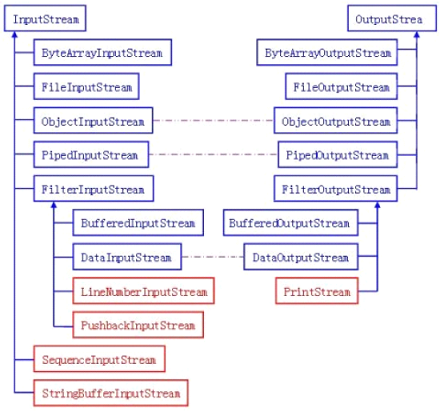
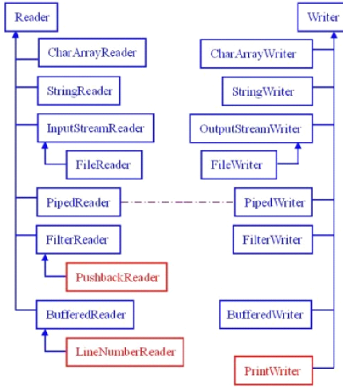

---
categories:
  - 'Java Core'
  - 'Java 进阶'
date: 2017-04-09 11:35
title: Java IO
---
原文：[Java IO流学习总结-Oubo的博客](http://www.cnblogs.com/oubo/archive/2012/01/06/2394638.html) 

参考：[Java I/O操作](http://www.jianshu.com/p/21ed71b26a5d)

## Java流操作有关的类或接口：

| 类                | 说明      |
| ---------------- | ------- |
| File             | 文件类     |
| RandomAccessFile | 随机存取文件类 |
| InputStream      | 字节输入流   |
| OutputStream     | 字节输出流   |
| Reader           | 字节输入流   |
| Writer           | 字符输出流   |


## Java流类图结构：


## 流的概念和作用

- 流是一组有顺序的，有起点和终点的字节集合，是对数据传输的总称或抽象。即数据在两设备间的传输称为流。
- **流的本质是数据传输，根据数据传输特性将流抽象为各种类，方便更直观的进行数据操作。** 


##  IO流的分类

- 根据处理数据类型的不同分为：字符流和字节流
- 根据数据流向不同分为：输入流和输出流


### 字符流和字节流

**字符流的由来**： 因为数据编码的不同，而有了对字符进行高效操作的流对象。本质其实就是基于字节流读取时，去查了指定的码表。 

**字节流和字符流的区别：**

- **读写单位不同：**字节流以字节（8bit）为单位，字符流以字符为单位，根据码表映射字符，一次可能读多个字节。
- **处理对象不同：**字节流能处理所有类型的数据（如图片、avi等），而字符流只能处理字符类型的数据。

> **结论：只要是处理纯文本数据，就优先考虑使用字符流。 除此之外都使用字节流。**


### 输入流和输出流

对输入流只能进行读操作，对输出流只能进行写操作，程序中需要根据待传输数据的不同特性而使用不同的流。


## Java IO流对象

### 输入字节流InputStream

IO 中输入字节流的继承图可见上图，可以看出：

1. `InputStream` 是所有的输入字节流的父类，它是一个**抽象类**。
2. `ByteArrayInputStream`、`StringBufferInputStream`、`FileInputStream` 是三种基本的**介质流**，它们分别从Byte 数组、StringBuffer、和本地文件中读取数据。`PipedInputStream` 是从与其它线程共用的管道中读取数据，与Piped 相关的知识后续单独介绍。
3. `ObjectInputStream` 和所有`FilterInputStream` 的子类都是**装饰流**（装饰器模式的主角）。


### 输出字节流OutputStream

IO 中输出字节流的继承图可见上图，可以看出：

1. `OutputStream` 是所有的输出字节流的父类，它是一个**抽象类**。
2. `ByteArrayOutputStream`、`FileOutputStream` 是两种基本的介质流，它们分别向Byte 数组、和本地文件中写入数据。`PipedOutputStream` 是向与其它线程共用的管道中写入数据，
3. `ObjectOutputStream` 和所有`FilterOutputStream` 的子类都是**装饰流**。


### 字节流的输入与输出的对应




**图中蓝色的为主要的对应部分，红色的部分就是不对应部分**。**紫色的虚线部分代表这些流一般要搭配使用**。


上面的图中可以看出Java IO 中的字节流是极其对称的。“存在及合理”我们看看这些字节流中**不太对称的几个类**吧！

1. `LineNumberInputStream` 主要完成从流中读取数据时，会得到相应的行号，至于什么时候分行、在哪里分行是由改类主动确定的，并不是在原始中有这样一个行号。在输出部分没有对应的部分，我们完全可以自己建立一个`LineNumberOutputStream`，在最初写入时会有一个基准的行号，以后每次遇到换行时会在下一行添加一个行号，看起来也是可以的。好像更不入流了。
2. `PushbackInputStream` 的功能是查看最后一个字节，不满意就放入缓冲区。主要用在编译器的语法、词法分析部分。输出部分的`BufferedOutputStream` 几乎实现相近的功能。
3. `StringBufferInputStream` 已经被Deprecated，本身就不应该出现在InputStream 部分，主要因为String 应该属于字符流的范围。已经被废弃了，当然输出部分也没有必要需要它了！还允许它存在只是为了保持版本的向下兼容而已。
4. `SequenceInputStream` 可以认为是一个工具类，将两个或者多个输入流当成一个输入流依次读取。完全可以从IO 包中去除，还完全不影响IO 包的结构，却让其更“纯洁”――纯洁的Decorator 模式。
5. `PrintStream` 也可以认为是一个辅助工具。主要可以向其他输出流，或者FileInputStream 写入数据，本身内部实现还是带缓冲的。本质上是对其它流的综合运用的一个工具而已。一样可以踢出IO 包！System.out 和System.out 就是PrintStream 的实例！


### 字符输入流Reader

在上面的继承关系图中可以看出：

1. `Reader` 是所有的输入字符流的父类，它是一个抽象类。

2. `CharArrayReader`、`StringReader` 是两种基本的介质流，它们分别将Char 数组、String中读取数据。`PipedReader` 是从与其它线程共用的管道中读取数据。

3. `BufferedReader` 很明显就是一个装饰器，它和其子类负责装饰其它Reader 对象。

4. `FilterReader` 是所有自定义具体装饰流的父类，其子类`PushbackReader` 对Reader 对象进行装饰，会增加一个行号。

5. `InputStreamReader` 是一个连接字节流和字符流的桥梁，它将字节流转变为字符流。`FileReader` 可以说是一个达到此功能、常用的工具类，在其源代码中明显使用了将FileInputStream 转变为Reader 的方法。 我们可以从这个类中得到一定的技巧。Reader 中各个类的用途和使用方法基本和InputStream 中的类使用一致。后面会有Reader 与InputStream 的对应关系。

   ​

### 字符输出流Writer

在上面的关系图中可以看出：

1. `Writer` 是所有的输出字符流的父类，它是一个抽象类。

2. `CharArrayWriter`、`StringWriter` 是两种基本的介质流，它们分别向Char 数组、String 中写入数据。PipedWriter 是向与其它线程共用的管道中写入数据，

3. `BufferedWriter` 是一个装饰器为Writer 提供缓冲功能。

4. `PrintWriter` 和`PrintStream` 极其类似，功能和使用也非常相似。

5. `OutputStreamWriter` 是OutputStream 到Writer 转换的桥梁，它的子类`FileWriter` 其实就是一个实现此功能的具体类（具体可以研究一SourceCode）。Writer中各个类的功能和使用和OutputStream 极其类似，后面会有它们的对应图。

   ​

### 字符流的输入与输出的对应




### 字符流与字节流转换

**转换流的特点：**

1. 其是字符流和字节流之间的桥梁

2. 可对读取到的字节数据经过指定编码转换成字符

3. 可对读取到的字符数据经过指定编码转换成字节

   ​

**何时使用转换流？**

1. 当字节和字符之间有转换动作时

2. 流操作的数据需要编码或解码时

   ​

**具体的对象体现：**

1. `InputStreamReader`: 字节到字符的桥梁
2. `OutputStreamWriter`: 字符到字节的桥梁

这两个流对象是字符体系中的成员，它们有转换作用，本身又是字符流，所以在构造的时候需要传入字节流对象进来。


### File类

File类是对文件系统中文件以及文件夹进行封装的对象，可以通过对象的思想来**操作文件和文件夹**。 

File类保存文件或目录的各种元数据信息，包括文件名、文件长度、最后修改时间、是否可读、获取当前文件的路径名，判断指定文件是否存在、获得当前目录中的文件列表，创建、删除文件和目录等方法。  


### RandomAccessFile类

该对象并不是流体系中的一员，其封装了**字节流**，同时还封装了一个缓冲区（字符数组），通过内部的指针来**操作字符数组**中的数据。 该对象特点：

1. 该对象**只能操作文件**，所以构造函数接收两种类型的参数：a.字符串文件路径；b.File对象。
2. 该对象既可以对文件进行读操作，也能进行写操作，在进行对象实例化时可指定操作模式(r,rw)

**注意：该对象在实例化时，如果要操作的文件不存在，会自动创建；如果文件存在，写数据未指定位置，会从头开始写，即覆盖原有的内容。** 可以用于多线程下载或多个线程同时写数据到文件。


## 示例

### 使用字节流读写数据

- 使用字节流读数据：

```java
import java.io.FileInputStream;
import java.io.IOException;

public class ReadByteStream {

    public static void main(String[] args) {

        FileInputStream fis = null; // 声明文件输入流对象
        try {
            fis = new FileInputStream("test.txt"); // test.txt文件在当前工程目录下事先创建好
            byte input[] = new byte[30];
            fis.read(input); // 读入到一个字节数组

            String str = new String(input, "UTF-8"); // 字符编码要与读入的文件对应
            System.out.println(str);

        } catch (IOException e) {
            e.printStackTrace();
        } finally {
            try {
                fis.close(); // 关闭输入流
            } catch (IOException e) {
                e.printStackTrace();
            }
        }

    }

}
```

- 使用字节流写数据：

```java
import java.io.FileOutputStream;
import java.io.IOException;

public class WriteByteStream {

    public static void main(String[] args) {

        FileOutputStream fos = null;
        try {
            fos = new FileOutputStream("test2.txt");

            String str = "1234567";
            byte[] outStr = str.getBytes("UTF-8"); // 读入字节数组，并指定编码方式
            fos.write(outStr); // 使用文件输出流写出到文件

        } catch (IOException e) {
            e.printStackTrace();
        } finally {
            try {
                fos.close();
            } catch (IOException e) {
                e.printStackTrace();
            }
        }
    }

}
```

- 使用字节流拷贝文件

```java
import java.io.FileInputStream;
import java.io.FileOutputStream;
import java.io.IOException;

public class CopyFile {

    public static void main(String[] args) {

        FileInputStream fis = null;
        FileOutputStream fos = null;

        try {
            fis = new FileInputStream("test.png");
            fos = new FileOutputStream("test_new.png");

            byte input[] = new byte[50]; // 每次读取50 bytes

            while (fis.read(input) != -1) { // read返回读入的数据大小，如果没有数据返回-1
                fos.write(input); // 每次写入50 bytes
            }

            System.out.println("done");
        } catch (IOException e) {
            e.printStackTrace();
        } finally {
            try {
                fis.close();
                fos.close();
            } catch (IOException e) {
                e.printStackTrace();
            }
        }

    }

}
```


### 使用带缓冲的字节流读写数据

带缓冲的流和不带缓冲的流区别:

- 不带缓冲的操作, 每读一个字节就要写入一个字节, 由于涉及磁盘的IO操作相比内存的操作要慢很多, 所以不带缓冲的流效率很低
- 带缓冲的流, 可以一次读很多字节, 但不向磁盘中写入, 只是先放到内存里. 等凑够了缓冲区大小的时候一次性写入磁盘, 这种方式可以减少磁盘操作次数, 速度就会提高很多!
- 带缓冲的流适合读写比较大的文件.

```java
import java.io.BufferedInputStream;
import java.io.BufferedOutputStream;
import java.io.FileInputStream;
import java.io.FileNotFoundException;
import java.io.FileOutputStream;
import java.io.IOException;


public class ReadByBufferedByteStream {

    public static void main(String[] args) {

        try {
            FileInputStream fis = new FileInputStream("movie.mp4");
            BufferedInputStream bis = new BufferedInputStream(fis,1000000); // 缓冲区大小1000000字节
            FileOutputStream fos = new FileOutputStream("moive_new.mp4");
            BufferedOutputStream bos = new BufferedOutputStream(fos,1000000); // 缓冲区大小1000000字节
            //大型文件对应的数组可以大一些，小文件对应的数组小一些
            byte input[] = new byte[100000]; // 每次读写字节大写
            int count = 0;
            long before = System.currentTimeMillis(); // 开始计时
            while (bis.read(input) != -1) {
                bos.write(input);
                count++;
            }
            bos.flush();
            bis.close();
            fis.close();
            bos.close();
            fos.close();
            System.out.println(System.currentTimeMillis()-before+"ms"); // 总时长
            System.out.println("读取了："+count+"次");

        } catch (FileNotFoundException e) {
            e.printStackTrace();
        } catch (IOException e) {
            e.printStackTrace();
        }
    }

}
```


### 使用字符流读写数据

```java
import java.io.FileInputStream;
import java.io.FileOutputStream;
import java.io.IOException;
import java.io.InputStreamReader;
import java.io.OutputStreamWriter;

public class RWByCharStream {

    public static void main(String[] args) {

        try {

            FileInputStream fis = new FileInputStream("java.txt");
            FileOutputStream fos = new FileOutputStream("java_new.txt");
            InputStreamReader reader = new InputStreamReader(fis, "UTF-8"); // 字符流的使用要传入字节流作为参数
            OutputStreamWriter writer = new OutputStreamWriter(fos, "UTF-8");

            char input[] = new char[100]; // 每次读取的数据大小
            int l = 0;
            while ((l = reader.read(input)) != -1) {
                // void write(char cbuf[], int off, int len)
                // 文件末尾的长度不一定是100，所以需要设置写入数据长度
                writer.write(input, 0, l);
            }

            reader.close(); // 先关闭字符流
            fis.close(); // 再关闭字节流
            writer.close();
            fos.close();

            System.out.println("done");

        } catch (IOException e) {
            e.printStackTrace();
        }

    }

}
```


### 使用带缓冲的字符流读写数据

使用字符流读取数据时不能按行读取，这时候就需要使用带有缓冲区的字符流。

```java
import java.io.BufferedReader;
import java.io.FileInputStream;
import java.io.FileOutputStream;
import java.io.IOException;
import java.io.InputStreamReader;
import java.io.OutputStreamWriter;
import java.io.PrintWriter;
import java.io.Writer;

public class RWByBufferedCharStream {

    public static void main(String[] args) {

        try {

            FileInputStream fis = new FileInputStream("java.txt");
            FileOutputStream fos = new FileOutputStream("java_new_buff.txt");

            InputStreamReader reader = new InputStreamReader(fis, "UTF-8");
            OutputStreamWriter writer = new OutputStreamWriter(fos, "UTF-8");

            BufferedReader br = new BufferedReader(reader);
            // BufferedWriter bw = new BufferedWriter(writer);
            // PrintWriter和BufferedWriter用法类似
            // PrintWriter可以输出换行符
            // 构造方法PrintWriter(Writer out,boolean autoFlush) 里可以设置缓冲区自动输出，这样就不需要手动调用flush方法了。
            PrintWriter pw = new PrintWriter(writer, true);

            String input;
            while ((input = br.readLine()) != null) { // BufferedReader可以按行读取
                // bw.write(input); //
                // BufferedWriter的writer方法是带有缓冲区的，此时打印的文本是不带换行符的
                pw.println(input);// PrintWriter的println方法支持不同平台的换行符输出
            }

            // bw.flush(); // 强制输出缓冲区内容。如果不加上flush，最后的缓冲区未读满将不输出内容

            // bw.close();
            pw.close();// 按顺序关闭流
            writer.close();
            fos.close();

            br.close();
            reader.close();
            fis.close();

            System.out.println("done");

        } catch (IOException e) {
            e.printStackTrace();
        }
    }

}
```


### FileReader 和FileWriter

**FileReader** 和**FileWriter** 专门用于操作文本文件. 用法与 **FileInputStream** 类似.

```java
import java.io.BufferedReader;
import java.io.BufferedWriter;
import java.io.FileReader;
import java.io.FileWriter;
import java.io.IOException;

public class FileRW {

    public static void main(String[] args) {

        FileReader fr = null;
        BufferedReader br = null;
        FileWriter fw = null;
        BufferedWriter bw = null;

        try {
            fr = new FileReader("java.txt");
            br = new BufferedReader(fr);
            fw = new FileWriter("java_new.txt");
            bw = new BufferedWriter(fw);

            String line;
            while ((line = br.readLine()) != null) {
                bw.write(line + "\n");
            }
            bw.flush();
            System.out.println("done");

        } catch (IOException e) {
            e.printStackTrace();
        } finally {
            try {
                bw.close();
                fw.close();
                br.close();
                fr.close();
            } catch (IOException e) {
                e.printStackTrace();
            }
        }
    }

}
```
