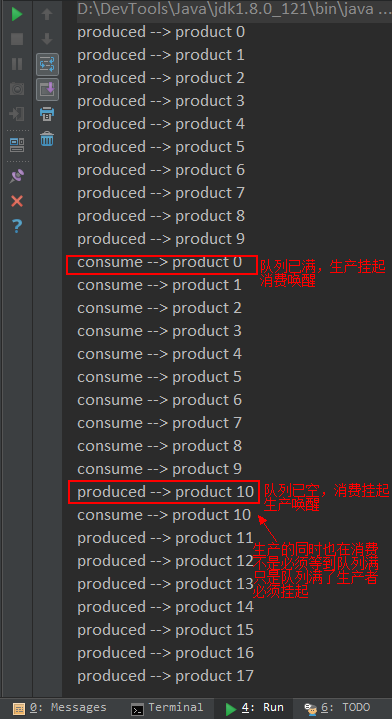

---
categories:
  - 'Java Core'
  - 'Java 线程'
date: 2017-03-12 14:51
status: public
title: 'Java线程之wait, notify 和 notifyAll'
---

参考并整合自 
[Java进阶（三）多线程开发关键技术](http://www.jasongj.com/java/multi_thread/)
[如何在 Java 中正确使用 wait, notify 和 notifyAll](http://developer.51cto.com/art/201508/487488.htm)

## 一、sleep和wait到底什么区别
1. 其实这个问题应该这么问——sleep和wait有什么相同点。因为这两个方法除了都能让当前线程暂停执行完，几乎没有其它相同点。

2. wait方法是Object类的方法，这意味着所有的Java类都可以调用该方法。sleep方法是Thread类的静态方法。

3. wait是在当前线程持有wait对象锁的情况下，**暂时放弃锁**，并让出CPU资源，并积极等待其它线程调用同一对象的notify或者notifyAll方法。注意，即使只有一个线程在等待，并且有其它线程调用了notify或者notifyAll方法，等待的线程只是被激活，但是**它必须得再次获得锁才能继续往下执行**。换言之，即使notify被调用，但只要锁没有被释放，原等待线程因为未获得锁仍然无法继续执行。


**此处通过生产者消费者问题来讲解如何使用 wait、notify 和 notifyAll 来实现线程间的通信。**


## 二、如何使用Wait

1. 调用哪个对象的wait 
  正确的方法是对在多线程间共享的那个Object来使用wait。在生产者消费者问题中，这个共享的Object就是那个缓冲区队列。
2. 何时调用wait
  wait方法需要释放锁，那么前提条件是它已经持有锁。所以wait和notify（或者notifyAll）方法都必须被包裹在synchronized语句块中（或者synchronized修饰的方法中），并且synchronized后锁的对象应该与调用wait方法的对象一样。否则抛出IllegalMonitorStateException
  既然我们应该在synchronized的函数或是synchronized语句块锁住的对象里调用wait，那哪个对象应该被synchronized呢？答案是，那个 你希望上锁的对象就应该被synchronized，即那个在多个线程间被共享的对象。在生产者消费者问题中，应该被synchronized的就是那个缓冲区队列。
3. 永远在循环（loop）里调用 wait 和 notify，不是在 If 语句
  if语句存在一些微妙的小问题，导致即使条件没被满足，你的线程你也有可能被错误地唤醒。所以如果你不在线程被唤 醒后再次使用while循环检查唤醒条件是否被满足，你的程序就有可能会出错——例如在缓冲区为满的时候生产者继续生成数据，或者缓冲区为空的时候消费者开始消耗数据。所以记住，永远在while循环而不是if语句中使用wait！

>关于第3点：根据自己的理解举个栗子~
>
>1. 程序运行2个消费者线程，1个生产者线程，consumer1 进入 synchronized 方法后发现缓冲区为空，调用 buffer.wait() 释放对象锁，此时 consumer1 进入 buffer 的`等待池`；
>2. producer 获得锁并开始生产数据；
>3. consumer2 想要进入 synchronized 方法消费数据，此时锁仍旧被 producer 持有，consumer2 进入 buffer 的`锁池`
>4. producer 生产完数据，调用 buffer.notifyAll() 之后，释放锁；
>5. 此时 consumer1 被唤醒，从 buffer 的`等待池` 移动到 `锁池` 竞争锁；
>6. consumer2 在竞争中获得锁，消费了唯一一个消息后释放锁；
>7. consumer1 最后获得锁，从调用 wait() 的地方继续运行；
>8. 那么问题来了，如果此时的条件检查不是在循环中，那么 consumer1 将消费一个空的缓冲区而出错，如果条件检查是在循环中，那么 consumer1 被唤醒后发现条件还是不满足，那么会继续调用 buffer.wait() 释放锁，等待生产者线程生产消息。


**基于以上认知，下面这个是使用wait和notify函数的规范代码模板：**
```java
// The standard idiom for calling the wait method in Java 
synchronized (sharedObject) { 
    while (condition) { 
        sharedObject.wait(); 
        // (Releases lock, and reacquires on wakeup) 
    } 
    // do action based upon condition e.g. take or put into queue 
} 
```
就像我之前说的一样，在while循环里使用wait的目的，是在线程被唤醒的前后都持续检查条件是否被满足。如果条件并未改变，wait被调用之前notify的唤醒通知就来了，那么这个线程就不会被真正地唤醒。


## 三、示例程序

以下是一段生产者和消费者利用 wait 和 notifyAll 方法通信的 Demo
```java
package org.demo;

import java.util.LinkedList;
import java.util.Queue;

/**
 * Created by jzchen on 2017/3/12 0012.
 */
public class ProducerComsumerDemo {


    public static void main(String[] args) {

        Queue<String> buffer = new LinkedList<>();
        int maxSize = 10;

        Producer producer = new Producer(buffer, maxSize, "Producer");
        Consumer consumer = new Consumer(buffer, maxSize, "Consumer");

        producer.start();
        consumer.start();

    }

    protected static class Producer extends Thread {

        private Queue<String> buffer = null;
        private int maxSize = 0;
        private String name = null;

        public Producer(Queue<String> buffer, int maxSize, String name) {
            this.buffer = buffer;
            this.maxSize = maxSize;
            this.name = name;
        }

        @Override
        public void run() {

            int product = 0;
            while (true) {
                synchronized (buffer) {

                    //队列已满时释放锁，等待消费
                    while (buffer.size() == maxSize) {
                        try {
                            buffer.wait();
                        } catch (InterruptedException e) {
                            e.printStackTrace();
                        }
                    }

                    //生产产品
                    try {
                        Thread.sleep(500);
                    } catch (InterruptedException e) {
                        e.printStackTrace();
                    }

                    System.out.println("produced --> product " + product);
                    buffer.add(String.valueOf(product++));
                    buffer.notifyAll();
                }
            }
        }
    }

    protected static class Consumer extends Thread {

        private Queue<String> buffer = null;
        private int maxSize = 0;
        private String name = null;

        public Consumer(Queue<String> buffer, int maxSize, String name) {
            this.buffer = buffer;
            this.maxSize = maxSize;
            this.name = name;
        }

        @Override
        public void run() {

            while (true) {
                synchronized (buffer) {
                    //队列为空时释放锁，等待生产
                    while (buffer.isEmpty()) {
                        try {
                            buffer.wait();
                        } catch (InterruptedException e) {
                            e.printStackTrace();
                        }
                    }

                    //消费产品
                    try {
                        Thread.sleep(1000);
                    } catch (InterruptedException e) {
                        e.printStackTrace();
                    }

                    System.out.println("consume --> product " + buffer.poll());
                    buffer.notifyAll();
                }
            }
        }
    }
}
```

 **可能看到的结果**




## 四、锁池和等待池

在Java中，每个对象都有两个池，锁(monitor)池和等待池

- **锁池**：假设线程A已经拥有了某个对象(注意:不是类)的锁，而其它的线程想要调用这个对象的某个synchronized方法(或者synchronized块)，由于这些线程在进入对象的synchronized方法之前必须先获得该对象的锁的拥有权，但是该对象的锁目前正被线程A拥有，所以这些线程就进入了该对象的锁池中。
- **等待池**：假设一个线程A调用了某个对象的wait()方法，线程A就会释放该对象的锁(因为wait()方法必须出现在synchronized中，这样自然在执行wait()方法之前线程A就已经拥有了该对象的锁)，同时线程A就进入到了该对象的等待池中。如果另外的一个线程调用了相同对象的notifyAll()方法，那么处于该对象的等待池中的线程就会全部进入该对象的锁池中，准备争夺锁的拥有权。如果另外的一个线程调用了相同对象的notify()方法，那么仅仅有一个处于该对象的等待池中的线程(随机)会进入该对象的锁池.

**深入理解**： 
如果线程调用了对象的 wait()方法，那么线程便会处于该对象的等待池中，等待池中的线程不会去竞争该对象的锁。 
当有线程调用了对象的 notifyAll()方法（唤醒所有 wait 线程）或 notify()方法（只随机唤醒一个 wait 线程），被唤醒的的线程便会进入该对象的锁池中，锁池中的线程会去竞争该对象锁。 
优先级高的线程竞争到对象锁的概率大，假若某线程没有竞争到该对象锁，它还会留在锁池中，唯有线程再次调用 wait()方法，它才会重新回到等待池中。而竞争到对象锁的线程则继续往下执行，直到执行完了 synchronized 代码块，它会释放掉该对象锁，这时锁池中的线程会继续竞争该对象锁。