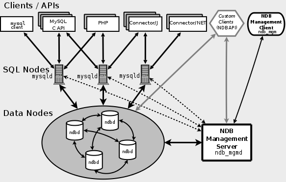

## MySQL Cluster介绍

[MySQL Cluster](http://dev.mysql.com/doc/refman/5.6/en/mysql-cluster-overview.html)是一个高性能、可扩展、集群化数据库产品。MySQL Cluster是一个**基于NDB Cluster存储引擎**的完整分布式数据库系统，采用**无共享**的数据存储技术，实时同步且支持快速故障切换、事务。NDB是一种in-memory的存储引擎，它具有可用性高和数据一致性好的特点。

MySQL Cluster可由多台服务器组成的、同时对外提供数据管理服务的分布式集群系统。通过合理的配置，可以将服务请求在多台物理机上分发实现负载均衡 ；同时内部实现了冗余机制，在部分服务器宕机的情况下，整个集群对外提供的服务不受影响，从而能达到99.999%以上的高可用性。




## MySQL Cluster分为三类节点

- **数据节点（Data Nodes）**：用于存储集群的数据。实现底层数据存储的功能，保存Cluster 的数据。每一个NDB 节点保存完整数据的一部分（或者一份完整的数据，视节点数目和配置而定），在MySQL Cluster 里面叫做一个fragment。而每一个fragment，正常情况来讲都会在其他的主机上面有一份（或者多分）完全相同的镜像存在。这些都是通过配置来完成的，所以只要配置得当，MySQL Cluster 在存储层不会出现单点的问题。数据节点是用命令`ndbd`启动的。
- **SQL节点（SQL Nodes）**：向外提供一个标准的SQL语言编程接口。SQL节点负责向数据节点传送访问请求，具体集群过程以及数据库底层均对外透明。
  SQL节点提供用户SQL指令请求，解析、连接管理，query优化和响、cache管理等、数据merge、sort，裁剪等功能，当SQL节点启动时，将向管理节点同步架构信息，用以数据查询路由。SQL节点作为查询入口，需要消耗大量cpu及内存资源，可使用分布式管理节点，并在SQL节点外封装一层请求分发及HA控制机制可解决单点及性能问题，其提供了线性扩展功能。SQL节点是使用命令`mysqld -ndbcluster`启动的，或将`ndbcluster`添加到“my.cnf”后使用“mysqld”启动。
- **管理节点（NDB Management Server）**：负责整个Cluster 集群中各个节点的管理工作，包括集群的配置，启动关闭各节点，以及实施数据的备份恢复等。管理节点会获取整个Cluster 环境中各节点的状态和错误信息，并且将各Cluster 集群中各个节点的信息反馈给整个集群中其他的所有节点。通常只需配置一个管理节点；然而为了排除单点故障需要，有可能的话，尽量增加管理节点的数量。MGM节点是用命令`ndb_mgm`启动的。


## MySQL Cluster搭建

### 使用 NDB Cluster Auto-Installer 安装

运行 `bin/ndb_setup.py`，会自动打开 Web 浏览器，根据提示设置。

在设置的最后一步包含了各节点的**启动命令**和**配置文件**


### 手工安装配置

暂略


### 管理集群

使用命令 `ndb_mgm` 连接管理节点

使用 `SHOW` 命令查看集群各节点状态

```
cjz-MBP:bin cjz$ ndb_mgm
-- NDB Cluster -- Management Client --
ndb_mgm> show
Connected to Management Server at: localhost:1186
Cluster Configuration
---------------------
[ndbd(NDB)]	2 node(s)
id=1	@127.0.0.1  (mysql-5.7.21 ndb-7.5.9, Nodegroup: 0, *)
id=2	@127.0.0.1  (mysql-5.7.21 ndb-7.5.9, Nodegroup: 0)

[ndb_mgmd(MGM)]	1 node(s)
id=49	@127.0.0.1  (mysql-5.7.21 ndb-7.5.9)

[mysqld(API)]	5 node(s)
id=50 (not connected, accepting connect from 127.0.0.1)
id=51 (not connected, accepting connect from 127.0.0.1)
id=52 (not connected, accepting connect from 127.0.0.1)
id=53	@127.0.0.1  (mysql-5.7.21 ndb-7.5.9)
id=54	@127.0.0.1  (mysql-5.7.21 ndb-7.5.9)
```


### 遇到的错误

```
ERROR 2002 (HY000): Can't connect to local MySQL server through socket /tmp/mysql.sock
```

是因为不能通过socket文件连接mysql服务器，先说解决方案，有两种：

1. 执行 `sudo ln -s /var/lib/mysql/mysql.sock /tmp/mysql.sock` 
2. 将连接mysql的语句改成 `mysql -h 127.0.0.1 -u root -p`

**再来分析为什么出现这种错误以及这么解决的原因：**

mysql使用unix socket或者tcp来连接数据库进行通讯，默认不加 -h选项时使用的就是localhost即unixsocket，此时会通过/tmp/mysql.sock来通讯，但是在配置文件中默认生成的socket文件是在/var/lib/mysql/mysql.sock(不同安装可能不同，建议查看/etc/my.cnf确认),所以要想mysql使用这个文件通讯，最简单的方法就是建立软链接，一劳永逸，此为方法一。

方法二就是强制mysql使用tcp通讯，因为127.0.0.1对于mysql来说走的是tcp协议而非unixsocket，这种方法的弊端就是每次都要指明本地地址127.0.0.1


[NDB Cluster Auto-Installer Overview](https://dev.mysql.com/doc/refman/5.7/en/mysql-cluster-install-auto-overview.html)

[MySQL Cluster搭建及配置](https://segmentfault.com/a/1190000003715950)


