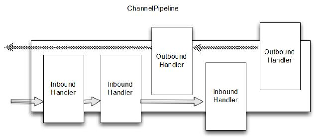

本章主要内容

- Channel
- ChannelHandler
- ChannePipeline
- ChannelHandlerContext

我们在上一章研究的 ByteBuf 是一个用来“包装”数据的容器。在本章我们将探讨这些容器是如何在应用程序中进行传输的，以及如何处理它们“包装”的数据。

Netty 在这方面提供了强大的支持。它让Channelhandler 链接在ChannelPipeline上使数据处理更加灵活和模块化。

在这一章中，下面我们会遇到各种各样 Channelhandler，ChannelPipeline 的使用案例，以及重要的相关的类Channelhandlercontext 。我们将展示如何将这些基本组成的框架可以帮助我们写干净可重用的处理实现。


## ChannelHandler 家族

在我们深入研究 ChannelHandler 内部之前，让我们花几分钟了解下这个 Netty 组件模型的基础。这里先对ChannelHandler 及其子类做个简单的介绍。

### Channel 生命周期

Channel 有个简单但强大的状态模型，与 ChannelInboundHandler API 密切相关。下面表格是 Channel 的四个状态

Table 6.1 Channel lifeycle states

| 状态                  | 描述                                    |
| ------------------- | ------------------------------------- |
| channelUnregistered | channel已创建但未注册到一个 EventLoop.          |
| channelRegistered   | channel 注册到一个 EventLoop.              |
| channelActive       | channel 变为活跃状态(连接到了远程主机)，现在可以接收和发送数据了 |
| channelInactive     | channel 处于非活跃状态，没有连接到远程主机             |

Channel 的正常的生命周期如下图，当状态出现变化，就会触发对应的事件，这样就能与 ChannelPipeline 中的 ChannelHandler进行及时的交互。

Figure 6.1 Channel State Model


### ChannelHandler 生命周期

ChannelHandler 定义的生命周期操作如下表，当 ChannelHandler 添加到 ChannelPipeline，或者从 ChannelPipeline 移除后，对应的方法将会被调用。每个方法都传入了一个 ChannelHandlerContext 参数

Table 6.2 ChannelHandler lifecycle methods

| 类型              | 描述                                       |
| --------------- | ---------------------------------------- |
| handlerAdded    | 当 ChannelHandler 添加到 ChannelPipeline 调用  |
| handlerRemoved  | 当 ChannelHandler 从 ChannelPipeline 移除时调用 |
| exceptionCaught | 当 ChannelPipeline 执行抛出异常时调用              |


### ChannelHandler 子接口

Netty 提供2个重要的 ChannelHandler 子接口：

- ChannelInboundHandler - 处理进站数据和所有状态更改事件
- ChannelOutboundHandler - 处理出站数据，允许拦截各种操作


### ChannelHandler 适配器

Netty 提供了一个简单的 ChannelHandler 框架实现，给所有声明方法签名。

这个类 `ChannelHandlerAdapter` 的方法,主要推送事件 到 pipeline 下个 ChannelHandler 直到 pipeline 的结束。这个类 也作为 ChannelInboundHandlerAdapter 和ChannelOutboundHandlerAdapter 的基础。所有三个适配器类的目的是作为自己的实现的起点;您可以扩展它们,覆盖你需要自定义的方法。


### ChannelInboundHandler

ChannelInboundHandler 的生命周期方法在下表中，当接收到数据或者与之关联的 Channel 状态改变时调用。之前已经注意到了，这些方法与 Channel 的生命周期接近

Table 6.3 ChannelInboundHandler methods

| 类型                        | 描述                                       |
| ------------------------- | ---------------------------------------- |
| channelRegistered         | 当Channel 已经注册到它的EventLoop 并且能够处理I/O 时被调用 |
| channelUnregistered       | 当Channel 从它的EventLoop 注销并且无法处理任何I/O 时被调用 |
| channelActive             | 当Channel 处于活动状态时被调用；Channel 已经连接/绑定并且已经就绪 |
| channelInactive           | 当Channel 离开活动状态并且不再连接它的远程节点时被调用          |
| channelReadComplete       | 当Channel上的一个读操作完成时被调用                    |
| channelRead               | 当从Channel 读取数据时被调用                       |
| channelWritabilityChanged | 当Channel 的可写状态发生改变时被调用。用户可以确保写操作不会完成得太快（以避免发生OutOfMemoryError）或者可以在Channel 变为再次可写时恢复写入。可以通过调用Channel 的isWritable()方法来检测Channel 的可写性。与可写性相关的阈值可以通过Channel.config().setWriteHighWaterMark()和Channel.config().setWriteLowWater-Mark()方法来设置 |
| userEventTriggered(...)   | 当ChannelnboundHandler.fireUserEventTriggered()方法被调用时被调用，因为一个POJO 被传经了ChannelPipeline |

注意，ChannelInboundHandler 实现覆盖了 channelRead() 方法处理进来的数据用来响应释放资源。Netty 在 ByteBuf 上使用了资源池，所以当执行释放资源时可以减少内存的消耗。


Listing 6.1 Handler to discard data

```java
@ChannelHandler.Sharable
public class DiscardHandler extends ChannelInboundHandlerAdapter {  //1.扩展 ChannelInboundHandlerAdapter

    @Override
    public void channelRead(ChannelHandlerContext ctx,
                                     Object msg) {
        ReferenceCountUtil.release(msg); 	//2.ReferenceCountUtil.release() 来丢弃收到的信息
    }

}
```


Netty 用一个 WARN-level 日志条目记录未释放的资源,使其能相当简单地找到代码中的违规实例。然而,由于手工管理资源会很繁琐,您可以通过使用 SimpleChannelInboundHandler 简化问题。如下：


Listing 6.2 Handler to discard data

```java
@ChannelHandler.Sharable
public class SimpleDiscardHandler extends SimpleChannelInboundHandler<Object> {  //1.扩展 SimpleChannelInboundHandler

    @Override
    public void channelRead0(ChannelHandlerContext ctx,
                                     Object msg) {
        // No need to do anything special //2.不需做特别的释放资源的动作
    }

}
```

注意 **SimpleChannelInboundHandler** 会自动释放资源，而无需存储任何信息的引用。


### ChannelOutboundHandler

ChannelOutboundHandler 提供了出站操作时调用的方法。这些方法会被 Channel, ChannelPipeline, 和 ChannelHandlerContext 调用。

ChannelOutboundHandler 另个一个强大的方面是它具有在请求时延迟操作或者事件的能力。比如，当你在写数据到 remote peer 的过程中被意外暂停，你可以延迟执行刷新操作，然后在迟些时候继续。

下面显示了 ChannelOutboundHandler 的方法（继承自 ChannelHandler 未列出来）

Table 6.4 ChannelOutboundHandler methods

| 类型         | 描述                              |
| ---------- | ------------------------------- |
| bind       | 当请求将Channel 绑定到本地地址时被调用         |
| connect    | 当请求将Channel 连接到远程节点时被调用         |
| disconnect | 当请求将Channel 从远程节点断开时被调用         |
| close      | 当请求关闭Channel 时被调用               |
| deregister | 当请求将Channel 从它的EventLoop 注销时被调用 |
| read       | 当请求从Channel 读取更多的数据时被调用         |
| flush      | 当请求通过Channel 将入队数据冲刷到远程节点时被调用   |
| write      | 当请求通过Channel 将数据写到远程节点时被调用      |

几乎所有的方法都将 ChannelPromise 作为参数,一旦请求结束要通过 ChannelPipeline 转发的时候，必须通知此参数。


**ChannelPromise vs. ChannelFuture**

ChannelPromise 是 特殊的 ChannelFuture，允许你的 ChannelPromise 及其 操作 成功或失败。所以任何时候调用例如 Channel.write(...) 一个新的 ChannelPromise将会创建并且通过 ChannelPipeline传递。这次写操作本身将会返回 ChannelFuture， 这样只允许你得到一次操作完成的通知。Netty 本身使用 ChannelPromise 作为返回的 ChannelFuture 的通知，事实上在大多数时候就是 ChannelPromise 自身（ChannelPromise 扩展了 ChannelFuture）

如前所述,ChannelOutboundHandlerAdapter 提供了一个实现了 ChannelOutboundHandler 所有基本方法的实现的框架。 这些简单事件转发到下一个 ChannelOutboundHandler 管道通过调用 ChannelHandlerContext 相关的等效方法。你可以根据需要自己实现想要的方法。


### 资源管理

- 每当通过调用ChannelInboundHandler.channelRead()或者ChannelOutbound-Handler.write()方法来处理数据时，你都需要确保没有任何的资源泄漏。你可能还记得在前面的章节中所提到的，Netty 使用引用计数来处理池化的ByteBuf。所以在完全使用完某个ByteBuf 后，调整其引用计数是很重要的。


- 为了帮助你诊断潜在的（资源泄漏）问题，Netty提供了class ResourceLeakDetector，它将对你应用程序的缓冲区分配做大约1%的采样来检测内存泄露。相关的开销是非常小的。

  如果检测到了内存泄露，将会产生类似于下面的日志消息：

```
LEAK: ByteBuf.release() was not called before it's garbage-collected. Enable
advanced leak reporting to find out where the leak occurred. To enable
advanced leak reporting, specify the JVM option
'-Dio.netty.leakDetectionLevel=ADVANCED' or call
Resourc eLeakDetector.setLevel().
```


Netty 目前定义了4 种泄漏检测级别，如表6-5 所示。

Table 6.5 Leak detection levels

| 级别描 述    |                                          |
| -------- | ---------------------------------------- |
| Disables | 禁用泄漏检测。只有在详尽的测试之后才应设置为这个值                |
| SIMPLE   | 使用1%的默认采样率检测并报告任何发现的泄露。这是默认级别，适合绝大部分的情况  |
| ADVANCED | 使用默认的采样率，报告所发现的任何的泄露以及对应的消息被访问的位置        |
| PARANOID | 类似于ADVANCED，但是其将会对每次（对消息的）访问都进行采样。这对性能将会有很大的影响，应该只在调试阶段使用 |


泄露检测级别可以通过将下面的Java 系统属性设置为表中的一个值来定义：

```
java -D io.netty.leakDetectionLevel=ADVANCED
```


这样，我们就能在 ChannelInboundHandler.channelRead(...) 和 ChannelOutboundHandler.write(...) 避免泄漏。

当你处理 channelRead(...) 操作，并在消费消息(不是通过 ChannelHandlerContext.fireChannelRead(...) 来传递它到下个 ChannelInboundHandler) 时，要释放它，如下：

Listing 6.3 Handler that consume inbound data

```java
@ChannelHandler.Sharable
public class DiscardInboundHandler extends ChannelInboundHandlerAdapter {  
	//1.继承 ChannelInboundHandlerAdapter

    @Override
    public void channelRead(ChannelHandlerContext ctx,
                                     Object msg) {
        ReferenceCountUtil.release(msg); 
        //2使用 ReferenceCountUtil.release(...) 来释放资源
    }

}
```

**所以记得，每次处理消息时，都要释放它。**


**SimpleChannelInboundHandler -消费入站消息更容易**

使用入站数据和释放它是一项常见的任务，Netty 为你提供了一个特殊的称为 SimpleChannelInboundHandler 的 ChannelInboundHandler 的实现。**该实现将自动释放一个消息，一旦这个消息被用户通过channelRead0() 方法消费。**


当你在处理写操作，并丢弃消息时，你需要释放它。现在让我们看下实际是如何操作的。

Listing 6.4 Handler to discard outbound data

```java
@ChannelHandler.Sharable 
  public class DiscardOutboundHandler extends ChannelOutboundHandlerAdapter { 
  //1.继承 ChannelOutboundHandlerAdapter
  @Override
  public void write(ChannelHandlerContext ctx,
                                   Object msg, ChannelPromise promise) {
      ReferenceCountUtil.release(msg);  //2.使用 ReferenceCountUtil.release(...) 来释放资源
      promise.setSuccess();    		//3.通知 ChannelPromise 数据已经被处理

  }
}
```

重要的是，释放资源并通知 ChannelPromise。如果，ChannelPromise 没有被通知到，这可能会引发 ChannelFutureListener 不会被处理的消息通知的状况。

所以，总结下：

- 如果消息是被 `消耗/丢弃` ， 并不会被传入下个 ChannelPipeline 的 ChannelOutboundHandler ，调用ReferenceCountUtil.release(message) 。
- 一旦消息经过实际的传输，在消息被写或者 Channel 关闭时，它将会自动释放。


## ChannelPipeline

ChannelPipeline 是一系列的ChannelHandler 实例,用于拦截 流经一个 Channel 的入站和出站事件,ChannelPipeline允许用户自己定义对入站/出站事件的处理逻辑，以及pipeline里的各个Handler之间的交互。

每一次创建了新的Channel ,都会新建一个新的 ChannelPipeline并绑定到Channel上。这个关联是 永久性的;Channel 既不能附上另一个 ChannelPipeline 也不能分离当前这个。这些都由Netty负责完成,而无需开发人员的特别处理。

根据它的起源,一个事件将由 ChannelInboundHandler 或 ChannelOutboundHandler 处理。随后它将调用 ChannelHandlerContext 实现转发到下一个相同的超类型的处理程序。


**ChannelHandlerContext**

一个 ChannelHandlerContext 使 ChannelHandler 与 ChannelPipeline 和 其他处理程序交互。**一个处理程序可以通知下一个 ChannelPipeline 中的 ChannelHandler 甚至动态修改 ChannelPipeline 的归属。**

下图展示了用于入站和出站 ChannelHandler 的 典型 ChannelPipeline 布局。



Figure 6.2 ChannelPipeline and ChannelHandlers


上图说明了 ChannelPipeline 主要是一系列 ChannelHandler。通过ChannelPipeline ChannelPipeline 还提供了方法传播事件本身。如果一个入站事件被触发，它将被传递的从 ChannelPipeline 开始到结束。举个例子,在这个图中出站 I/O 事件将从 ChannelPipeline 右端开始一直处理到左边。

**ChannelPipeline 相对论**

你可能会说,从 ChannelPipeline 事件传递的角度来看,ChannelPipeline 的“开始” 取决于是否入站或出站事件。然而,Netty 总是指 ChannelPipeline 入站口(图中的左边)为“开始”,出站口(右边)作为“结束”。当我们完成使用 ChannelPipeline.add*() 添加混合入站和出站处理程序,每个 ChannelHandler 的“顺序”是它的地位从“开始”到“结束”正如我们刚才定义的。因此,如果我们在图6.1处理程序按顺序从左到右第一个ChannelHandler被一个入站事件将是#1,第一个处理程序被出站事件将是#5

随着管道传播事件,它决定下个 ChannelHandler 是否是相匹配的方向运动的类型。如果没有,ChannelPipeline 跳过 ChannelHandler 并继续下一个合适的方向。**记住,一个处理程序可能同时实现ChannelInboundHandler 和 ChannelOutboundHandler 接口。**


### 修改 ChannelPipeline

ChannelHandler 可以实时修改 ChannelPipeline 的布局，通过添加、移除、替换其他 ChannelHandler（也可以从 ChannelPipeline 移除 ChannelHandler 自身）。这个 是 ChannelHandler 重要的功能之一。

Table 6.6 ChannelHandler methods for modifying a ChannelPipeline

| 名称                                  | 描述                                      |
| ----------------------------------- | --------------------------------------- |
| addFirst addBefore addAfter addLast | 添加 ChannelHandler 到 ChannelPipeline.    |
| Remove                              | 从 ChannelPipeline 移除 ChannelHandler.    |
| Replace                             | 在 ChannelPipeline 替换另外一个 ChannelHandler |

下面展示了操作

Listing 6.5 Modify the ChannelPipeline

```java
ChannelPipeline pipeline = null; // get reference to pipeline;
FirstHandler firstHandler = new FirstHandler();  //1.创建一个 FirstHandler 实例
pipeline.addLast("handler1", firstHandler); 	//2.添加该实例作为 "handler1" 到 ChannelPipeline
pipeline.addFirst("handler2", new SecondHandler()); //3.添加 SecondHandler 实例作为 "handler2" 到 ChannelPipeline 的第一个槽，这意味着它将替换之前已经存在的 "handler1"
pipeline.addLast("handler3", new ThirdHandler()); //4.添加 ThirdHandler 实例作为"handler3" 到 ChannelPipeline 的最后一个槽

pipeline.remove("handler3"); 	//5.通过名称移除 "handler3"
pipeline.remove(firstHandler);   //6.通过引用移除 FirstHandler (因为只有一个，所以可以不用关联名字 "handler1"）

//7.将作为"handler2"的 SecondHandler 实例替换为作为 "handler4"的 FourthHandler
pipeline.replace("handler2", "handler4", new ForthHandler()); 
```

以后我们将看到,这种轻松添加、移除和替换 ChannelHandler 能力， 适合非常灵活的实现逻辑。


**ChannelHandler 执行 ChannelPipeline 和阻塞**

通常每个 ChannelHandler 添加到 ChannelPipeline 将处理事件 传递到 EventLoop( I/O 的线程)。至关重要的是不要阻塞这个线程， 它将会负面影响的整体处理I/O。 有时可能需要使用阻塞 api 接口来处理遗留代码。对于这个情况下,ChannelPipeline 已有 add() 方法,它接受一个EventExecutorGroup。如果一个定制的 EventExecutorGroup 传入事件将由含在这个 EventExecutorGroup 中的 EventExecutor之一来处理，并且从 Channel 的 EventLoop 本身离开。一个默认实现,称为来自 Netty 的 DefaultEventExecutorGroup

除了上述操作，其他访问 ChannelHandler 的方法如下：

Table 6.7 ChannelPipeline operations for retrieving ChannelHandlers