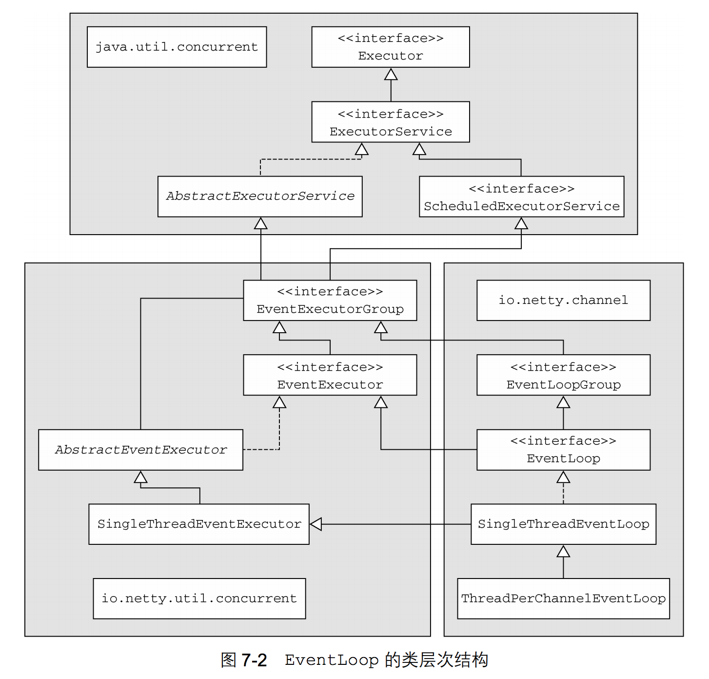

本章介绍

- 线程模型的总览
- EventLoop
- 并发
- 任务执行
- 任务调度

线程模型定义了应用或者框架如何执行你的代码，所以选择线程模型极其重要。Netty 提供了一个简单强大的线程模型来帮助我们简化代码。所有 ChannelHandler，包括业务逻辑，都**保证由一个 Thread 同时执行特定的 Channel**。这并不意味着Netty不能使用多线程，只是 Netty 限制每个Channel 都由一个 Thread 处理，这种设计适用于非阻塞 IO 操作。

读完本章就会深刻理解 Netty 的线程模型以及 Nett y团队为什么会选择这样的线程模型，这些信息可以让我们在使用 Netty 时让程序由最好的性能。此外，Netty 提供的线程模型还可以让我们编写整洁简单的代码，以保持代码的整洁性；我们还会学习 Netty 团队的经验，过去使用其他的线程模型，现在我们将使用 Netty 提供的更容易更强大的线程模型来开发。

本章假设如下：

- 你明白线程是什么以及如何使用，并有使用线程的工作经验。若不是这样，就请花些时间来了解清楚这些知识。推荐一本书：《Java Concurrency in Practice（Java 并发编程实战）》（Brian Goetz）。
- 你了解多线程应用程序及其设计，也包括如何保证线程安全和获取最佳性能。


## EventLoop

事件循环所做的正如它的名字所说的。它运行在一个循环里,直到它的终止。这符合网络框架的设计,因为他们需要在一个循环为一个特定的连接运行事件。这不是 Netty 发明新的东西;其他框架和实现已经这样做了。

下面的清单显示了典型的 EventLoop 逻辑。请注意这是为了更好的说明这个想法而不是单单展示 Netty 实现本身。

Listing 14.1 Execute task in EventLoop

```java
while (!terminated) {
    //1.阻塞直到事件可以运行
    List<Runnable> readyEvents = blockUntilEventsReady(); 
  
    for (Runnable ev: readyEvents) {
        ev.run(); //2.循环所有事件，并运行他们
    }
}
```

在 Netty 中使用 EventLoop 接口代表事件循环，EventLoop 是从EventExecutor 和 ScheduledExecutorService 扩展而来，所以可以将任务直接交给 EventLoop 执行。类关系图如下



Figure 15.2 EventLoop class hierarchy

EventLoop 是完全由一个 Thread,从未改变。为了更合理利用资源,根据配置和可用的内核， Netty 可以使用多个 EventLoop。

**事件/任务执行顺序**

一个重要的细节关于事件和任务的执行顺序是,**事件/任务执行顺序按照FIFO(先进先出)**。这是必要的,因为否则事件不能按顺序处理,所处理的字节将不能保证正确的顺序。这将导致问题,所以这个不是所允许的设计。


### Netty 4 中的 I/O 和事件处理

Netty 使用 I/O 事件,被各种 I/O 操作运输本身所触发。 这些 I/O 操作，例如网络 API 的一部分，由Java 和底层操作系统提供。

一个区别在于,一些操作(或者事件)是由 Netty 的本身的传输实现触发的，一些是由用户自己。例如读事件通常是由传输本身在读取一些数据时触发。相比之下,写事件通常是由用户本身,例如,当调用 Channel.write(…)。

究竟需要做一次处理一个事件取决于事件的性质。经常会读网络栈的数据转移到您的应用程序。有时它会在另一个方向做同样的事情,例如,把数据从应用程序到网络堆栈(内核)发送到它的远端。但不限于这种类型的事务;重要的是,所使用的逻辑是通用的,灵活地处理各种各样的用例。

I/O 和事件处理的一个重要的事情在 Netty 4,是每一个 I/O 操作和事件总是由 EventLoop 本身处理,以及分配给 EventLoop 的 Thread。

我们应该注意,Netty 不总是使用我们描述的线程模型(通过 EventLoop 抽象)。在下一节中,你会了解 Netty 3 中使用的线程模型。这将帮助你理解为什么现在用新的线程模型以及为什么使用取代了 Netty 3 中仍然使用的旧模式。