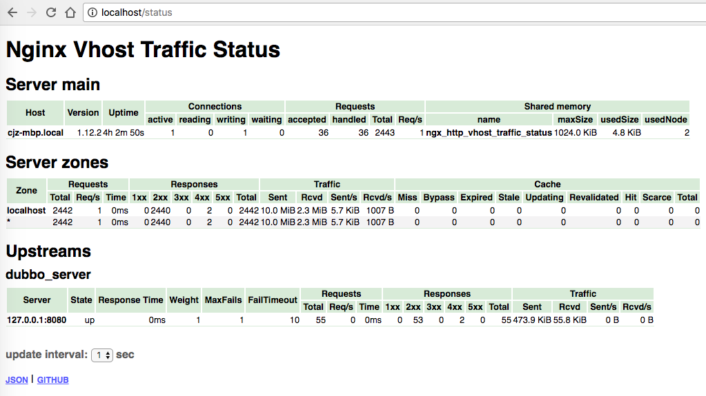

## Nginx 的安装

### **mac homebrew **安装 nginx

```shell
brew install nginx
```

* 安装完成后的信息：
  * /usr/local/etc/nginx/nginx.conf （配置文件路径）
  * /usr/local/var/www 			（服务器默认路径）
  * /usr/local/Cellar/nginx/1.6.2 	（貌似是安装路径）


* 通过 homebrew 安装的 nginx 会将路径写到环境变量中，运行：

  ```
  nginx				启动 nginx
  nginx -s quit       平稳关闭Nginx，保存相关信息，有安排的结束web服务。
  nginx -s stop       快速关闭Nginx，可能不保存相关信息，并迅速终止web服务。
  nginx -s reload     因改变了Nginx相关配置，需要重新加载配置而重载。
  nginx -s reopen     重新打开日志文件。
  nginx -c filename   为 Nginx 指定一个配置文件，来代替缺省的。
  nginx -t            不运行，而仅仅测试配置文件。nginx 将检查配置文件的语法的正确性，并尝试打开配置文件中所引用到的文件。
  nginx -v            显示 nginx 的版本。
  nginx -V            显示 nginx 的版本，编译器版本和配置参数。
  ```

</br>

### 手动编译源码安装**nginx**

手动编译源码安装修改配置和定制模块等比较方便

* 下载 [nginx源码](https://nginx.org/en/download.html) 选择一个适合自己的版本

- 执行 configuration ，生成 makefile

  - 如果不需要定制编译的模块，直接执行 `configuration`

  ```
  cd nginx-1.12.2
  ./configuration
  ```

  - 如果需要设置一些属性，或者定制编译的模块

  ```shell
  ./configure \
  --with-http_gzip_static_module       	 \
  --with-http_stub_status_module       	 \
  --with-pcre                        		 \
  --with-http_realip_module           	 \
  --without-http_scgi_module            	 \
  --without-http_uwsgi_module        		 \
  --without-http_fastcgi_module      	  	 \
  --with-debug							 \
  --add-module=./nginx-module-vts
  ```

执行完 `configuration `可以看到除了一些 check 信息之外显示了默认的配置

```
Configuration summary
  + using system PCRE library
  + OpenSSL library is not used
  + using system zlib library

  nginx path prefix: "/usr/local/nginx"
  nginx binary file: "/usr/local/nginx/sbin/nginx"
  nginx modules path: "/usr/local/nginx/modules"
  nginx configuration prefix: "/usr/local/nginx/conf"
  nginx configuration file: "/usr/local/nginx/conf/nginx.conf"
  nginx pid file: "/usr/local/nginx/logs/nginx.pid"
  nginx error log file: "/usr/local/nginx/logs/error.log"
  nginx http access log file: "/usr/local/nginx/logs/access.log"
  nginx http client request body temporary files: "client_body_temp"
  nginx http proxy temporary files: "proxy_temp"
  nginx http fastcgi temporary files: "fastcgi_temp"
  nginx http uwsgi temporary files: "uwsgi_temp"
  nginx http scgi temporary files: "scgi_temp"
```

- 执行 configuration 命令后会生成一个 `makefile` 文件，执行

```
make
sudo make install 
```

`make` 命令编译代码，`make install` 命令会将 nginx 安装到 `/usr/local/nginx` 路径下

* 切换到安装目录，启动服务（可能需要sudo）

```
cd /usr/local/nginx
sbin/nginx				启动 nginx
```

</br>

### 添加第三方模块

* 在编译之前配置里添加第三方模块

```
./configure \
...
...
## some configuration
...
...
--add-module=./nginx-module-vts
```

- 重新编译

```
make
sudo make install 
sudo make upgrade
```

* 修改配置文件

```yaml
#user  nobody;
worker_processes  1;

#error_log  logs/error.log;
#error_log  logs/error.log  notice;
#error_log  logs/error.log  info;

#pid        logs/nginx.pid;

events {
    worker_connections  1024;
}


http {
    include       mime.types;
    default_type  application/octet-stream;

    # some conf......

    # enable module nginx-module-vts
    # 这个模块是用来监控nginx的运行情况的，比如反向代理的服务器，cache等情况。
    vhost_traffic_status_zone;
    
    server {
    	#监听80端口，80端口是知名端口号，用于HTTP协议
        listen       80;
        server_name  localhost;
        
        # some conf......
        
        location / {
            root   html;
            index  index.html index.htm;
        }
        
        location /status {
            vhost_traffic_status_display;
            vhost_traffic_status_display_format html;
        }
    }
}
```

主要就是在 `http` 模块下添加  `vhost_traffic_status_zone;`  和在 `server` 模块下添加 `location /status`

*  访问 `localhost/status`，可以看到



</br>

### 开启 dubug 模式（日志将记录 debug 信息）

* 修改配置后重新编译

```
./configure \
...
...
## some configuration
...
...
--add-module=./nginx-module-vts	\
--with-debug
```

修改配置文件

```
vim ./conf/nginx.conf
```

```yaml
#user  nobody;
worker_processes  1;

#error_log  logs/error.log;
#error_log  logs/error.log  notice;
#error_log  logs/error.log  info;
error_log  /usr/local/nginx/logs/error.log debug;	// 开启 debug 日志，一并写入错误日志文件中

#pid        logs/nginx.pid;

events {
    worker_connections  1024;
}


http {
    include       mime.types;
    default_type  application/octet-stream;

    # some conf......
    
    server {
    	#监听80端口，80端口是知名端口号，用于HTTP协议
        listen       80;
        server_name  localhost;
        
        # some conf......
        
        location / {
            root   html;
            index  index.html index.htm;
        }
        
        # some conf......
    }
}
```

主要是添加 `error_log  /usr/local/nginx/logs/error.log debug;` 这一行指定 debug 信息输出的文件。

后续将继续介绍配置文件。

</br>

## http反向代理配置

### 什么叫反向代理服务器?

* 要说反向代理服务器，先来说一般的代理服务器。代理就是受委托去做一些事。假如用户A委托B去做一些事，做完之后B告诉A结果。在代理服务器中也是一样的道理，用户A通过代理服务器B访问网站C(`www.example.com`)，请求先到代理服务器B，B再转发请求到网站C，代理服务器B是真正访问网站C的，访问之后再把网站C的应答结果发给用户A。这样给用户A的感觉是C直接提供服务的一样，因为看不到B的整个处理过程。代理服务器是一个中间者，是充当转发请求的角色。这种代理也叫`正向代理`。

* 使用正向代理是要在客户端进行设置，比如浏览器设置代理服务器的域名或IP，还有端口等。

  **正向代理的作用有很多，例如，能访问本无法访问的，加速，cache，隐藏访问者的行踪等，具体的不再详述了。**

* `反向代理`(reverse proxy)正好与正向代理相反，对于客户端而言代理服务器就像是原始服务器，并且客户端不需要进行任何特别的设置。假如用户A访问网站B，这个时候网站B充当了web服务器，也充当了反向代理服务器，它充当的代理服务器的角色是这样，假如用户A要得到网站C的内容，而用户A又不能直接访问到(例如网络原因)，而服务器B可以访问到网站C，那服务器可以得到网站C的内容再存起来发给用户A，这整个过程用户A是直接和代理服务器B交互的，用户A不知道网站C的存在，这个web服务器B就是一台反向代理服务器，这个网站C就是上游服务器(upstream servers)。

* **反向代理的作用是，隐藏和保护原始服务器，**就像刚才的例子，用户A根本不知道服务器C的存在，但服务器C确实提供了服务。**还有，就是负载均衡。**当反向代理服务器不止一个的时候，就可以做成一个集群，当用户A访问网站B时，用户A又需要网站C的内容，而网站C有好多服务器，这些服务器就形成了集群，而网站B在请求网站C，就可以有多种方式(轮循，hash等)，把请求均匀地分配给集群中的服务器，这个就是负载均衡。

</br>

###  反向代理配置

* nginx.conf 配置文件如下：

```yaml
#user  nobody;
worker_processes  1;

#error_log  logs/error.log;
#error_log  logs/error.log  notice;
#error_log  logs/error.log  info;
error_log  /usr/local/nginx/logs/error.log debug;	// 开启 debug 日志，一并写入错误日志文件中

#pid        logs/nginx.pid;

events {
    worker_connections  1024;
}


http {
    include       mime.types;
    default_type  application/octet-stream;

    # 设定实际的上游服务器列表
    # 我们将在 8080 端口启用了 Tomcat webapp
    upstream dubbo_server{
        server 127.0.0.1:8080;
    }
    
    server {
    	#监听80端口，80端口是知名端口号，用于HTTP协议
        listen       80;
        server_name  localhost;
        
        # 代理配置参数
        proxy_connect_timeout 180;
        proxy_send_timeout 180;
        proxy_read_timeout 180;
        proxy_set_header Host $host;
        proxy_set_header X-Forwarder-For $remote_addr;

        # 反向代理的路径（和upstream绑定），location 后面设置映射的路径
        location / {
            proxy_pass http://dubbo_server;
        } 
        
        # some conf......
    }
}
```

1. 启动 webapp，注意启动绑定的端口要和 nginx 中的 `upstream` 设置的端口保持一致。
2. 在浏览器中访问 `localhost` 不出意外，页面已经不是 nginx 默认的首页，而是部署在 8080 端口的 Tomcat webapp。

</br>

## 负载均衡配置

上一个例子中，代理仅仅指向一个服务器。

但是，网站在实际运营过程中，多半都是有多台服务器运行着同样的app，这时需要使用负载均衡来分流。

nginx也可以实现简单的负载均衡功能。

假设这样一个应用场景：将应用部署在 192.168.1.11:80、192.168.1.12:80、192.168.1.13:80 三台linux环境的服务器上。网站域名叫 www.helloworld.com，公网IP为 192.168.1.11。在公网IP所在的服务器上部署 nginx，对所有请求做负载均衡处理。

</br>

### 负载均衡配置

```yaml
#user  nobody;
worker_processes  1;

#error_log  logs/error.log;
#error_log  logs/error.log  notice;
#error_log  logs/error.log  info;
error_log  /usr/local/nginx/logs/error.log debug;	// 开启 debug 日志，一并写入错误日志文件中

#pid        logs/nginx.pid;

events {
    worker_connections  1024;
}


http {
    include       mime.types;
    default_type  application/octet-stream;
    
    #设定负载均衡的服务器列表
    upstream load_balance_server {
        #weigth参数表示权值，权值越高被分配到的几率越大
        server 192.168.1.11:80   weight=5;
        server 192.168.1.12:80   weight=1;
        server 192.168.1.13:80   weight=6;
    }
    
    server {
    	#监听80端口，80端口是知名端口号，用于HTTP协议
        listen       80;
        server_name  localhost;
        
        # 代理配置参数
        proxy_connect_timeout 180;
        proxy_send_timeout 180;
        proxy_read_timeout 180;
        proxy_set_header Host $host;
        proxy_set_header X-Forwarder-For $remote_addr;

        # 反向代理的路径（和upstream绑定），location 后面设置映射的路径
        location / {
            proxy_pass http://load_balance_server;
        } 
        
        # some conf......
    }
}
```


## 网站有多个webapp的配置

当一个网站功能越来越丰富时，往往需要将一些功能相对独立的模块剥离出来，独立维护。这样的话，通常，会有多个 webapp。

举个例子：假如 www.helloworld.com 站点有好几个webapp，finance（金融）、product（产品）、admin（用户中心）。访问这些应用的方式通过上下文(context)来进行区分:

www.helloworld.com/finance/

www.helloworld.com/product/

www.helloworld.com/admin/

我们知道，http的默认端口号是80，如果在一台服务器上同时启动这3个 webapp 应用，都用80端口，肯定是不成的。所以，这三个应用需要分别绑定不同的端口号。

那么，问题来了，用户在实际访问 www.helloworld.com 站点时，访问不同 webapp，总不会还带着对应的端口号去访问吧。所以，你再次需要用到反向代理来做处理。

```yaml
http {
    #此处省略一些基本配置
    
    upstream product_server{
        server www.helloworld.com:8081;
    }
    
    upstream admin_server{
        server www.helloworld.com:8082;
    }
    
    upstream finance_server{
        server www.helloworld.com:8083;
    }

    server {
        #此处省略一些基本配置
        #默认指向product的server
        location / {
            proxy_pass http://product_server;
        }

        location /product/{
            proxy_pass http://product_server;
        }

        location /admin/ {
            proxy_pass http://admin_server;
        }
        
        location /finance/ {
            proxy_pass http://finance_server;
        }
    }
}
```


[nginx简易教程](http://www.cnblogs.com/jingmoxukong/p/5945200.html)

[nginx教程](https://www.gitbook.com/book/hfpp2012/nginx/details)