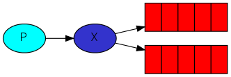
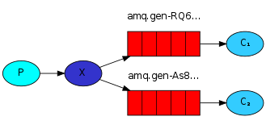

在 work queue 一节 我们创建了work queue，其背后的构思是每个任务都分发给一个确定的 worker 。这一节，我们将会把消息交付给多个消费者，这种模式叫做“发布/订阅” （publish/subscribe）模式。

我们将建立一个简单的日志系统，它由两个程序组成，一个负责发送日志信息，另外一个负责接收并打印日志。

在日志系统中，每一个运行的接受者程序都将收到消息。通过这种方法，我们可以运行一个接受者直接将日志写入硬盘，同事运行另外一个接受者将日志打印到屏幕上。

本质上，发布日志消息将广播给所有的接受者。


## 交换(机)（Exchanges）

在前面的小节，我们向队列发送和接受消息，接下来要介绍 Rabbit 完整的消息模型。

RabbitMQ 消息模型的核心思想是：从不直接向队列发送任何消息。实际上，生产者经常是完全不知道消息会被交付给哪一个队列的。

相应的，生产者只能发送消息给 `exchange`。exchange 很简单，一方面它从生产者接受消息，另一方面将消息推送给队列。exchange 必须准确地知道如何处理它接受到的消息。它应该被追加到特定的队列？还是广播给所有的队列？还是应该被废弃。

`exchange type` 定义了如下规则：



有如下几个 exchange type：

- direct
- topic
- headers
- fanout


以下集中介绍最后一个 fanout（扇出/广播）。

先创建一个这种类型的 exchange 命名为“logs”

```java
channel.exchangeDeclare("logs", "fanout");
```

`fanout exchange` 的作用很简单，就是将它接收到的所有消息广播给它知道的所有的队列。这正式我们的日志系统所需要的。


现在我们可以使用命名的 exchange 发布消息了

```java
channel.basicPublish( "logs", "", null, message.getBytes());
```


>**列出 exchanges 清单**
>
>```shell
>sudo rabbitmqctl list_exchanges
>```
>
>此命令会显示出一些 amq.* exchanges 和默认（未命名）的 exchange。
>
>**未命名 exchange**
>
>在前面的例子，我们没有使用 exchanges ，却任然能够给队列发送消息。这是因为当我们使用空字符串 （“”）标识exchange，使用的是默认的exchange。
>
>如：
>
>```java
>channel.basicPublish("", "hello", null, message.getBytes());
>```
>
>第一个参数是 exchange 名，空字符串表示默认或者未命名的 exchange ：消息将路由到 `routingKey` 指定的队列，如果队列存在的话。


## 临时队列（Temporary queues）

前面我们一直使用指定名称的队列（如：“hello”，“task_queue” 等）。能够命名度列对我们来说很重要

- 我们需要把 wokers 指定到同个队列。
- 如果你需要在生产者和消费者之间共享队列，命名队列也很重要。

但是对于我们的日志系统来说，我们需要监听所有的日志消息，而不只是一个子集（如果多个 worker 共享队列，每个worker 只能收到所有消息的一个子集）。而且我们只关心从现在起的所有消息流，而不关心以前存在的。要解决这个问题：

1. 无论何时连接到 Rabbit ，我们都需要一个新的、空的队列。这就需要使用一个随机名称来创建一个队列，更好地是让服务器为我们选择一个随机的名称。
2. 一旦我们关闭消费者的连接，队列需要自动地被删除。


在 Java 客户端中，当我们不为 queueDeclare() 方法提供参数时，将使用一个生成的名字创建一个非持久化、独占的、自动删除的队列：

```java
String queueName = channel.queueDeclare().getQueue();
```

这意味着队列将拥有一个随机的队列名，例如像 amq.gen-JzTY20BRgKO-HjmUJj0wLg.


## 绑定（Bindings）


我们已经创建了一个 fanout exchange 和一个队列，现在需要告诉 exchange 如何发送消息给我们定义的队列。exchange 和 queue 之间的关联叫做 `binding`。

```java
channel.queueBind(queueName, "logs", "");
```

现在，*logs* exchange 将向我们的队列发送消息。


> **列出 bindings 清单**
>
> ```shell
> rabbitmqctl list_bindings
> ```


## 合并代码



生产者程序负责发送日志消息。和之前最大的不同的是，如果我们要发布消息，需要发布到 *logs* exchange 而不是未命名 exchange。 我们需要在发送消息的时候提供一个 `routingKey` ，但这个值在  fanout exchanges 中会被忽略。

**EmitLog.java** :

```java
package org.demo.rabbitMQDemo.logQueues.fanout;

import com.rabbitmq.client.BuiltinExchangeType;
import com.rabbitmq.client.ConnectionFactory;
import com.rabbitmq.client.Connection;
import com.rabbitmq.client.Channel;

public class EmitLog {

  private static final String EXCHANGE_NAME = "logs";

  public static void main(String[] argv) throws Exception {
    ConnectionFactory factory = new ConnectionFactory();
    factory.setHost("localhost");
    Connection connection = factory.newConnection();
    Channel channel = connection.createChannel();

    /** 定义Exchange，广播 */
    channel.exchangeDeclare(EXCHANGE_NAME, BuiltinExchangeType.FANOUT);

    String message = "info: Hello World!";

    channel.basicPublish(EXCHANGE_NAME, "", null, message.getBytes("UTF-8"));
    System.out.println(" [x] Sent '" + message + "'");

    channel.close();
    connection.close();
  }
}
```

>  注：
>
>  - 如上所述，建立了连接之后需要定义一个 exchange。这一步是必要的，因为向一个不存在的 exchange  发送的消息将被丢弃。
>  - 如果没有队列绑定了exchange ，发送的消息也将丢失。


**ReceiveLogs.java**

```java
package org.demo.rabbitMQDemo.logQueues.fanout;

import com.rabbitmq.client.*;

import java.io.IOException;

public class ReceiveLogs {
  private static final String EXCHANGE_NAME = "logs";

  public static void main(String[] argv) throws Exception {
    ConnectionFactory factory = new ConnectionFactory();
    factory.setHost("localhost");
    Connection connection = factory.newConnection();
    Channel channel = connection.createChannel();

    /** 声明Exchange，类型为 fanout */
    channel.exchangeDeclare(EXCHANGE_NAME, "fanout");
    
    /** 无参数定义一个非持久、独占、自动删除、随机命名的队列 */
    String queueName = channel.queueDeclare().getQueue();
    
    /** 绑定 exchange 和 queue */
    channel.queueBind(queueName, EXCHANGE_NAME, "");

    System.out.println(" [*] Waiting for messages. To exit press CTRL+C");

    Consumer consumer = new DefaultConsumer(channel) {
      @Override
      public void handleDelivery(String consumerTag, Envelope envelope,
                                 AMQP.BasicProperties properties, byte[] body) throws IOException {
        String message = new String(body, "UTF-8");
        System.out.println(" [x] Received '" + message + "'");
      }
    };
    channel.basicConsume(queueName, true, consumer);
  }
}
```


使用 rabbitmqctl list_bindings 能验证程序是否正确创建并绑定了队列：

```
sudo rabbitmqctl list_bindings
# => Listing bindings ...
# => logs    exchange        amq.gen-JzTY20BRgKO-HjmUJj0wLg  queue           []
# => logs    exchange        amq.gen-vso0PVvyiRIL2WoV3i48Yg  queue           []
# => ...done.
```


查看控制台输出

```shell
# EmitLog
 [x] Sent 'info: Hello World!'
```

```shell
# ReceiveLogs 1
 [*] Waiting for messages. To exit press CTRL+C
 [x] Received 'info: Hello World!'
```

```shell
# ReceiveLogs 2
 [*] Waiting for messages. To exit press CTRL+C
 [x] Received 'info: Hello World!'
```


