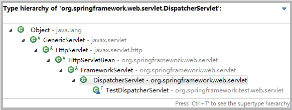

**初始化过程**

DispatcherServlet.init() 【HttpServletBean】

DispatcherServlet.initServletBean()【FrameworkServlet】

FrameworkServlet.initWebApplicationContext()

DispatcherServlet.onRefresh(ApplicationContext)

DispatcherServlet.initStrategies()

**相应请求的过程**

FrameworkServlet.service()

FrameworkServlet.processRequest()

DispatcherServlet.doDispatch()

DispatcherServlet.doDispatch()

**DispatcherServlet 继承体系**

