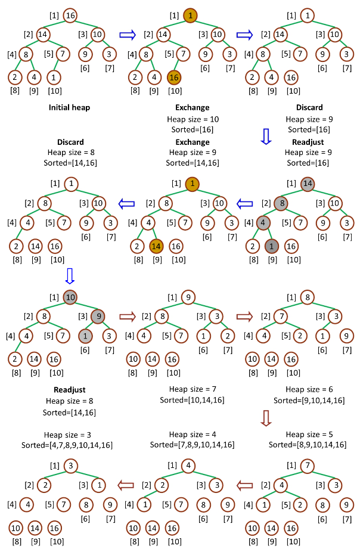

# 1. 算法原理

## 1.1 什么是堆？

- `堆（二叉堆）`可以视为一棵`完全的二叉树`，完全二叉树的一个“优秀”的性质是，**除了最底层之外，每一层都是满的**，这使得堆可以利用数组来表示（普通的一般的二叉树通常用链表作为基本容器表示），每一个结点对应数组中的一个元素。

<!-- more -->

如下图，是一个堆和数组的相互关系


- 对于给定的某个结点的下标 i，可以很容易的计算出这个结点的父结点、孩子结点的下标：
  - Parent(i) = floor(i/2)，i 的父节点下标
  - Left(i) = 2i，i 的左子节点下标
  - Right(i) = 2i + 1，i 的右子节点下标
- 二叉堆一般分为两种：最大堆和最小堆。

1. 最大堆：

- 最大堆中的最大元素值出现在根结点（堆顶）
- 堆中每个父节点的元素值都大于等于其孩子结点（如果存在）

2. 最小堆：

- 最小堆中的最小元素值出现在根结点（堆顶）
- 堆中每个父节点的元素值都小于等于其孩子结点（如果存在）


## 1.2 堆排序原理

堆排序就是把最大堆堆顶的最大数取出，将剩余的堆继续调整为最大堆，再次将堆顶的最大数取出，这个过程持续到剩余数只有一个时结束。在堆中定义以下几种操作：

- 最大堆调整（Max-Heapify）：将堆的末端子节点作调整，使得子节点永远小于父节点
- 创建最大堆（Build-Max-Heap）：将堆所有数据重新排序，使其成为最大堆
- 堆排序（Heap-Sort）：移除位在第一个数据的根节点，并做最大堆调整的递归运算


继续进行下面的讨论前，需要注意的一个问题是：数组都是 `Zero-Based`，这就意味着我们的堆数据结构模型要发生改变


相应的，几个计算公式也要作出相应调整：

- Parent(i) = floor((i-1)/2)，i 的父节点下标
- Left(i) = 2i + 1，i 的左子节点下标
- Right(i) = 2(i + 1)，i 的右子节点下标


### 1.2.1 最大堆调整（Max-Heapify）

最大堆调整（MAX‐HEAPIFY）的作用是保持最大堆的性质，是创建最大堆的核心子程序，作用过程如图所示：


由于一次调整后，堆仍然违反堆性质，所以需要递归的测试，使得整个堆都满足堆性质

```java
/**
 * 从 index 开始检查并保持最大堆性质
 * @param array
 * @param index
 * @param heapSize
 */
public static void maxHeapify(int[] array, int index, int heapSize) {
  int iMax = index,
    iLeft = 2 * index + 1,
    iRight = 2 * (index + 1);

  // 找出父节点和左右子节点中的最大值的下标
  if (iLeft < heapSize && array[index] < array[iLeft]) {
    iMax = iLeft;
  }
  if (iRight < heapSize && array[iMax] < array[iRight]) {
    iMax = iRight;
  }
  // 当父节点不是最大值时交换父节点和该子节点
  if (iMax != index) {
    swap(array, iMax, index);
    maxHeapify(array, iMax, heapSize); // 递归调整（交换父子节点后，可能会导致以子节点为根的子堆不是最大堆）
  }
}

public static void swap(int[] array, int i, int j) {
  int temp = array[i];
  array[i] = array[j];
  array[j] = temp;
}
```


### 1.2.2 创建最大堆（Build-Max-Heap）

创建最大堆（Build-Max-Heap）的作用是将一个数组改造成一个最大堆，接受数组和堆大小两个参数，Build-Max-Heap 将`自下而上`的调用 `Max-Heapify` 来改造数组，建立最大堆。因为 Max-Heapify 能够保证下标 i 的结点之后结点都满足最大堆的性质，所以**自下而上的调用 Max-Heapify 能够在改造过程中保持这一性质**。如果最大堆的数量元素是 n，那么 Build-Max-Heap 从 Parent(n) 开始，往上依次调用 Max-Heapify。流程如下：


### 1.2.3 堆排序（Heap-Sort）

堆排序（Heap-Sort）是堆排序的接口算法，`Heap-Sort`先调用`Build-Max-Heap`将数组改造为最大堆，然后将堆顶和堆底元素交换，之后将底部上升，最后重新调用`Max-Heapify`保持最大堆性质。由于堆顶元素必然是堆中最大的元素，所以一次操作之后，堆中存在的最大元素被分离出堆，重复n-1次之后，数组排列完毕。整个流程如下：




```java
/**
 * 堆排序（Heap-Sort）是堆排序的接口算法，
 * Heap-Sort先调用Build-Max-Heap将数组改造为最大堆
 * 然后将堆顶和堆底元素交换，之后将底部上升，最后重新调用Max-Heapify保持最大堆性质。
 * @param array
 * @param heapSize
 */
public static void heapSort(int[] array, int heapSize) {
  buildMaxHeap(array, heapSize);
  for (int i = heapSize - 1; i > 0; i--) {
    swap(array, 0, i);
    maxHeapify(array, 0, i);
  }
}
```


# 2. 算法实现

合并以上三个步骤后最终的代码：

```java
/**
 * Created by cjz on 2017/6/3.
 */
public class HeapSort {

    /**
     * 从 index 开始检查并保持最大堆性质
     * @param array
     * @param index
     * @param heapSize
     */
    public static void maxHeapify(int[] array, int index, int heapSize) {
        int iMax = index,
            iLeft = 2 * index + 1,
            iRight = 2 * (index + 1);

        // 找出父节点和左右子节点中的最大值的下标
        if (iLeft < heapSize && array[index] < array[iLeft]) {
            iMax = iLeft;
        }
        if (iRight < heapSize && array[iMax] < array[iRight]) {
            iMax = iRight;
        }
        // 当父节点不是最大值时交换父节点和该子节点
        if (iMax != index) {
            swap(array, iMax, index);
            maxHeapify(array, iMax, heapSize); // 递归调整（交换父子节点后，可能会导致以子节点为根的子堆不是最大堆）
        }
    }


    /**
     * 从原始的数组中创建最大堆
     * @param array
     * @param heapSize
     */
    public static void buildMaxHeap(int[] array, int heapSize) {

        int iParent = (heapSize - 1) / 2; // 第一个需要进行最大堆调整的节点

        for (int i = iParent; i >= 0; i--) {
            maxHeapify(array, i, heapSize);
        }
    }

    /**
     * 堆排序（Heap-Sort）是堆排序的接口算法，
     * Heap-Sort先调用Build-Max-Heap将数组改造为最大堆
     * 然后将堆顶和堆底元素交换，之后将底部上升，最后重新调用Max-Heapify保持最大堆性质。
     * @param array
     * @param heapSize
     */
    public static void heapSort(int[] array, int heapSize) {
        buildMaxHeap(array, heapSize);
        for (int i = heapSize - 1; i > 0; i--) {
            swap(array, 0, i);
            maxHeapify(array, 0, i);
        }
    }

    public static void swap(int[] array, int i, int j) {
        int temp = array[i];
        array[i] = array[j];
        array[j] = temp;
    }

    public static void main(String[] args) {
        int array[] = {15,6,6,10,6,5,6,3,1,6,7,6,2,8,6};
        System.out.println("排序之前：");
        for(int element : array){
            System.out.print(element+" ");
        }

        heapSort(array,array.length);

        System.out.println("\n排序之后：");
        for(int element : array){
            System.out.print(element+" ");
        }

    }
}

```

