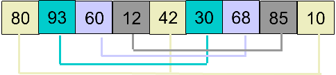
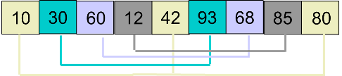

## 算法原理

- 希尔排序算法是按其设计者希尔（Donald Shell）的名字命名，该算法由1959年公布，是插入排序的一种更高效的改进版本。它的作法不是每次一个元素挨一个元素的比较。而是初期选用大跨步（增量较大）间隔比较，使记录跳跃式接近它的排序位置；然后增量缩小；最后增量为 1 ，这样记录移动次数大大减少，提高了排序效率。希尔排序对增量序列的选择没有严格规定。
- 希尔排序是基于插入排序的以下两点性质而提出改进方法的：
  1. 插入排序在**对几乎已经排好序的数据操作时， 效率高**， 即可以达到线性排序的效率
  2. 但插入排序一般来说是低效的， 因为插入排序每次只能将数据移动一位
- 算法思路：
  - 先取一个正整数 d1(d1 < n)，把全部记录分成 d1 个组，所有距离为 d1 的倍数的记录看成一组，然后在各组内进行插入排序
  - 然后取 d2(d2 < d1)
  - 重复上述分组和排序操作；直到取 di = 1(i >= 1) 位置，即所有记录成为一个组，最后对这个组进行插入排序。一般选 d1 约为 n/2，d2 为 d1 /2， d3 为 d2/2 ，…， di = 1。


<!-- more -->






## 算法实现

```java
public class ShellSort {

    public static void shellSort(int[] array) {

        int length = array.length;
        int gap = length / 2;                       // gap的一般初始值为length / 2;

        while (gap > 0) {
            for (int i = gap; i < length; i++) {    // 从gap开始往后对每组进行排序
                for (int j = i; 0 < j; j -= gap) {
                    if (j-gap>=0 && array[j - gap] > array[j]) {    // 同组内比较后交换
                        swap(array, j - gap, j);
                    } else {
                        break;
                    }
                }
            }
            gap = gap / 2;
        }
    }

    public static void  swap(int[] array, int i,int k) {
        int temp = array[i];
        array[i] = array[k];
        array[k] = temp;
    }

    public static void main(String[] args) {

        int array[] = {80, 93, 60, 12, 42, 30, 68, 85, 10};
        System.out.println("排序之前：");
        for(int element : array){
            System.out.print(element+" ");
        }

        shellSort(array);

        System.out.println("\n排序之后：");
        for(int element : array){
            System.out.print(element+" ");
        }

    }
}
```


