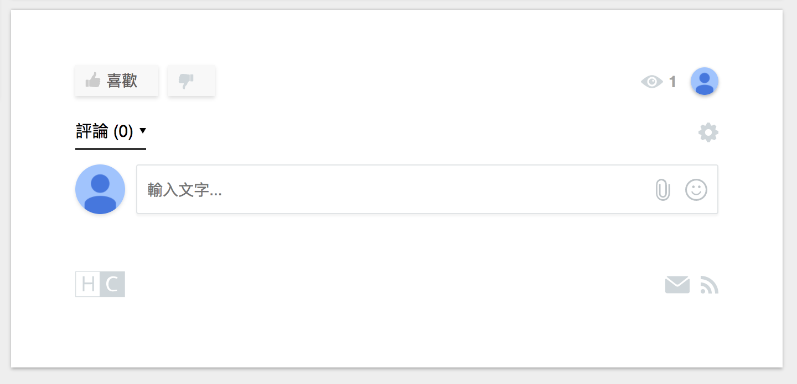
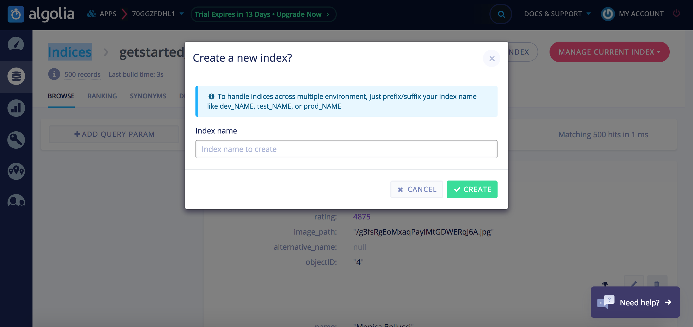
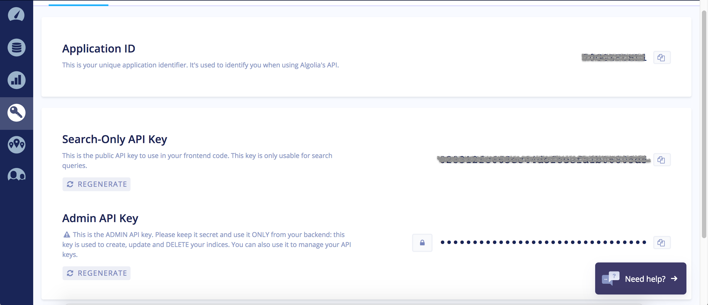
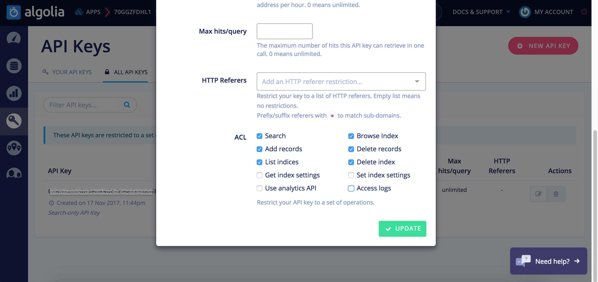
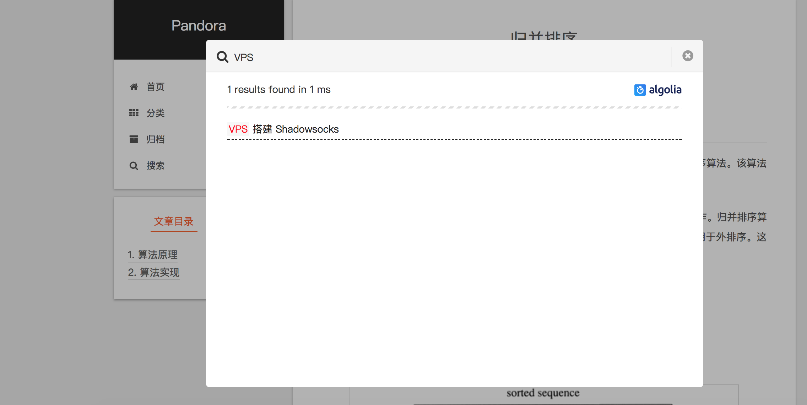

## 评论系统

> 如需取消某个 页面/文章 的评论，在 md 文件的 [front-matter ](https://hexo.io/docs/front-matter.html)中增加 `comments: false`

说明：比较热门的 **DISQUS** 基本被墙，用不了，而大家所熟知的“多说”也停止服务了，因此选择了 **HyperComments** ，最新版的 Hexo 已经集成了该评论系统，只要简单配置一个 ID 就可以。

1. 用 Google 账号登录 [HyperComments](https://www.hypercomments.com/)

2. 根据引导选择 Free 版本，输入你的网站地址，然后生成code，记录下 code 中的 widget_id。

   ```
   _hcwp.push({widget:"Stream", widget_id: your_id});
   ```

   > 在  setting -> widget -> code 可以找到你的 widget_id

3. 在 `主题配置文件` 中找到 Hypercomments 的设置，填入你的 widget_id，搞定。

   ```properties
   # Hypercomments
   hypercomments_id: your_id
   ```




</br>

## 数据统计与分析

### 百度统计

1. 登录 [百度统计](http://tongji.baidu.com/)，定位到站点的代码获取页面

2. 复制 `hm.js?` 后面那串统计脚本 id

   ```javascript
   <script>
   var _hmt = _hmt || [];
   (function() {
     var hm = document.createElement("script");
     hm.src = "https://hm.baidu.com/hm.js?xxxxx_baidu_analytics_id_xxxxx";
     var s = document.getElementsByTagName("script")[0]; 
     s.parentNode.insertBefore(hm, s);
   })();
   </script>
   ```

3. 编辑 `主题配置文件`， 修改字段 `baidu_analytics`，值设置成你的百度统计脚本 id。

   ```
   # Baidu Analytics ID
   baidu_analytics: xxxxx_baidu_analytics_id_xxxxx
   ```

</br>

### 不蒜子统计 由 [panzhitian](https://github.com/iissnan/hexo-theme-next/pull/809) 贡献

> **注意：** 此特性在版本 5.0.1 中引入，要使用此功能请确保所使用的 NexT 版本在此之后

编辑 `主题配置文件` 中的`busuanzi_count`的配置项。

- 当`enable: true`时，代表开启全局开关。若`site_uv`、`site_pv`、`page_pv`的值均为`false`时，不蒜子仅作记录而不会在页面上显示。
- 当`site_uv: true`时，代表在页面底部显示站点的UV值。

`site_uv_header`和`site_uv_footer`为自定义样式配置，相关的值留空时将不显示，可以使用（带特效的）font-awesome。显示效果为`[site_uv_header]UV值[site_uv_footer]`。

```properties
# Show PV/UV of the website/page with busuanzi.
# Get more information on http://ibruce.info/2015/04/04/busuanzi/
busuanzi_count:
  # count values only if the other configs are false
  enable: true
  # custom uv span for the whole site
  site_uv: true
  site_uv_header: <i class="fa fa-user"></i> 访客总数
  site_uv_footer: 
  # custom pv span for the whole site
  site_pv: true
  site_pv_header: <i class="fa fa-eye"></i> 总访问量
  site_pv_footer: 
  # custom pv span for one page only
  page_pv: true
  page_pv_header: <i class="fa fa-file-o"></i> 浏览
  page_pv_footer: 次
```

</br>

## 搜索服务

NexT 支持集成 [Swiftype](https://swiftype.com/)、 [微搜索](http://tinysou.com/)、Local Search 和 Algolia。

> Swiftype 收费了，微搜索似乎没维护了，最后尝试了 Algolia 

### Algolia

> **注意：** 此特性在版本 5.1.0 中引入，要使用此功能请确保所使用的 NexT 版本在此之后

#### 注册 Algolia，创建 Index

前往 [Algolia 注册页面](https://www.algolia.com/)，注册一个新账户。 可以使用 GitHub 或者 Google 账户直接登录，注册后的 14 天内拥有所有功能（包括收费类别的）。之后若未续费会自动降级为免费账户，免费账户 总共有 10,000 条记录，每月有 100,000 的可以操作数。注册完成后，创建一个新的 Index，这个 Index 将在后面使用。



</br>

#### 安装 Hexo Algolia

Index 创建完成后，此时这个 Index 里未包含任何数据。 接下来需要安装 [Hexo Algolia](https://github.com/oncletom/hexo-algolia) 扩展， 这个扩展的功能是搜集站点的内容并通过 API 发送给 Algolia。前往站点根目录，执行命令安装：

```
npm install --save hexo-algolia
```

</br>

#### 获取 Key，更新站点配置

在 Algolia 服务站点上找到需要使用的一些配置的值，包括 `Application ID`、`Search-Only API Key`、 `Admin API Key`。注意，`Admin API Key` 需要保密保存。



编辑 站点配置文件，新增以下配置：

```
algolia:
  applicationID: Application ID
  apiKey: Search-Only API Key
  adminApiKey: Admin API Key
  indexName: indexName
  chunkSize: 5000
```

替换除了 chunkSize 以外的其他字段为在 Algolia 获取到的值。

此外：需要修改 `Search-Only API Key` 的 ACL 权限，否则在后续生成索引的时候会报无权限。

```
not enough rights to update an object 
```



</br>

#### 更新 Index

新版本的 `hexo-algolia` 在更新 Index 之前需要校验权限，直接运行会报错

```
hexo algolia
ERROR [Algolia] Please set an `HEXO_ALGOLIA_INDEXING_KEY` environment variable to enable content indexing.
ERROR >> Read https://npmjs.com/hexo-algolia#api-key for more informations.
```

因此先设置环境变量

```
export HEXO_ALGOLIA_INDEXING_KEY=your_search_api_key
```

之后在运行

```
hexo algolia
INFO  [Algolia] Testing HEXO_ALGOLIA_INDEXING_KEY permissions.
INFO  Start processing
INFO  [Algolia] Identified 129 pages and posts to index.
INFO  [Algolia] Indexing chunk 1 of 3 (50 items each)
INFO  [Algolia] Indexing chunk 2 of 3 (50 items each)
INFO  [Algolia] Indexing chunk 3 of 3 (50 items each)
INFO  [Algolia] Indexing done.
```

</br>

#### 主题集成

更改 `主题配置文件`，找到 Algolia Search 配置部分：

```
algolia_search:
  enable: true
  hits:
    per_page: 10
  labels:
    input_placeholder: Search for Posts
    hits_empty: "We didn't find any results for the search: ${query}"
    hits_stats: "${hits} results found in ${time} ms"
```

将 enable 改为 true 即可，根据需要你可以调整 `labels` 中的文本。

</br>

#### 踩坑

如果最后可以搜索了，但是跳转的连接不正确，出现  `yoursite/2017/11/09/xxxx.html` 之类的链接，似乎是因为新版的的 `hexo-algolia` 的bug还是谁的bug

> GitHUb Issue #1084 [5.1.0使用algolia搜索问题](https://github.com/iissnan/hexo-theme-next/issues/1084) 给出了解决方法

里面提到了两个方法，第一个

> 大家如果遇到同樣問題， 請install `npm install hexo-algolia@0.2.0`， 然後在站点找到`package.json`， 把裏面的hexo-algolia， 換成 `"hexo-algolia": "^0.2.0"`。

第一个方法我尝试不成功，于是换第二个

> version: 5.1.0
> 这个版本中，var storedPost = _.pick(data, ['title', 'date', 'slug', 'path', 'content', 'excerpt', 'objectID']);的确应该是这样，而我的原先是var storedPost = _.pick(data, ['title', 'date', 'slug', 'content', 'excerpt', 'permalink']); 因此不仅要添加path字段，还要修改最后的permalink字段

修改 `node_modules/hexo-algolia/lib/command.js`

```json
var INDEXED_PROPERTIES = [
  'title',
  'date',
  'updated',
  'slug',
  'path',	// 添加 path
  'excerpt',
  'objectID', // 去掉原来的 permalink
  'layout'
];
```

Finally Done!!!




