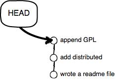

Git是目前世界上最先进的分布式版本控制系统（没有之一）

<!-- more -->


根据原文整理 [Git教程 —— 廖雪峰](http://www.liaoxuefeng.com/wiki/0013739516305929606dd18361248578c67b8067c8c017b000)

# 基本操作

## 初始化Git仓库

使用`git init`命令

```
$ git init
Initialized empty Git repository in /Users/michael/learngit/.git/
```


## 添加文件到Git仓库

- 第一步，使用命令`git add <file>`，注意，可反复多次使用，添加多个文件；

  ```
  $ git add README.md
  $ git add --all
  ```

- 第二步，使用命令`git commit`，完成。

  ```
  git commit -m "commit message"
  ```

  ​

## 查看工作区的状态

使用`git status`命令。

```
$ git status
# On branch master
# Changes not staged for commit:
#   (use "git add <file>..." to update what will be committed)
#   (use "git checkout -- <file>..." to discard changes in working directory)
#
#    modified:   readme.txt
#
no changes added to commit (use "git add" and/or "git commit -a")
```


## 查看修改内容

用`git diff`可以查看修改内容。

```
$ git diff readme.txt 
diff --git a/readme.txt b/readme.txt
index 46d49bf..9247db6 100644
--- a/readme.txt
+++ b/readme.txt
@@ -1,2 +1,2 @@
-Git is a version control system.
+Git is a distributed version control system.
 Git is free software.
```


## 删除文件

当你删除了工作区的一个文件，这个时候，Git知道你删除了文件，因此，工作区和版本库就不一致了，`git status`命令会立刻告诉你哪些文件被删除了：

```
$ git status
# On branch master
# Changes not staged for commit:
#   (use "git add/rm <file>..." to update what will be committed)
#   (use "git checkout -- <file>..." to discard changes in working directory)
#
#       deleted:    test.txt
#
no changes added to commit (use "git add" and/or "git commit -a")
```

要从版本库中删除该文件，那就用命令`git rm`删掉，并且`git commit`：

```
$ git rm test.txt
rm 'test.txt'
$ git commit -m "remove test.txt"
[master d17efd8] remove test.txt
 1 file changed, 1 deletion(-)
 delete mode 100644 test.txt
```


# 版本管理

每当你觉得文件修改到一定程度的时候，就可以“保存一个快照”，这个快照在Git中被称为`commit`。一旦你把文件改乱了，或者误删了文件，还可以从最近的一个`commit`恢复，然后继续工作，而不是把几个月的工作成果全部丢失。


## 查看提交历史

`git log`命令显示从最近到最远的提交日志，我们可以看到3次提交

```
$ git log
commit 3628164fb26d48395383f8f31179f24e0882e1e0
Author: Michael Liao <askxuefeng@gmail.com>
Date:   Tue Aug 20 15:11:49 2013 +0800

    append GPL

commit ea34578d5496d7dd233c827ed32a8cd576c5ee85
Author: Michael Liao <askxuefeng@gmail.com>
Date:   Tue Aug 20 14:53:12 2013 +0800

    add distributed

commit cb926e7ea50ad11b8f9e909c05226233bf755030
Author: Michael Liao <askxuefeng@gmail.com>
Date:   Mon Aug 19 17:51:55 2013 +0800

    wrote a readme file
```

如果嫌输出信息太多，看得眼花缭乱的，可以试试加上`--pretty=oneline`参数：

```
$ git log --pretty=oneline
3628164fb26d48395383f8f31179f24e0882e1e0 append GPL
ea34578d5496d7dd233c827ed32a8cd576c5ee85 add distributed
cb926e7ea50ad11b8f9e909c05226233bf755030 wrote a readme file
```


## 版本回退

要回退到上一个版本，首先，Git必须知道当前版本是哪个版本，在Git中，用`HEAD`表示当前版本，也就是最新的提交`3628164...882e1e0`（注意我的提交ID和你的肯定不一样），上一个版本就是`HEAD^`，上上一个版本就是`HEAD^^`，当然往上100个版本写100个`^`比较容易数不过来，所以写成`HEAD~100`。


回退到上一个版本，使用`git reset`命令：

```
git reset --hard HEAD^
HEAD is now at ea34578 add distributed
```


回退版本后，最新的那个版本`append GPL`已经看不到了！**只要上面的命令行窗口还没有被关掉**，你就可以顺着往上找，找到那个`append GPL`的`commit id`是`3628164...`，于是就可以指定回到未来的某个版本：

```
$ git reset --hard 3628164
HEAD is now at 3628164 append GPL
```

版本号没必要写全，前几位就可以了，Git会自动去找。当然也不能只写前一两位，因为Git可能会找到多个版本号，就无法确定是哪一个了。





## 查看命令历史

当你回退到旧版本后，再想恢复到较新的版本，就必须找到新版本的commit id。提供了一个命令`git reflog`用来记录你的每一次命令：

```
$ git reflog
ea34578 HEAD@{0}: reset: moving to HEAD^
3628164 HEAD@{1}: commit: append GPL
ea34578 HEAD@{2}: commit: add distributed
cb926e7 HEAD@{3}: commit (initial): wrote a readme file
```


**小结**

- `HEAD`指向的版本就是当前版本，因此，Git允许我们在版本的历史之间穿梭，使用命令`git reset --hard commit_id`。

- 穿梭前，用`git log`可以查看提交历史，以便确定要回退到哪个版本。

- 要重返未来，用`git reflog`查看命令历史，以便确定要回到未来的哪个版本。

  ​

# 工作区和暂存区


## 工作区（Working Directory）

就是你在电脑里能看到的目录，比如我的`learngit`文件夹就是一个工作区。


## 版本库（Repository）

工作区有一个隐藏目录`.git`，这个不算工作区，而是Git的版本库。

Git的版本库里存了很多东西，其中最重要的就是称为stage（或者叫index）的暂存区，还有Git为我们自动创建的第一个分支`master`，以及指向`master`的一个指针叫`HEAD`。


分支和`HEAD`的概念我们以后再讲。

前面讲了我们把文件往Git版本库里添加的时候，是分两步执行的：

- 第一步是用`git add`把文件添加进去，实际上就是把文件修改添加到暂存区；
- 第二步是用`git commit`提交更改，实际上就是把暂存区的所有内容提交到当前分支。


因为我们创建Git版本库时，Git自动为我们创建了唯一一个`master`分支，所以，现在，`git commit`就是往`master`分支上提交更改。

你可以简单理解为，需要提交的文件修改通通放到暂存区，然后，一次性提交暂存区的所有修改。


# 撤销修改

## 撤销工作区修改

如果你只是在工作区做了一些修改，但是还没有`git add`到暂存区，如果用`git status`查看一下：

```
$ git status
# On branch master
# Changes not staged for commit:
#   (use "git add <file>..." to update what will be committed)
#   (use "git checkout -- <file>..." to discard changes in working directory)
#
#       modified:   readme.txt
#
no changes added to commit (use "git add" and/or "git commit -a")
```


Git会告诉你，`git checkout -- file`可以丢弃工作区的修改。

```
$ git checkout -- readme.txt
```

命令`git checkout -- readme.txt`意思就是，把`readme.txt`文件在工作区的修改全部撤销，这里有两种情况：

- 一种是`readme.txt`自修改后还没有被放到暂存区，现在，撤销修改就回到和版本库一模一样的状态；
- 一种是`readme.txt`已经添加到暂存区后，又作了修改，现在，撤销修改就回到添加到暂存区后的状态。

总之，就是让这个文件回到最近一次`git commit`或`git add`时的状态。


**注：**`git checkout -- file`命令中的`--`很重要，没有`--`，就变成了“切换到另一个分支”的命令，我们在后面的分支管理中会再次遇到`git checkout`命令。


## 撤销暂存区修改

如果你在工作区做了一修改，还`git add`到暂存区了：

用`git status`查看一下，修改只是添加到了暂存区，还没有提交：

```
$ git status
# On branch master
# Changes to be committed:
#   (use "git reset HEAD <file>..." to unstage)
#
#       modified:   readme.txt
#
```

Git同样告诉我们，用命令`git reset HEAD file`可以把暂存区的修改撤销掉（unstage），重新放回工作区：

```
$ git reset HEAD readme.txt
Unstaged changes after reset:
M       readme.txt
```

`git reset`命令既可以回退版本，也可以把暂存区的修改回退到工作区。当我们用`HEAD`时，表示最新的版本。

再用`git status`查看一下，现在暂存区是干净的，工作区有修改：

```
$ git status
# On branch master
# Changes not staged for commit:
#   (use "git add <file>..." to update what will be committed)
#   (use "git checkout -- <file>..." to discard changes in working directory)
#
#       modified:   readme.txt
#
no changes added to commit (use "git add" and/or "git commit -a")
```

还记得如何丢弃工作区的修改吗？

```
$ git checkout -- readme.txt

$ git status
# On branch master
nothing to commit (working directory clean)

```

整个世界终于清静了！


**小结**

场景1：当你改乱了工作区某个文件的内容，想直接丢弃工作区的修改时，用命令`git checkout -- file`。

场景2：当你不但改乱了工作区某个文件的内容，还添加到了暂存区时，想丢弃修改，分两步，第一步用命令`git reset HEAD file`，就回到了场景1，第二步按场景1操作。

场景3：已经提交了不合适的修改到版本库时，想要撤销本次提交，参考 **版本回退** 一节，不过前提是没有推送到远程库。


# 远程仓库


## 添加远程库

可以从远程仓库克隆出新的仓库，也可以把一个已有的本地仓库与之关联，然后，把本地仓库的内容推送到GitHub仓库。

现在，我们根据GitHub的提示，在本地的`learngit`仓库下运行命令：

```
$ git remote add origin git@github.com:michaelliao/learngit.git
```


添加后，远程库的名字就是`origin`，这是Git默认的叫法，也可以改成别的，但是`origin`这个名字一看就知道是远程库。

下一步，就可以把本地库的所有内容推送到远程库上：

```
$ git push -u origin master
Counting objects: 19, done.
Delta compression using up to 4 threads.
Compressing objects: 100% (19/19), done.
Writing objects: 100% (19/19), 13.73 KiB, done.
Total 23 (delta 6), reused 0 (delta 0)
To git@github.com:michaelliao/learngit.git
 * [new branch]      master -> master
Branch master set up to track remote branch master from origin.

```

把本地库的内容推送到远程，用`git push`命令，实际上是把当前分支`master`推送到远程。

由于远程库是空的，我们第一次推送`master`分支时，加上了`-u`参数，Git不但会把本地的`master`分支内容推送的远程新的`master`分支，还会把本地的`master`分支和远程的`master`分支关联起来，在以后的推送或者拉取时就可以简化命令。


从现在起，只要本地作了提交，就可以通过命令：

```
$ git push origin master
```


**小结**

要关联一个远程库，使用命令`git remote add origin git@server-name:path/repo-name.git`；

关联后，使用命令`git push -u origin master`第一次推送master分支的所有内容；

此后，每次本地提交后，只要有必要，就可以使用命令`git push origin master`推送最新修改；


## 克隆远程库

远程库已经准备好了，下一步是用命令`git clone`克隆一个本地库：

```
$ git clone git@github.com:michaelliao/gitskills.git
Cloning into 'gitskills'...
remote: Counting objects: 3, done.
remote: Total 3 (delta 0), reused 0 (delta 0)
Receiving objects: 100% (3/3), done.
```


你也许还注意到，GitHub给出的地址不止一个，还可以用`https://github.com/michaelliao/gitskills.git`这样的地址。实际上，Git支持多种协议，默认的`git://`使用ssh，但也可以使用`https`等其他协议。

使用`https`除了速度慢以外，还有个最大的麻烦是每次推送都必须输入口令，但是在某些只开放http端口的公司内部就无法使用`ssh`协议而只能用`https`。


**小结**

要克隆一个仓库，首先必须知道仓库的地址，然后使用`git clone`命令克隆。

Git支持多种协议，包括`https`，但通过`ssh`支持的原生`git`协议速度最快。


# 分支管理

在 **版本回退** 里，你已经知道，每次提交，Git都把它们串成一条时间线，这条时间线就是一个分支。截止到目前，只有一条时间线，在Git里，这个分支叫主分支，即`master`分支。`HEAD`严格来说不是指向提交，而是指向`master`，`master`才是指向提交的，所以，`HEAD`指向的就是当前分支。

一开始的时候，`master`分支是一条线，Git用`master`指向最新的提交，再用`HEAD`指向`master`，就能确定当前分支，以及当前分支的提交点：


每次提交，`master`分支都会向前移动一步，这样，随着你不断提交，`master`分支的线也越来越长.

当我们创建新的分支，例如`dev`时，Git新建了一个指针叫`dev`，指向`master`相同的提交，再把`HEAD`指向`dev`，就表示当前分支在`dev`上：


你看，Git创建一个分支很快，因为除了增加一个`dev`指针，改改`HEAD`的指向，工作区的文件都没有任何变化！

不过，从现在开始，对工作区的修改和提交就是针对`dev`分支了，比如新提交一次后，`dev`指针往前移动一步，而`master`指针不变：


假如我们在`dev`上的工作完成了，就可以把`dev`合并到`master`上。Git怎么合并呢？最简单的方法，就是直接把`master`指向`dev`的当前提交，就完成了合并：


所以Git合并分支也很快！就改改指针，工作区内容也不变！

合并完分支后，甚至可以删除`dev`分支。删除`dev`分支就是把`dev`指针给删掉，删掉后，我们就剩下了一条`master`分支：


**下面开始实战。**

## 创建与合并分支

首先，我们创建`dev`分支，然后切换到`dev`分支：

```
$ git checkout -b dev
Switched to a new branch 'dev'

```

`git checkout`命令加上`-b`参数表示创建并切换，相当于以下两条命令：

```
$ git branch dev
$ git checkout dev
Switched to branch 'dev'

```

然后，用`git branch`命令查看当前分支：

```
$ git branch
* dev
  master

```

`git branch`命令会列出所有分支，当前分支前面会标一个`*`号。

然后，我们就可以在`dev`分支上正常提交，比如对readme.txt做个修改，加上一行：

```
Creating a new branch is quick.

```

然后提交：

```
$ git add readme.txt 
$ git commit -m "branch test"
[dev fec145a] branch test
 1 file changed, 1 insertion(+)

```

现在，`dev`分支的工作完成，我们就可以切换回`master`分支：

```
$ git checkout master
Switched to branch 'master'
```

现在，我们把`dev`分支的工作成果合并到`master`分支上：

```
$ git merge dev
Updating d17efd8..fec145a
Fast-forward
 readme.txt |    1 +
 1 file changed, 1 insertion(+)

```

`git merge`命令用于合并指定分支到当前分支。合并后，再查看readme.txt的内容，就可以看到，和`dev`分支的最新提交是完全一样的。

注意到上面的`Fast-forward`信息，Git告诉我们，这次合并是“快进模式”，也就是直接把`master`指向`dev`的当前提交，所以合并速度非常快。

当然，也不是每次合并都能`Fast-forward`，我们后面会讲其他方式的合并。

合并完成后，就可以放心地删除`dev`分支了：

```
$ git branch -d dev
Deleted branch dev (was fec145a).
```

删除后，查看`branch`，就只剩下`master`分支了：

```
$ git branch
* master

```

因为创建、合并和删除分支非常快，所以Git鼓励你使用分支完成某个任务，合并后再删掉分支，这和直接在`master`分支上工作效果是一样的，但过程更安全。


**小结**

Git鼓励大量使用分支：

查看分支：`git branch`

创建分支：`git branch <name>`

切换分支：`git checkout <name>`

创建+切换分支：`git checkout -b <name>`

合并某分支到当前分支：`git merge <name>`

删除分支：`git branch -d <name>`


## 解决冲突

人生不如意之事十之八九，合并分支往往也不是一帆风顺的。

准备新的`feature1`分支，继续我们的新分支开发：

```
$ git checkout -b feature1
Switched to a new branch 'feature1'

```

修改readme.txt最后一行，改为：

```
Creating a new branch is quick AND simple.

```

在`feature1`分支上提交：

```
$ git add readme.txt 
$ git commit -m "AND simple"
[feature1 75a857c] AND simple
 1 file changed, 1 insertion(+), 1 deletion(-)

```

切换到`master`分支：

```
$ git checkout master
Switched to branch 'master'
Your branch is ahead of 'origin/master' by 1 commit.

```

Git还会自动提示我们当前`master`分支比远程的`master`分支要超前1个提交。

在`master`分支上把readme.txt文件的最后一行改为：

```
Creating a new branch is quick & simple.

```

提交：

```
$ git add readme.txt 
$ git commit -m "& simple"
[master 400b400] & simple
 1 file changed, 1 insertion(+), 1 deletion(-)

```

现在，`master`分支和`feature1`分支各自都分别有新的提交，变成了这样：


这种情况下，Git无法执行“快速合并”，只能试图把各自的修改合并起来，但这种合并就可能会有冲突，我们试试看：

```
$ git merge feature1
Auto-merging readme.txt
CONFLICT (content): Merge conflict in readme.txt
Automatic merge failed; fix conflicts and then commit the result.

```

果然冲突了！Git告诉我们，readme.txt文件存在冲突，必须手动解决冲突后再提交。`git status`也可以告诉我们冲突的文件：

```
$ git status
# On branch master
# Your branch is ahead of 'origin/master' by 2 commits.
#
# Unmerged paths:
#   (use "git add/rm <file>..." as appropriate to mark resolution)
#
#       both modified:      readme.txt
#
no changes added to commit (use "git add" and/or "git commit -a")

```

我们可以直接查看readme.txt的内容：

```
Git is a distributed version control system.
Git is free software distributed under the GPL.
Git has a mutable index called stage.
Git tracks changes of files.
<<<<<<< HEAD
Creating a new branch is quick & simple.
=======
Creating a new branch is quick AND simple.
>>>>>>> feature1

```

Git用`<<<<<<<`，`=======`，`>>>>>>>`标记出不同分支的内容，我们修改如下后保存：

```
Creating a new branch is quick and simple.

```

再提交：

```
$ git add readme.txt 
$ git commit -m "conflict fixed"
[master 59bc1cb] conflict fixed

```

现在，`master`分支和`feature1`分支变成了下图所示：


最后，删除`feature1`分支：

```
$ git branch -d feature1
Deleted branch feature1 (was 75a857c).
```


**小结**

当Git无法自动合并分支时，就必须首先解决冲突。解决冲突后，再提交，合并完成。

用`git log --graph`命令可以看到分支合并图。


## 多人协作

当你从远程仓库克隆时，实际上Git自动把本地的`master`分支和远程的`master`分支对应起来了，并且，远程仓库的默认名称是`origin`。

要查看远程库的信息，用`git remote`：

```
$ git remote
origin

```

或者，用`git remote -v`显示更详细的信息：

```
$ git remote -v
origin  git@github.com:michaelliao/learngit.git (fetch)
origin  git@github.com:michaelliao/learngit.git (push)

```

上面显示了可以抓取和推送的`origin`的地址。如果没有推送权限，就看不到push的地址。


### 推送分支

推送分支，就是把该分支上的所有本地提交推送到远程库。推送时，要指定本地分支，这样，Git就会把该分支推送到远程库对应的远程分支上：

```
$ git push origin master

```

如果要推送其他分支，比如`dev`，就改成：

```
$ git push origin dev

```

但是，并不是一定要把本地分支往远程推送，那么，哪些分支需要推送，哪些不需要呢？

- `master`分支是主分支，因此要时刻与远程同步；
- `dev`分支是开发分支，团队所有成员都需要在上面工作，所以也需要与远程同步；
- bug分支只用于在本地修复bug，就没必要推到远程了，除非老板要看看你每周到底修复了几个bug；
- feature分支是否推到远程，取决于你是否和你的小伙伴合作在上面开发。


### 抓取分支

多人协作时，大家都会往`master`和`dev`分支上推送各自的修改。

现在，模拟一个你的小伙伴，可以在另一台电脑（注意要把SSH Key添加到GitHub）或者同一台电脑的另一个目录下克隆：

```
$ git clone git@github.com:michaelliao/learngit.git
Cloning into 'learngit'...
remote: Counting objects: 46, done.
remote: Compressing objects: 100% (26/26), done.
remote: Total 46 (delta 16), reused 45 (delta 15)
Receiving objects: 100% (46/46), 15.69 KiB | 6 KiB/s, done.
Resolving deltas: 100% (16/16), done.

```

当你的小伙伴从远程库clone时，默认情况下，**你的小伙伴只能看到本地的`master`分支**。不信可以用`git branch`命令看看：

```
$ git branch
* master
```

现在，你的小伙伴要在`dev`分支上开发，就必须创建远程`origin`的`dev`分支到本地，于是他用这个命令创建本地`dev`分支：

```
$ git checkout -b dev origin/dev

```

现在，他就可以在`dev`上继续修改，然后，时不时地把`dev`分支`push`到远程：

```
$ git commit -m "add /usr/bin/env"
[dev 291bea8] add /usr/bin/env
 1 file changed, 1 insertion(+)
$ git push origin dev
Counting objects: 5, done.
Delta compression using up to 4 threads.
Compressing objects: 100% (2/2), done.
Writing objects: 100% (3/3), 349 bytes, done.
Total 3 (delta 0), reused 0 (delta 0)
To git@github.com:michaelliao/learngit.git
   fc38031..291bea8  dev -> dev
```


你的小伙伴已经向`origin/dev`分支推送了他的提交，而碰巧你也对同样的文件作了修改，并试图推送：

```
$ git add hello.py 
$ git commit -m "add coding: utf-8"
[dev bd6ae48] add coding: utf-8
 1 file changed, 1 insertion(+)
$ git push origin dev
To git@github.com:michaelliao/learngit.git
 ! [rejected]        dev -> dev (non-fast-forward)
error: failed to push some refs to 'git@github.com:michaelliao/learngit.git'
hint: Updates were rejected because the tip of your current branch is behind
hint: its remote counterpart. Merge the remote changes (e.g. 'git pull')
hint: before pushing again.
hint: See the 'Note about fast-forwards' in 'git push --help' for details.

```

推送失败，因为你的小伙伴的最新提交和你试图推送的提交有冲突，解决办法也很简单，Git已经提示我们，先用`git pull`把最新的提交从`origin/dev`抓下来，然后，在本地合并，解决冲突，再推送：

```
$ git pull
remote: Counting objects: 5, done.
remote: Compressing objects: 100% (2/2), done.
remote: Total 3 (delta 0), reused 3 (delta 0)
Unpacking objects: 100% (3/3), done.
From github.com:michaelliao/learngit
   fc38031..291bea8  dev        -> origin/dev
There is no tracking information for the current branch.
Please specify which branch you want to merge with.
See git-pull(1) for details

    git pull <remote> <branch>

If you wish to set tracking information for this branch you can do so with:

    git branch --set-upstream dev origin/<branch>

```

`git pull`也失败了，原因是没有指定本地`dev`分支与远程`origin/dev`分支的链接，根据提示，设置`dev`和`origin/dev`的链接：

```
$ git branch --set-upstream dev origin/dev
Branch dev set up to track remote branch dev from origin.

```

再pull：

```
$ git pull
Auto-merging hello.py
CONFLICT (content): Merge conflict in hello.py
Automatic merge failed; fix conflicts and then commit the result.

```

这回`git pull`成功，但是合并有冲突，需要手动解决，解决的方法和分支管理中的[解决冲突](http://www.liaoxuefeng.com/wiki/0013739516305929606dd18361248578c67b8067c8c017b000/001375840202368c74be33fbd884e71b570f2cc3c0d1dcf000)完全一样。解决后，提交，再push：

```
$ git commit -m "merge & fix hello.py"
[dev adca45d] merge & fix hello.py
$ git push origin dev
Counting objects: 10, done.
Delta compression using up to 4 threads.
Compressing objects: 100% (5/5), done.
Writing objects: 100% (6/6), 747 bytes, done.
Total 6 (delta 0), reused 0 (delta 0)
To git@github.com:michaelliao/learngit.git
   291bea8..adca45d  dev -> dev
```

因此，多人协作的工作模式通常是这样：

1. 首先，可以试图用`git push origin branch-name`推送自己的修改；
2. 如果推送失败，则因为远程分支比你的本地更新，需要先用`git pull`试图合并；
3. 如果合并有冲突，则解决冲突，并在本地提交；
4. 没有冲突或者解决掉冲突后，再用`git push origin branch-name`推送就能成功！

如果`git pull`提示“no tracking information”，则说明本地分支和远程分支的链接关系没有创建，用命令`git branch --set-upstream branch-name origin/branch-name`。

这就是多人协作的工作模式，一旦熟悉了，就非常简单。


### 小结

- 查看远程库信息，使用`git remote -v`；
- 本地新建的分支如果不推送到远程，对其他人就是不可见的；
- 从本地推送分支，使用`git push origin branch-name`，如果推送失败，先用`git pull`抓取远程的新提交；
- 在本地创建和远程分支对应的分支，使用`git checkout -b branch-name origin/branch-name`，本地和远程分支的名称最好一致；
- 建立本地分支和远程分支的关联，使用`git branch --set-upstream branch-name origin/branch-name`；
- 从远程抓取分支，使用`git pull`，如果有冲突，要先处理冲突。