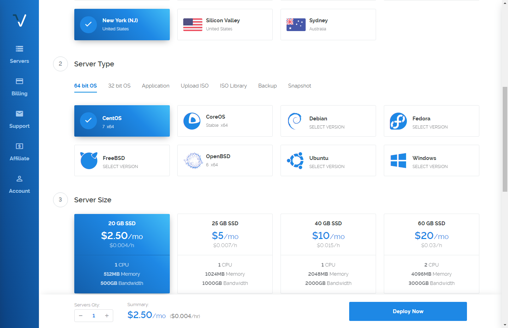

原文：

[自己用 VPS 搭建 SS 服务](https://hacpai.com/article/1491382329320)

[教你如何自己搭建vps](http://www.oneplusbbs.com/thread-3068029-1-1.html)

## Shadowsocks 和 VPN 的区别

### SS

- 可以根据配置自定义需要走代理的地址
- 手机可以直接开启不需要关闭 
- 基本不用担心会增加电量消耗
- 特征不明显不容易被断

### VPN

- 所有的连接都会通过 VPN 
- 会影响国内其它网站的访问速度
- 需要时开启, 不需要时关闭 会频繁点 VPN ~
- 有明显特征


</br>


## VPS 的选择

[老左常用国内 / 国外 VPS 推荐](http://www.laozuo.org/myvps)
我选了作为全球最大的游戏主机提供商之一的 vultr。

关于机房的选择，搜罗了一些评价后，大多数反映需要根据运营商来选择：

- 电信运行商：LA 的机房比较快，New York（NJ）的机房次之。
- 联通运营商：Tokyo, Japan 的机房比较块。

我购买的时候，Tokyo 和 LA  $2.5/mo 的产品已经缺货，所以只能购买 New York（NJ），ping 的平均延迟大概 125ms 左右，可接受。



</br>

## 搭建 shadowsocks 服务

### SSH 接连你的服务器

> 由于服务器是在美国 SSH 接连中输入速度会受到影响

#### Windows

需要装 SSH 接连的工具，比如 PuTTY，或者可以直接使用 github 的命令行客户端，一般已经安装了 ssh。

##### Mac

默认有 SSH 命令

>  此后所有的 `00.00.00.00` 为你服务器的 IP 地址

```
 ssh root@00.00.00.00
 login as: root
 root@00.00.00.00's password:
```

</br>

### 安装 shadowsocks 服务

#### 脚本一键安装

顺序执行以下三个语句

```
wget --no-check-certificate https://raw.githubusercontent.com/teddysun/shadowsocks_install/master/shadowsocks.sh
```

```
chmod +x shadowsocks.sh
```

```
./shadowsocks.sh 2>&1 | tee shadowsocks.log
```

- 期间没出现[{root@vurlt](mailto:%7Broot@vurlt)~}就不要动，这个命令是给服务器装SS。中间会提示你输入你的 `SS SERVER` 的密码和端口。建议你自己输入一个密码和端口(端口范围1-65536，推荐10000以上),如果不输入,系统会启用默认密码端口。然后按任意键继续

- 稍等一会跑完命令后会出来你的SS客户端的信息,记得记下来

  ```
  Congratulations, shadowsocks install completed!
  Your Server IP: 00.00.00.00
  Your Server Port: 433
  Your Password: 123456
  Your Local IP: 127.0.0.1
  Your Local Port: 1080
  Your Encryption Method: aes-256-cfb

  Welcome to visit:https://teddysun.com/342.html
  Enjoy it!
  ```

- 看到以上提示后就表明VPS上SS已经安装成功，并且已经设置了开机启动，VPS重启后不用手工启动SS。

- 此时，你的VPS重新启动，服务端已经完全配置完毕。


</br>

#### 手动安装	

- 安装 shadowsocks

```
$ python --version
Python 2.7.5 //需要 python 版本 >= 2.6

$ yum install m2crypto python-setuptools
$ yum install python-pip
$ pip install shadowsocks
```

> **m2crypto**: 加解密数据、操作密钥、操作 SSL 协议
>
> **python-setuptools**: ease_install 是 setuptools 包中的一个命令
>
> **ease_install**: 提供了在线一键安装模块的傻瓜方便方式
>
> **pip** 是 easy_install 的改进版，提供更好的提示信息，删除 package 等功能。（我们直接使用 pip ）


- shadowsocks 安装成功后可以看到

```
$ pip install shadowsocks
Collecting shadowsocks
  Using cached shadowsocks-2.8.2.tar.gz
Installing collected packages: shadowsocks
  Running setup.py install for shadowsocks ... done
Successfully installed shadowsocks-2.8.2
```


- 创建 shadowsocks 配置文件

```
$ vi /etc/shadowsocks.json
```

点击字母 i 进入 INSERT, 写入

```json
{
    "server":"00.00.00.00", // 服务器的IP地址
    "server_port":443,  	// ss 服务的端口
    "local_port":1080,  	// 本地端口
    "password":"123456",  	// ss 连接密码
    "timeout":600,  		// 超时时间 (s)
    "method":"aes-256-cfb" 	// 加密方式
}
```

ESC

```
$ :wq //写入并退出
```

</br>

#### 防火墙（手动安装需要设置）

```
$ firewall-cmd --query-port=443/tcp // 检查端口是不是已经启用了 如果已经占用了换个端口就好, 改一下上面的json文件
no
$ firewall-cmd --zone=public --add-port=443/tcp --permanent // 永久开启443端口(否则重启后连接会超时)
success
$ firewall-cmd --reload
success
```

若需要查看或者删除 ss 的防火墙设置

```
## 查看
$ firewall-cmd --zone= public --query-port=80/tcp
## 删除
$ firewall-cmd --zone= public --remove-port=80/tcp --permanent
```

</br>

### 启动 SS 服务

```
$ ssserver -c /etc/shadowsocks.json -d start
# 关闭服务把 start 改 stop
```

后台运行

```
# 注意这个会在当前路径下生成一个 nohup.out 的文件
$ nohup ssserver -c /etc/shadowsocks.json -d start &

# 这个方法下想要关闭 shadowsocks 的时候 kill 进程即可
$ ps -aux|grep shadowsocks
root     10085  0.0  1.7 206632  8724 ?        Ss   07:50   0:00 /usr/bin/python /usr/bin/ssserver -c /etc/shadowsocks.json -d start
root     10121  0.0  0.1 112648   960 pts/1    R+   07:55   0:00 grep --color=auto shadowsocks
$ kill 10085
```

</br>

## 接连 SS

[shadowsocks 官网 下载](https://shadowsocks.org/en/download/clients.html) （官网经常打不开）

[shadowsocks GitHub 下载](https://github.com/shadowsocks?utf8=%E2%9C%93&q=sh&type=&language=)

- [Windows 版本](https://github.com/shadowsocks/shadowsocks-windows/releases/)
- [Mac 版本](https://github.com/shadowsocks/ShadowsocksX-NG/releases)
- **IOS** 中国 App Store 能下载到 OpenWingy (免费)


## 写在最后

Vultr VPS 使用起来还是挺稳定的，实例配置也很便捷，界面友好，最便宜的 $2.5/month。

如果觉得文章对你有帮助，可以使用我的推荐链接注册，[Vultr 官网](https://www.vultr.com/?ref=7262235) ，我似乎可以得到推广费哈哈哈。

<a href="https://www.vultr.com/?ref=7262235"></a>

