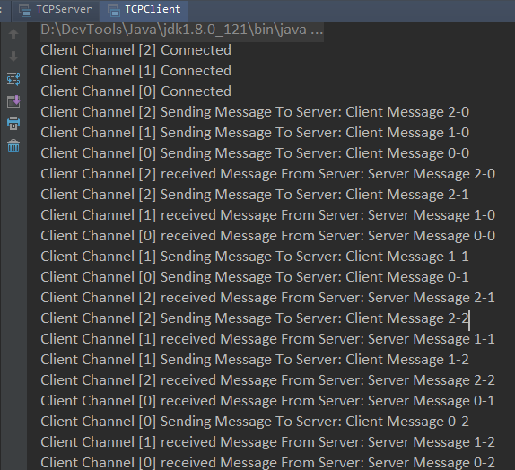
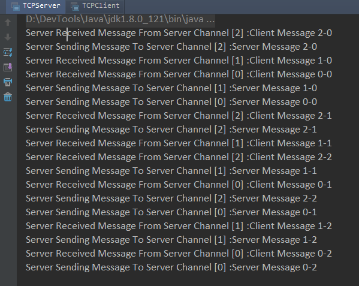

---
categories:
  - Java Core
  - Java NIO
date: 2017-04-25 00:04
title: Java NIO（十二）之 Channel  Demo
---
## Demo

以下代码使用 ``ServerSocketChannel`` 和 ``SocketChannel`` 搭建一个 客户端/服务端 通信的示例，客户端发起三个连接，每个连接连续读写三次数据。

## 1. 服务端代码：

```java
package org.demo.nio;

import java.io.IOException;
import java.net.InetSocketAddress;
import java.nio.channels.*;
import java.util.Iterator;

/**
 * Created by jzchen on 2017/4/3.
 */
public class TCPServer {


    public static void main(String[] args) {

        ServerSocketChannel serverSocketChannel = null;
        Selector selector = null;
        Iterator<SelectionKey> iterator = null;
        SelectionKey selectionKey = null;

        try {
            /*
             * 启动服务端
             */
            selector = Selector.open();
            serverSocketChannel = ServerSocketChannel.open();
            serverSocketChannel.socket().bind(new InetSocketAddress(9999));
            serverSocketChannel.configureBlocking(false);                   //设置 Channel 非阻塞模式
            serverSocketChannel.register(selector, SelectionKey.OP_ACCEPT);         //ServerSocketChannel 注册“接收就绪”
        }catch (IOException e) {
            e.printStackTrace();
        }

        ServerHandler handler = new ServerHandler(selector);

        /*
         * 服务端循环等待客户端连接或读数据
         */
        while(true) {

            try{
                /*
                 * 检测是否有 Channel 就绪
                 */
                while (selector.select()==0 ){
                    continue;
                }

                iterator = selector.selectedKeys().iterator();

                while(iterator.hasNext()) {
                    selectionKey  = iterator.next();
                    if(selectionKey.isAcceptable())
                        handler.handleAccept(selectionKey);
                    else if(selectionKey.isReadable())
                        handler.handleRead(selectionKey);
                    else if(selectionKey.isWritable())
                        handler.handleWrite(selectionKey);

                    /*
                     * 处理后的通道必须从集合中移除，否则无法向客户端写数据，会一直重复 “写就绪”
                     */
                    iterator.remove();
                }
            }catch (IOException e) {
                e.printStackTrace();
                /*
                 * 遇到异常，如客户端断开，需要移除
                 */
                iterator.remove();
            }
        }
    }
}
```

## 2. 服务端连接处理类：

```java
package org.demo.nio;

import java.io.IOException;
import java.nio.ByteBuffer;
import java.nio.channels.SelectionKey;
import java.nio.channels.Selector;
import java.nio.channels.ServerSocketChannel;
import java.nio.channels.SocketChannel;
import java.nio.charset.Charset;

/**
 * Created by jzchen on 2017/4/3.
 */
public class ServerHandler {

    Selector selector = null;
    ServerHandler(Selector selector) {
        this.selector = selector;
    }

    int clientChannelCount = 0;

    /**
     * 处理连接
     * @param selectionKey
     * @throws IOException
     */
    public void handleAccept(SelectionKey selectionKey) throws IOException{
        ServerSocketChannel serverChannel = (ServerSocketChannel) selectionKey.channel();
        SocketChannel channel = serverChannel.accept();
        channel.configureBlocking(false);

        //设置通道信息，用户客户端提示信息
        Integer[] channelMsg = new Integer[2];
        channelMsg[0] = clientChannelCount++;
        channelMsg[1] = 0;

        SelectionKey clientSelectionKey = channel.register(selector, SelectionKey.OP_READ);
        clientSelectionKey.attach(channelMsg);
    }

    /**
     * 处理读
     * @param selectionKey
     * @throws IOException
     */
    public void handleRead(SelectionKey selectionKey) throws IOException{

        Integer[] channelMsg =  (Integer[]) selectionKey.attachment();
        Integer channelNum = channelMsg[TCPClient.CHANNEL_NUM_INT];
        Integer msgNum = channelMsg[TCPClient.MSG_NUM_INT];
        SocketChannel channel = (SocketChannel) selectionKey.channel();
        ByteBuffer buffer = ByteBuffer.allocate(100);

        /*
         * 读取不到内容说明，客户端断开连接，关闭服务端的channel（目前还不知道会不会出问题）
         */
        if(channel.read(buffer) <0 ) {
            selectionKey.channel().close();
            return;
        }

        buffer.flip();
        while (buffer.hasRemaining()) {
            String clientMsg = Charset.forName("UTF-8").newDecoder().decode(buffer).toString();
            System.out.println("Server Received Message From Server Channel [" + channelNum + "] :" + clientMsg);
        }

        /*
         * 重新设置关注的事件
         */
        selectionKey.interestOps(SelectionKey.OP_WRITE);
    }

    /**
     * 处理写
     * @param selectionKey
     * @throws IOException
     */
    public void handleWrite(SelectionKey selectionKey) throws IOException {
        Integer[] channelMsg =  (Integer[]) selectionKey.attachment();
        Integer channelNum = channelMsg[TCPClient.CHANNEL_NUM_INT];
        Integer msgNum = channelMsg[TCPClient.MSG_NUM_INT];
        SocketChannel channel = (SocketChannel) selectionKey.channel();

        String ServerMsg = "Server Message " + channelNum + "-" + msgNum;
        ByteBuffer respBuffer = ByteBuffer.wrap(ServerMsg.getBytes("UTF-8"));
        System.out.println("Server Sending Message To Server Channel [" + channelNum + "] :" + ServerMsg);
        while (respBuffer.hasRemaining())
            channel.write(respBuffer);

         /*
         * 重新设置关注的事件
         */
        selectionKey.interestOps(SelectionKey.OP_READ);
        channelMsg[TCPClient.MSG_NUM_INT]++;
    }
}
```


##  3. 客户端代码：

```java
package org.demo.nio;

import java.io.IOException;
import java.net.InetSocketAddress;
import java.nio.channels.SelectionKey;
import java.nio.channels.Selector;
import java.nio.channels.SocketChannel;
import java.util.Iterator;

/**
 * Created by jzchen on 2017/4/3.
 */
public class TCPClient {

    public static Integer CHANNEL_NUM_INT = 0;
    public static Integer MSG_NUM_INT = 1;

    public static void main(String[] args) {

        Selector selector = null;

        try {
            selector = Selector.open();

            ClientHandler handler = new ClientHandler(selector);

            /*
             * 开启三个客户端连接，每个连接会发送三次信息到服务端
             */
            for(int i=0; i<3; i++) {

                SocketChannel channel = SocketChannel.open();
                channel.configureBlocking(false);
                channel.connect(new InetSocketAddress("127.0.0.1", 9999));
                SelectionKey selectionKey = channel.register(selector, SelectionKey.OP_CONNECT | SelectionKey.OP_WRITE);

                //设置通道信息，用于组装客户端信息
                Integer[] channelMsg = new Integer[2];
                channelMsg[CHANNEL_NUM_INT] = i;
                channelMsg[MSG_NUM_INT] = 0;
                selectionKey.attach(channelMsg);

            }

            while(true) {
                /*
                 * 检测是否有 Channel 就绪
                 */
                while(selector.select()==0)
                    continue;

                Iterator<SelectionKey> iterator = selector.selectedKeys().iterator();

                while(iterator.hasNext()) {
                    SelectionKey selectionKey = iterator.next();
                    if (selectionKey.isConnectable())
                        handler.handleConnect(selectionKey);
                    else if (selectionKey.isReadable())
                        handler.handleRead(selectionKey);
                    else if (selectionKey.isWritable())
                        handler.handleWrite(selectionKey);


                    /*
                     * “连接就绪”处理后会进入“写就绪状态”
                     * 写处理后的通道必须从集合中移除，否则无法向服务端写数据，会一直重复 “写就绪”
                     */
                    iterator.remove();
                }

            }

        } catch (IOException e) {
            e.printStackTrace();
        } catch (Exception exc) {
            exc.printStackTrace();
        }
    }
}
```


## 4. 客户端连接处理类

```java
package org.demo.nio;

import java.io.IOException;
import java.nio.ByteBuffer;
import java.nio.channels.SelectionKey;
import java.nio.channels.Selector;
import java.nio.channels.SocketChannel;
import java.nio.charset.Charset;

/**
 * Created by jzchen on 2017/4/3.
 */
public class ClientHandler {

    public Selector selector = null;

    ClientHandler(Selector selector) {
        this.selector = selector;
    }

    public void handleConnect(SelectionKey selectionKey) throws IOException {
        Integer[] channelMsg =  (Integer[]) selectionKey.attachment();
        Integer channelNum = channelMsg[TCPClient.CHANNEL_NUM_INT];

        SocketChannel channel = (SocketChannel) selectionKey.channel();
        //非阻塞可能尚未连接完成
        while(!channel.finishConnect()) {
            continue;
        }
        System.out.println("Client Channel ["+ channelNum + "] Connected");
    }

    public void handleRead(SelectionKey selectionKey) throws IOException {
        Integer[] channelMsg =  (Integer[]) selectionKey.attachment();
        Integer channelNum = channelMsg[TCPClient.CHANNEL_NUM_INT];

        SocketChannel channel = (SocketChannel) selectionKey.channel();
        ByteBuffer buffer = ByteBuffer.allocate(100);
        channel.read(buffer);

        buffer.flip();
        String serverMsg = Charset.forName("UTF-8").newDecoder().decode(buffer).toString();
        System.out.println("Client Channel ["+ channelNum + "] received Message From Server: " + serverMsg);

        selectionKey.interestOps(SelectionKey.OP_WRITE);
    }

    public void handleWrite(SelectionKey selectionKey) throws IOException {
        Integer[] channelMsg =  (Integer[]) selectionKey.attachment();
        Integer channelNum = channelMsg[TCPClient.CHANNEL_NUM_INT];
        Integer msgNum = channelMsg[TCPClient.MSG_NUM_INT];
        SocketChannel channel = (SocketChannel) selectionKey.channel();

        //每个通道只连续向服务端发送3次信息。
        if(msgNum >= 3) {
            channel.close();
            return;
        }

        String clientMsg = "Client Message " + channelNum + "-" + msgNum;
        ByteBuffer buffer = ByteBuffer.wrap(clientMsg.getBytes("UTF-8"));
        System.out.println("Client Channel ["+ channelNum + "] Sending Message To Server: " + clientMsg);

        if(buffer.hasRemaining())
            channel.write(buffer);

        selectionKey.interestOps(SelectionKey.OP_READ);
        channelMsg[TCPClient.MSG_NUM_INT]++;
    }

}
```

## 5. 运行结果

**客户端**




**服务端**

