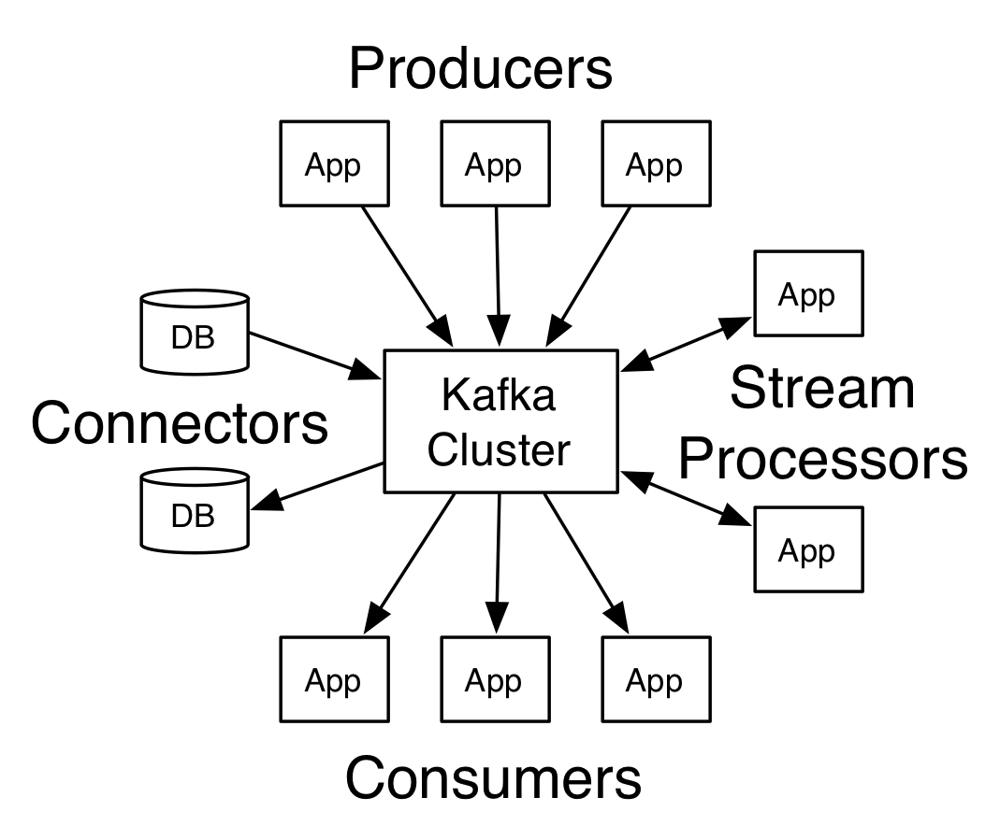
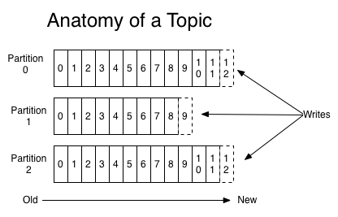

## **介绍**

**Kafka作为一个分布式的流平台，这到底意味着什么？**

我们认为，一个**流处理平台**具有三个关键能力：

1. 发布和订阅消息（流），在这方面，它类似于一个消息队列或企业消息系统。
2. 以`容错`的方式存储消息（流）。
3. 在消息流发生时处理它们。

<!-- more -->

### **什么是kakfa的优势**

**它应用于2大类应用：**

1. 构建实时的流数据管道，可靠地获取系统和应用程序之间的数据。
2. 构建实时流的应用程序，对数据流进行转换或反应。

### **几个概念**

1. kafka作为一个集群运行在一个或多个服务器上。

2. kafka集群存储的消息是以topic为类别记录的。

3. 每个消息（也叫记录record，我习惯叫消息）是由一个key，一个value和时间戳构成。

   ​

### **kafka有四个核心API**

- 应用程序使用 `Producer API` 发布消息到一个或多个topic（主题）。
- 应用程序使用 `Consumer API` 来订阅一个或多个topic，并处理产生的消息。
- 应用程序使用 `Streams API` 充当一个流处理器，从1个或多个topic消费输入流，并生产一个输出流到1个或多个输出topic，**有效地将输入流转换到输出流**。
- `Connector API`允许构建或运行可重复使用的生产者或消费者，**将topic连接到现有的应用程序或数据系统**。例如，一个关系数据库的连接器可捕获每一个变化。

Client和Server之间的通讯，是通过一条简单、高性能并且和开发语言无关的TCP协议，除了Java Client外，还有非常多的其它编程语言的Client	。

### **Kafka所使用的基本术语**

- **Topic**：Kafka将消息种子(Feed)分门别类，每一类的消息称之为一个主题(Topic).

- **Producer**：发布消息的对象称之为主题生产者(Kafka topic producer)

- **Consumer**：订阅消息并处理发布的消息的种子的对象称之为主题消费者(consumers)

- **Broker**：已发布的消息保存在一组服务器中，称之为Kafka集群。集群中的每一个服务器都是一个代理(Broker). 消费者可以订阅一个或多个主题（topic），并从Broker拉数据，从而消费这些已发布的消息。

## 话题和日志 (Topic和Log)
Topic是发布的消息的类别或者种子Feed名。对于每一个Topic，Kafka集群维护这一个分区的log，就像下图中的示例：

- 每一个分区都是一个**顺序的、不可变**的消息队列， 并且可以持续的添加。分区中的消息都被分了一个序列号，称之为**偏移量(offset)**，在每个分区中此偏移量都是唯一的。
- Kafka集群**保持所有的消息**，直到它们过期， 无论消息是否被消费了。
- 实际上消费者所持有的仅有的元数据就是这个偏移量，也就是消费者在这个log中的位置。 这个**偏移量由消费者控制**：正常情况当消费者消费消息的时候，偏移量也线性的的增加。但是实际偏移量由消费者控制，消费者可以将偏移量重置为更老的一个偏移量，重新读取消息。 可以看到这种设计对消费者来说操作自如， **一个消费者的操作不会影响其它消费者对此log的处理**。
- 再说说分区。Kafka中采用分区的设计有几个目的。一是可以处理更多的消息，**不受单台服务器的限制**。Topic拥有多个分区意味着它可以不受限的处理更多的数据。第二，分区可以作为**并行处理的单元**，稍后会谈到这一点。

## 分布式(Distribution)

- Log的分区被**分布到集群中的多个服务器上**。每个服务器处理它分到的分区。 
- 根据配置每个分区还可以复制到其它服务器作为**备份容错**。 每个分区有一个leader，零或多个follower。Leader处理此分区的所有的读写请求，而follower被动的复制数据。如果leader宕机，其它的一个follower会被推举为新的leader。 
- 一台服务器可能同时是一个分区的leader，另一个分区的follower。 这样可以平衡负载，避免所有的请求都只让一台或者某几台服务器处理。

## 生产者(Producers)

生产者往某个Topic上发布消息。**生产者也负责选择发布到Topic上的哪一个分区**。最简单的方式从分区列表中轮流选择。也可以根据某种算法依照权重选择分区。**开发者负责如何选择分区的算法**。

## 消费者(Consumers)

- 通常来讲，消息模型可以分为两种， **`队列` 和`发布-订阅`式**。 
- **队列**的处理方式是：一组消费者从服务器读取消息，**一条消息只有其中的一个消费者来处理**。
- 在**发布-订阅模型**中：消息被广播给所有的消费者，接收到消息的消费者都可以处理此消息。
- Kafka为这两种模型提供了单一的消费者抽象模型： **消费者组 （consumer group）**。 消费者用一个消费者组名标记自己。 一个发布在Topic上消息被分发给此消费者组中的一个消费者。 
- 假如所有的消费者都在一个组中，那么这就变成了queue模型。 假如所有的消费者都在不同的组中，那么就完全变成了发布-订阅模型。 更通用的， 我们可以创建一些消费者组作为逻辑上的订阅者。每个组包含数目不等的消费者， 一个组内多个消费者可以用来扩展性能和容错。正如下图所示：

## Kafka的保证(Guarantees)
- 生产者发送到一个特定的Topic的分区上，**消息将会按照它们发送的顺序依次加入**，也就是说，如果一个消息M1和M2使用相同的producer发送，M1先发送，那么M1将比M2的offset低，并且优先的出现在日志中。
- 消费者收到的消息也是此顺序。
- 如果一个Topic配置了复制因子（replication facto）为N， 那么可以允许N-1服务器宕机而不丢失任何已经提交（committed）的消息。

有关这些保证的更多详细信息，请参见文档的设计部分。

## kafka作为一个消息系统

**Kafka的流与传统企业消息系统相比的概念如何？**

- 传统的消息有两种模式：`队列`和`发布订阅`。
  - **队列模式**：消费者池从服务器读取消息（每个消息只被其中一个读取）; 
  - **发布订阅模式**：消息广播给所有的消费者。
- 这两种模式都有优缺点，**队列**的优点是允许多个消费者瓜分处理数据，这样可以扩展处理。但是，队列不像多个订阅者，一旦消息者进程读取后故障了，那么消息就丢了。而**发布和订阅**允许你广播数据到多个消费者，由于每个订阅者都订阅了消息，所以没办法缩放处理。
- **kafka中消费者组有两个概念**：
  - `队列`：消费者组（consumer group）允许同名的消费者组成员瓜分处理。
  - `发布订阅`：允许你广播消息给多个消费者组（不同名）。

> kafka的每个topic都具有这两种模式。

**kafka有比传统的消息系统更强的顺序保证。**

- 传统的消息系统按顺序保存数据，如果多个消费者从队列消费，则服务器按存储的顺序发送消息，但是，尽管服务器按顺序发送，消息异步传递到消费者，因此消息可能乱序到达消费者。这意味着**消息存在并行消费的情况，顺序就无法保证**。消息系统常常通过**仅设1个消费者**来解决这个问题，但是这意味着没用到并行处理。

- kafka做的更好。通过并行`topic`的`parition` —— **kafka提供了顺序保证和负载均衡**。
  - 每个`partition`仅由同一个消费者组中的一个消费者消费到。并确保消费者是该partition的唯一消费者，并按顺序消费数据。
  - 每个`topic`有多个分区，则需要对多个消费者做负载均衡，但请注意，**相同的消费者组中不能有比分区更多的消费者，否则多出的消费者一直处于空等待，不会收到消息**。

> 理解：消费者组内的多个消费者共同消费一个主题，但每个 partition 仅由同一个消费者组中的一个消费者消费，这样能保证需要保证顺序的消息在同个分区内被同一个消费者顺序消费，又能让多个消费者共同消费一个主题所有消息，实现负载均衡。

## kafka作为一个存储系统

- 所有**发布消息**和**消费消息**分离的系统，实际上都充当了一个存储系统（发布的消息先存储起来）。Kafka比别的系统的优势是它是一个**非常高性能的`存储系统`**。
- 写入到kafka的数据的数据也同时**写到磁盘并复制到集群中保证容错性**。并允许生产者等待消息应答，直到消息完全写入。
- kafka的磁盘结构 - 无论你服务器上有50KB或50TB，执行是相同的。

client来控制读取数据的位置。你还可以认为kafka是一种专用于高性能，低延迟，提交日志存储，复制，和传播特殊用途的`分布式文件系统`。

## kafka的流处理

- 仅仅读，写和存储是不够的，kafka的目标是实时的流处理。
- 在kafka中，流处理持续获取`输入topic`的数据，进行处理加工，然后写入`输出topic`。例如，一个零售APP，接收销售和出货的`输入流`，统计数量或调整价格后输出。
- 可以直接使用`producer API`和`consumer API`进行简单的处理。对于复杂的转换，Kafka提供了更强大的`Streams API`。可构建`聚合计算`或`连接流到一起`的复杂应用程序。
- 有助于解决此类应用面临的硬性问题：处理无序的数据，代码更改的再处理，执行状态计算等。
- Sterams API在Kafka中的核心：使用producer和consumer API作为输入，利用Kafka做状态存储，使用相同的组机制在stream处理器实例之间进行容错保障。

## 总结

- 消息传递，存储和流处理的组合看似反常，但对于Kafka作为流式处理平台的作用至关重要。
- 像HDFS这样的分布式文件系统允许存储静态文件来进行批处理。这样系统可以有效地存储和**处理来自过去的历史数据**。
- 传统企业的消息系统允许在你订阅之后处理未来的消息：**在未来数据到达时处理它**。
- Kafka结合了这两种能力，这种组合对于kafka作为流处理应用和流数据管道平台是至关重要的。
- 批处理以及消息驱动应用程序的流处理的概念：通过组合存储和低延迟订阅，流处理应用可以用相同的方式对待过去和未来的数据。它是一个单一的应用程序，它可以处理历史的存储数据，当它处理到最后一个消息时，它进入**等待未来的数据到达**，而不是结束。
- 同样，对于流数据管道（pipeline），订阅实时事件的组合使得可以将Kafka用于非常低延迟的管道；但是，可靠地存储数据的能力使得它可以将其用于必须保证传递的关键数据，或与仅定期加载数据或长时间维护的离线系统集成在一起。流处理可以在数据到达时转换它。

## 最后怎么样才算真正的学会kafka
- kafka节点之间如何复制备份的？
- kafka消息是否会丢失？为什么？
- kafka最合理的配置是什么？
- kafka的leader选举机制是什么？
- kafka对硬件的配置有什么要求？
- kafka的消息保证有几种方式？

...

​	

参考：

[Apache Kafka Introduction](https://kafka.apache.org/documentation/#introduction)

[kafka安装和启动 —— 半兽人