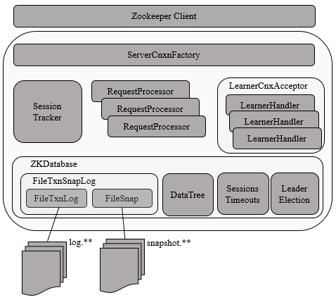
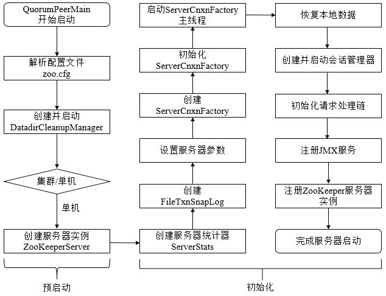

## 服务端

服务端整体架构如下

**Zookeeper服务器的启动**，大致可以分为以下五个步骤

1. 配置文件解析。
2. 初始化数据管理器。
3. 初始化网络I/O管理器。
4. 数据恢复。
5. 对外服务。

## 单机版服务器启动

**单机版服务器的启动其流程图如下**

上图的过程可以分为**预启动**和**初始化**过程。

**1. 预启动**

1. 统一由**`QuorumPeerMain`**作为启动类。无论单机或集群，在 `zkServer.cmd` 和 `zkServer.sh` 中都配置了QuorumPeerMain 作为启动入口类。
2. 解析配置文件 `zoo.cfg`。zoo.cfg配置运行时的基本参数，如**tickTime、dataDir、clientPort**等参数。
3. 创建并启动**历史文件清理器 `DatadirCleanupManager`**。对事务日志和快照数据文件进行定时清理。
4. 判断当前是集群模式还是单机模式启动。若是单机模式，则委托给 **ZooKeeperServerMain** 进行启动。
5. 再次进行配置文件zoo.cfg的解析。
6. 创建服务器实例 **ZooKeeperServer**。Zookeeper服务器首先会进行服务器实例的创建，然后对该服务器实例进行初始化，包括**连接器、内存数据库、请求处理器**等组件的初始化。

**2. 初始化**

1. 创建服务器**统计器`ServerStats`**。ServerStats是Zookeeper**服务器运行时的统计器**。
2. 创建Zookeeper**数据管理器`FileTxnSnapLog`**。FileTxnSnapLog是Zookeeper**上层服务器和底层数据存储之间的对接层**，提供了一系列操作数据文件的接口，如**事务日志文件和快照数据文件**。Zookeeper根据zoo.cfg文件中解析出的快照数据目录**dataDir**和事务日志目录**dataLogDir**来创建FileTxnSnapLog。
3. 设置服务器**tickTime**和会话超时时间限制。
4. **创建ServerCnxnFactory**。通过配置系统属性`zookeper.serverCnxnFactory`来指定使用Zookeeper自己实现的NIO还是使用Netty框架作为Zookeeper**服务端网络连接工厂**。
5. **初始化**ServerCnxnFactory。Zookeeper会初始化Thread作为ServerCnxnFactory的主线程，然后再初始化NIO服务器。
6. **启动**ServerCnxnFactory主线程。进入Thread的run方法，此时服务端还不能处理客户端请求。
7. **恢复本地数据**。启动时，需要从本地快照数据文件和事务日志文件进行数据恢复。
8. **创建并启动会话管理器**。Zookeeper会创建会话管理器**SessionTracker**进行会话管理。
9. **初始化Zookeeper的请求处理链**。Zookeeper请求处理方式为责任链模式的实现。会有多个请求处理器依次处理一个客户端请求，在服务器启动时，会将这些请求处理器串联成一个请求处理链。
10. **注册JMX服务**。Zookeeper会将服务器运行时的一些信息以JMX的方式暴露给外部。
11. **注册Zookeeper服务器实例**。将Zookeeper服务器实例注册给ServerCnxnFactory，之后Zookeeper就可以对外提供服务。

**至此，单机版的Zookeeper服务器启动完毕。**

## 集群服务器启动

**单机和集群服务器的启动在很多地方是一致的，其流程图如下**

上图的过程可以分为**预启动、初始化、Leader选举、Leader与Follower启动期交互过程、Leader与Follower启动**等过程。

**1. 预启动**

1. 统一由**QuorumPeerMain**作为启动类。
2. 解析配置文件`zoo.cfg`。
3. 创建并启动历史文件清理器**DatadirCleanupFactory**。
4. 判断当前是集群模式还是单机模式的启动。在集群模式中，在**zoo.cfg文件中配置了多个服务器地址**，可以选择集群启动。

　　

**2. 初始化**

1. **创建ServerCnxnFactory**。
2. **初始化**ServerCnxnFactory。
3. 创建Zookeeper**数据管理器FileTxnSnapLog**。
4. **创建QuorumPeer实例**。**Quorum是集群模式下特有的对象**，是Zookeeper服务器实例**（ZooKeeperServer）的托管者**，QuorumPeer代表了集群中的一台机器，在运行期间，QuorumPeer会不断检测当前服务器实例的运行状态，同时根据情况发起Leader选举。
5. 创建**内存数据库ZKDatabase**。ZKDatabase负责管理ZooKeeper的**所有会话记录以及DataTree和事务日志的存储**。
6. **初始化QuorumPeer**。将核心组件如**FileTxnSnapLog、ServerCnxnFactory、ZKDatabase**注册到QuorumPeer中，同时配置QuorumPeer的参数，如服务器列表地址、Leader选举算法和会话超时时间限制等。
7. 恢复本地数据。
8. 启动ServerCnxnFactory主线程。

**3. Leader选举**

1. **初始化Leader选举**。**集群模式特有**，Zookeeper首先会根据自身的服务器ID（SID）、最新的ZXID（lastLoggedZxid）和当前的服务器epoch（currentEpoch）来生成一个初始化投票，在初始化过程中，每个服务器都会给自己投票。然后，根据zoo.cfg的配置，创建相应Leader选举算法实现，Zookeeper提供了三种默认算法（LeaderElection、AuthFastLeaderElection、FastLeaderElection），可通过zoo.cfg中的electionAlg属性来指定，**但现只支持FastLeaderElection选举算法**。在初始化阶段，Zookeeper会创建Leader选举所需的**网络I/O层QuorumCnxManager**，同时启动对Leader选举端口的监听，等待集群中其他服务器创建连接。
2. 注册JMX服务。
3. 检测当前服务器状态。运行期间，QuorumPeer会不断检测当前服务器状态。在正常情况下，Zookeeper服务器的状态在LOOKING、LEADING、FOLLOWING/OBSERVING之间进行切换。**在启动阶段，QuorumPeer的初始状态是LOOKING，因此开始进行Leader选举**。
4. **Leader选举**。通过投票确定Leader，其余机器称为Follower和Observer。具体算法在后面会给出。

**4. Leader和Follower启动期交互过程**

1. **创建Leader服务器和Follower服务器**。完成Leader选举后，每个服务器会根据自己服务器的角色创建相应的服务器实例，并进入各自角色的主流程。
2. Leader服务器启动**Follower接收器LearnerCnxAcceptor**。运行期间，Leader服务器需要和所有其余的服务器（统称为Learner）保持连接以确集群的机器存活情况，**LearnerCnxAcceptor负责接收所有非Leader服务器的连接请求**。
3. **Leader服务器开始和Leader建立连接**。所有Learner会找到Leader服务器，并与其建立连接。
4. **Leader服务器创建LearnerHandler**。Leader接收到来自其他机器连接创建请求后，会创建一个LearnerHandler实例，**每个LearnerHandler实例都对应一个Leader与Learner服务器之间的连接**，其负责Leader和Learner服务器之间几乎所有的消息通信和数据同步。
5. **向Leader注册**。Learner完成和Leader的连接后，会向Leader进行注册，即将Learner服务器的基本信息（LearnerInfo），包括SID和ZXID，发送给Leader服务器。
6. **Leader解析Learner信息，计算新的epoch**。Leader接收到Learner服务器基本信息后，会解析出该Learner的SID和ZXID，然后根据ZXID解析出对应的epoch_of_learner，并和当前Leader服务器的epoch_of_leader进行比较，如果该Learner的epoch_of_learner更大，则更新Leader的epoch_of_leader = epoch_of_learner + 1。然后LearnHandler进行等待，直到过半Learner已经向Leader进行了注册，同时更新了epoch_of_leader后，Leader就可以确定当前集群的epoch了。
7. **发送Leader状态**。计算出新的epoch后，Leader会将该信息以一个LEADERINFO消息的形式发送给Learner，并等待Learner的响应。
8. **Learner发送ACK消息**。Learner接收到LEADERINFO后，会解析出epoch和ZXID，然后向Leader反馈一个ACKEPOCH响应。
9. **数据同步**。Leader收到Learner的ACKEPOCH后，即可进行数据同步。
10. **启动Leader和Learner服务器**。当有*过半Learner已经完成了数据同步*，那么Leader和Learner服务器实例就可以启动了。

**5. Leader和Follower启动**

1. 创建启动会话管理器。
2. 初始化Zookeeper请求处理链，集群模式的每个处理器也会在启动阶段串联请求处理链。
3. 注册JMX服务。

**至此，集群版的Zookeeper服务器启动完毕。**

参考文章：

[【分布式】Zookeeper服务端启动](http://www.cnblogs.com/leesf456/p/6105276.html)

《从Paxos到Zookeeper分布式一致性原理与实践》