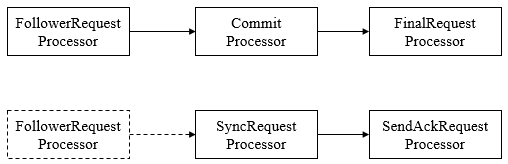
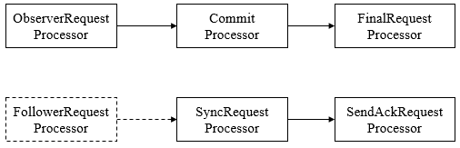

## Leader

Leader服务器是Zookeeper集群工作的核心，其主要工作如下

1. 事务请求的**唯一调度和处理者**，保证集群事务处理的**顺序性**。
2. 集群内部各服务器的**调度者**

### **请求处理链**

使用**责任链**来处理每个客户端的请求时Zookeeper的特色，Leader服务器的请求处理链如下

1. **PrepRequestProcessor**。请求预处理器。在Zookeeper中，那些会改变服务器状态的请求称为**事务请求**（创建节点、更新数据、删除节点、创建会话等），PrepRequestProcessor能够识别出当前客户端请求是否是事务请求。对于事务请求，PrepRequestProcessor处理器会**对其进行一系列预处理**，如创建请求事务头、事务体、会话检查、ACL检查和版本检查等。
2. **ProposalRequestProcessor**。事务投票处理器。**Leader服务器事务处理流程的发起者**，对于非事务性请求，ProposalRequestProcessor会直接将请求转发到CommitProcessor处理器，不再做任何处理，而对于事务性请求，处理将请求转发到CommitProcessor外，还会**根据请求类型创建对应的Proposal提议**，并发送给所有的Follower服务器来**发起一次集群内的事务投票**。同时，ProposalRequestProcessor还会将事务请求交付给SyncRequestProcessor进行**事务日志的记录**。
3. **SyncRequestProcessor**。事务日志记录处理器。用来将事务请求记录到事务日志文件中，同时会触发Zookeeper进行数据快照。
4. **AckRequestProcessor**。负责在SyncRequestProcessor完成事务日志记录后，向Proposal的投票收集器**发送ACK反馈**，以通知投票收集器当前服务器已经完成了对该Proposal的**事务日志记录**。
5. **CommitProcessor**。事务提交处理器。对于非事务请求，该处理器会直接将其交付给下一级处理器处理；对于事务请求，其会等待集群内针对Proposal的投票直到该Proposal可被提交，利用CommitProcessor，每个服务器都可以很好地**控制对事务请求的顺序处理**。
6. **ToBeCommitProcessor**。该处理器有一个**`toBeApplied`**队列，用来存储那些已经被CommitProcessor处理过的可被提交的Proposal。其会将这些请求交付给FinalRequestProcessor处理器处理，待其处理完后，再将其从toBeApplied队列中移除。
7. **FinalRequestProcessor**。用来进行客户端请求返回之前的操作，包括创建客户端请求的响应，针对事务请求，该处理还会负责**将事务应用**到内存数据库中去。

### LearnerHandler

为了保证整个集群内部的实时通信，同时为了确保可以控制所有的Follower/Observer服务器，Leader服务器会**与每个Follower/Observer服务器建立一个TCP长连接**。同时也会为每个Follower/Observer服务器创建一个名为**`LearnerHandler`**的实体。LearnerHandler是Learner服务器的管理者，主要负责Follower/Observer服务器和Leader服务器之间的一系列网络通信，包括**数据同步、请求转发和Proposal提议的投票等**。Leader服务器中保存了所有Follower/Observer对应的LearnerHandler。

## **Follower**

　　Follower是Zookeeper集群的跟随者，其主要工作如下

1. 处理客户端非事务性请求（读取数据），转发事务请求给Leader服务器。
2. 参与事务请求Proposal的投票。
3. 参与Leader选举投票。

Follower也采用了**责任链模式**组装的请求处理链来处理每一个客户端请求，由于不需要对事务请求的投票处理，因此Follower的请求处理链会相对简单，其处理链如下

1. **FollowerRequestProcessor**。其用作识别当前请求是否是事务请求，若是，那么Follower就会**将该请求转发给Leader服务器**，Leader服务器是在接收到这个事务请求后，就会将其提交到请求处理链，按照正常事务请求进行处理。
2. **SendAckRequestProcessor**。其承担了事务日志记录反馈的角色，在完成事务日志记录后，会向Leader服务器**发送ACK消息**以表明自身完成了事务日志的记录工作。

## Observer

Observer充当观察者角色，观察Zookeeper集群的最新状态变化并将这些状态同步过来，其对于非事务请求可以进行独立处理，对于事务请求，则会转发给Leader服务器进行处理。**Observer不会参与任何形式的投票**，包括事务请求Proposal的投票和Leader选举投票。其处理链如下

## 集群间消息通信

Zookeeper的消息类型大体分为**数据同步型、服务器初始化型、请求处理型和会话管理型**。

1. **数据同步型**。指在Learner和Leader服务器进行数据同步时，网络通信所用到的消息，通常有**DIFF、TRUNC、SNAP、UPTODATE**。

| 消息类型         | 发送方-> 接收方         | 说明                                      |
| :----------- | :---------------- | --------------------------------------- |
| **DIFF**     | Leader -> Learner | 用于通知Learner服务器，Leader即将与其进 行DIFF方式的数据同步 |
| **TRUNC**    | Leader -> Learner | 用于触发Learner服务器进行内存数据库的回 滚操作             |
| **SNAP**     | Leader -> Learner | 用于通知Learner服务器，Leader即将与其进 行SNAP方式的数据同步 |
| **UPTODATE** | Leader -> Learner | 用于告知Learner服务器已经完成了数据同步， 可以幵始对外提供服务     |

2. **服务器初始化型**。指在整个集群或是某些新机器初始化时，Leader和Learner之间相互通信所使用的消息类型，常见的有OBSERVERINFO、FOLLOWERINFO、LEADERINFO、ACKEPOCH和NEWLEADER五种。

| 消息类型             | 发送方->接收方          | 说明                                       |
| :--------------- | :---------------- | :--------------------------------------- |
| **OBSERVERINFO** | Observer->Leader  | 用于向Leader服务器注册自己，同时向Leader服务器 表明当前Learner服务器是Observer，消息中包含 Observer 的 SID 和 ZXID |
| **FOLLOWERINFO** | Follower->Leader  | 用于向Leader注册自己，表明当前Learner服务器是 Follower，消息中包含Follower的SID和ZXID |
| **LEADERINFO**   | Leader -> Learner | Leader 收到 OBSERVERINFO 和 FOLLOWERINFO 后， 会将自身的基本信息发送给这些Learner,这个消息就 是LEADERINFO,消息中包含Leader的EPOCH值 |
| **ACKEPOCH**     | Learner -> Leader | Learner接受到Leader发来的LEADERINFO后，会将自 己最新的ZXID和EPOCH以ACKEPOCH消息的形式发 送给Leader |
| **NEWLEADER**    | Leader -> Learner | Leader向Learner发送阶段性的标识消息，Leader与 Learner完成交互后，向Learner发送NEWLEADER消 息，消息包含Leader最新的ZXID |

3. **请求处理型**。指在进行清理时，Leader和Learner服务器之间互相通信所使用的消息，常见的有REQUEST、PROPOSAL、ACK、COMMIT、INFORM和SYNC六种。

| 消息类型         | 发送方->接收方         | 说明                                       |
| :----------- | :--------------- | :--------------------------------------- |
| **REQUEST**  | Learner->Leader  | 请求转发消息，Learner收到事务请求后，将该请求以 REQUEST消息的形式转发给Leader服务器处理 |
| **PROPOSAL** | Leader->Follower | ZAB协议中的提议。在处理事务请求时，Leader服务器会将事 务请求以PROPOSAL消息的形式创建投票发送给集群中的所 有Follower来进行事务日志的记录 |
| **ACK**      | Follower->Leader | Follower接收到PROPOSAL消息后，会进行事务日志记录，如 果完成记录后，就会以ACK消息的形式反馈给Leader |
| **COMMIT**   | Leader >Follower | 用于通知集群中所有Follower可以进行事务请求的提交了， Leader在接收到过半的Follower服务器发来的ACK消息后，就 进入事务请求的最终提交琉程一生成COMMIT消息，告知所 有的Follower服务器进行事务请求的提交 |
| **INFORM**   | Leader->Observer | 通知Observer已经可以提交事务请求，同时还会在消息中携带 事务请求的内容  |
| **SYNC**     | Leader->Learner  | 通知Learner服务器已经完成了 Sync操作                 |

4. **会话管理型**。指Zookeeper在进行会话管理时和Learner服务器之间互相通信所使用的消息，常见的有PING和REVALIDATE两种。

| 消息类型       | 发送方->接收方          | 说明                                       |
| :--------- | :---------------- | :--------------------------------------- |
| PING       | Leader->Learner   | 同步Learner上的客户端心跳检测，用以激活存活的客户端。 客户端往往会随机地和任意一台服务器保持连接，因此Leader 无法直接接收到所有客户端的心跳检测，霓要委托给Learner 来保存这些客户端的心跳检测记录，Leader会定时地向Learner 发送PENG消息，Learner在接收到PING消息后，会将这段时间 内保持心跳的客户端列表，同样以PING消息的形式反馈给 Leader服务器，由Leader负责逐个对这些客户端进行会话激活 |
| REVALIDATE | Learner -> Leader | 检猃会话是否有效，同时也会激活会话，通常发生在客户端重 连的过程中，新的服务器霓要向Leader发送REVALIDATE消息 以确定该会话是否已经超时 |

参考文章：

[【分布式】Zookeeper的服务器角色](http://www.cnblogs.com/leesf456/p/6139266.html)

《从Paxos到Zookeeper分布式一致性原理与实践》